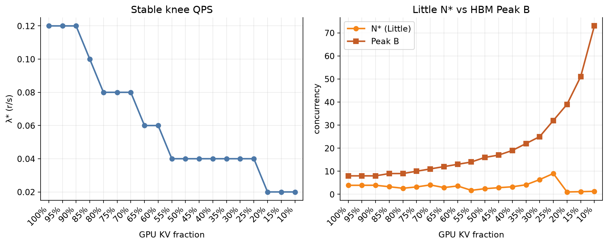

# GPU KV fraction vs inference speed

LLaMa2-70B / 1×H200 / paged-attn / **Poisson QPS knee** (prefill & decode 512±32).
Prefill / recompute charge **full** context on HBM. After those steps, decode occupancy is `floor(S × gpu_frac)` HBM tokens and spill writes are charged once. Off-GPU remainder is DRAM:SSD = 5:2 and is read **every decode step**, overlapped with compute via layer-prefetch (`N=80`). SSD is N3X-SLC **128KiB** / `qd_cap=32` / 14 GB/s (same as official Case 2).

Source: [`kv_working_set_test_report/gpu_frac_sweep/summary.json`](kv_working_set_test_report/gpu_frac_sweep/summary.json)

Each `gpu_frac` has its own `λ*` — **swept, not a target**: the largest stable offered QPS (goodput ≥ 0.90 and TTFT p99 ≤ 3× light-load). Token/s and TPOT below are **at that knee**, not at a shared arrival rate. `N* = offered λ* × request_time.p50` is a Little **estimate** of average in-flight requests, not a scheduler count. Peak B is the HBM occupancy ceiling (513 blocks after 1% watermark on 518), not N*.

`λ*` 不是预期到达率，是该 `gpu_frac` 还能稳住的最大到达率。`N*` 是 Little 估计，不是数出来的并发。

**Peak B** (decode, S=1024) after watermark:

```text
Peak B = floor(513 / ceil(floor(1024 × gpu_frac) / 16))
```

Prefill Peak B at S=512 is always **16**.

---

## 1. Knee token/s vs GPU KV fraction — peak B on the same axes


- **Left axis:** system token/s at `λ*`.
- **Right axis:** Peak B at S=1024.

Down to ~90% the knee matches all-GPU (**0.12 r/s**, **128 tok/s**): the cold set is still small enough for layer-prefetch to hide. From 85% to 25%, `λ*` and token/s fall as the per-step cold set grows. At 20% and below the search only holds `λ*=0.02` (light-load).

90% 以上与全 GPU 膝点相同。再往下冷集变大，吞吐下降。

| gpu_frac | Peak B | λ* | N* | token/s | vs 100% |
| ---: | ---: | ---: | ---: | ---: | ---: |
| 100% | 8 | 0.12 | 3.89 | 128.4 | 1.00× |
| 50% | 16 | 0.04 | 2.43 | 43.5 | 0.34× |
| 30% | 25 | 0.04 | 6.37 | 39.9 | 0.31× |
| 10% | 73 | 0.02 | 1.29 | 22.1 | 0.17× |

---

## 2. Direct view: token/s as a function of peak B


Larger Peak B comes with a larger cold set. Token/s at the knee does not rise with occupancy.

Peak B 变大伴随着更大的冷集，膝点 token/s 不会随占用上升。

---

## 3. TTFT vs TPOT (same sweep, at λ*)


TPOT p50 generally rises as `gpu_frac` falls (63 ms → 311 ms at 30% → 430 ms at 25%), then **drops** at 20% (100 ms) because that row's `λ*` falls to 0.02 and `N*` ≈ 1. Each point is at **its own knee**, not a fixed QPS, so TPOT is sawtoothed when the search steps down. TTFT p50 stays sub-second at every knee — the burst p50 cliff is gone.

TPOT 大体随 `gpu_frac` 变长，但在 `λ*` 降档时会回落（轻载、几乎无排队）。膝点 TTFT p50 都在 1 秒以内，没有 burst 悬崖。

---

## 4. λ* and N* vs Peak B



`N*` stays below Peak B: I/O (and compute batching) saturates before HBM is full. At 30%, `N*=6.4` vs Peak B=25.

`N*` 低于 Peak B：HBM 还没装满，I/O 已经顶住。

---

## 5. Prefill peak B vs decode peak B


Prefill occupancy is full-context, so **B_prefill = 16** at S=512 for every `gpu_frac`. Decode Peak B rises from 8 to 73 after trim.

---

## 6. Full sweep table

| gpu_frac | Peak B | λ* | N* | token/s | TPOT p50 | TTFT p50 | TTFT p99 | preempt |
| ---: | ---: | ---: | ---: | ---: | ---: | ---: | ---: | ---: |
| 100% | 8 | 0.12 | 3.89 | 128.4 | 63.2 ms | 0.10 s | 0.16 s | 2 |
| 95% | 8 | 0.12 | 3.91 | 128.4 | 63.5 ms | 0.11 s | 0.15 s | 1 |
| 90% | 8 | 0.12 | 3.92 | 128.4 | 63.7 ms | 0.11 s | 0.15 s | 0 |
| 85% | 9 | 0.10 | 3.28 | 107.8 | 63.4 ms | 0.10 s | 0.15 s | 0 |
| 80% | 9 | 0.08 | 2.63 | 86.8 | 63.5 ms | 0.10 s | 0.16 s | 0 |
| 75% | 10 | 0.08 | 3.20 | 86.1 | 76.4 ms | 0.12 s | 0.23 s | 0 |
| 70% | 11 | 0.08 | 4.07 | 83.4 | 100.4 ms | 0.11 s | 0.33 s | 0 |
| 65% | 12 | 0.06 | 2.92 | 64.4 | 94.9 ms | 0.12 s | 0.30 s | 0 |
| 60% | 13 | 0.06 | 3.61 | 62.8 | 118.7 ms | 0.12 s | 0.36 s | 0 |
| 55% | 14 | 0.04 | 1.72 | 44.0 | 84.7 ms | 0.12 s | 0.28 s | 0 |
| 50% | 16 | 0.04 | 2.43 | 43.5 | 118.9 ms | 0.13 s | 0.32 s | 0 |
| 45% | 17 | 0.04 | 2.87 | 42.8 | 142.4 ms | 0.13 s | 0.34 s | 0 |
| 40% | 19 | 0.04 | 3.26 | 42.1 | 161.1 ms | 0.13 s | 0.40 s | 0 |
| 35% | 22 | 0.04 | 4.13 | 41.3 | 200.4 ms | 0.14 s | 0.61 s | 0 |
| **30%** | **25** | **0.04** | **6.37** | **39.9** | **311.2 ms** | **0.18 s** | **0.65 s** | 0 |
| 25% | 32 | 0.04 | 9.01 | 38.2 | 430.4 ms | 0.20 s | 0.96 s | 0 |
| 20% | 39 | 0.02 | 1.02 | 22.1 | 100.0 ms | 0.11 s | 0.41 s | 0 |
| 15% | 51 | 0.02 | 1.13 | 22.1 | 110.2 ms | 0.11 s | 0.46 s | 0 |
| 10% | 73 | 0.02 | 1.29 | 22.1 | 129.7 ms | 0.13 s | 0.52 s | 0 |

Each row is at that `gpu_frac`'s own `λ*`. When `λ*` steps down (25% → 20%: 0.04 → 0.02), `N*` falls **9.01 → 1.02** and TPOT returns to light-load (~100 ms). Same pattern at 70% → 65% and 60% → 55%. This is not a faster decode at lower HBM occupancy.

各行在各自膝点采集。`λ*` 降档后并发掉到 ~1，SSD 争用消失，TPOT 回落；不是留更少显存单步更快。

---

## 7. DRAM / SSD occupancy / DRAM 与 SSD 占用

**极限容量** is Peak B occupancy (HBM packed, S=1024), not `N*`. Official 30/50/20: provision **32 GiB DRAM + 13 GiB SSD** for both MHA and GQA. See [`kv_working_set_test_report.md`](kv_working_set_test_report.md) §8 for the formula.

| | MHA-64 Peak B | MHA DRAM | MHA SSD | GQA-8 Peak B | GQA DRAM | GQA SSD |
| --- | ---: | ---: | ---: | ---: | ---: | ---: |
| **30% (official)** | **25** | **31.25 GiB** | **12.51 GiB** | **205** | **32.03 GiB** | **12.83 GiB** |
| 10% | 73 | 117.27 GiB | 47.05 GiB | 586 | 117.67 GiB | 47.21 GiB |

GQA bytes/token are 1/8 but Peak B is ~8×, so host 极限几乎相同. `N*` columns below are Little estimates × a full S=1024 decode window (**upper bound**), not a measured watermark.

The simulator does **not** cap DRAM or SSD. Host GiB are derived after decode trim (`S=1024`, `size_per_token = 2.50 MiB` here, remainder DRAM:SSD = 5:2):

```text
GiB = concurrency × tokens_tier × 2.50 / 1024
```

**Peak** columns: HBM packed to Peak B (occupancy ceiling). **N\*** columns: Little N* × full S=1024 window (upper bound, not measured occupancy).

模拟器不限制 DRAM/SSD。Peak 列为 HBM 打满的极限；N* 列为 Little 上界。官方 30/50/20 极限 **31.25 + 12.51 GiB**。N* 上界 **7.96 + 3.19 GiB**。

| gpu_frac | tokens (GPU/DRAM/SSD) | Peak B | Peak DRAM | Peak SSD | N* | N* DRAM | N* SSD |
| ---: | --- | ---: | ---: | ---: | ---: | ---: | ---: |
| 100% | 1024 / 0 / 0 | 8 | 0 | 0 | 3.89 | 0 | 0 |
| 95% | 972 / 36 / 16 | 8 | 0.70 | 0.31 | 3.91 | 0.34 | 0.15 |
| 90% | 921 / 73 / 30 | 8 | 1.43 | 0.59 | 3.92 | 0.70 | 0.29 |
| 85% | 870 / 109 / 45 | 9 | 2.40 | 0.99 | 3.28 | 0.87 | 0.36 |
| 80% | 819 / 146 / 59 | 9 | 3.21 | 1.30 | 2.63 | 0.94 | 0.38 |
| 75% | 768 / 182 / 74 | 10 | 4.44 | 1.81 | 3.20 | 1.42 | 0.58 |
| 70% | 716 / 219 / 89 | 11 | 5.88 | 2.39 | 4.07 | 2.18 | 0.88 |
| 65% | 665 / 256 / 103 | 12 | 7.50 | 3.02 | 2.92 | 1.82 | 0.73 |
| 60% | 614 / 292 / 118 | 13 | 9.27 | 3.75 | 3.61 | 2.57 | 1.04 |
| 55% | 563 / 329 / 132 | 14 | 11.25 | 4.51 | 1.72 | 1.38 | 0.55 |
| 50% | 512 / 365 / 147 | 16 | 14.26 | 5.74 | 2.43 | 2.17 | 0.87 |
| 45% | 460 / 402 / 162 | 17 | 16.68 | 6.72 | 2.87 | 2.82 | 1.14 |
| 40% | 409 / 438 / 177 | 19 | 20.32 | 8.21 | 3.26 | 3.49 | 1.41 |
| 35% | 358 / 475 / 191 | 22 | 25.51 | 10.26 | 4.13 | 4.79 | 1.93 |
| **30%** | **307 / 512 / 205** | **25** | **31.25** | **12.51** | **6.37** | **7.96** | **3.19** |
| 25% | 256 / 548 / 220 | 32 | 42.81 | 17.19 | 9.01 | 12.05 | 4.84 |
| 20% | 204 / 585 / 235 | 39 | 55.70 | 22.38 | 1.02 | 1.46 | 0.59 |
| 15% | 153 / 621 / 250 | 51 | 77.32 | 31.13 | 1.13 | 1.71 | 0.69 |
| 10% | 102 / 658 / 264 | 73 | 117.27 | 47.05 | 1.29 | 2.07 | 0.83 |

Units: GiB (`1024³`). 100 concurrent S=1024 at 30/50/20 would be **125.00 GiB DRAM + 50.05 GiB SSD** (test pile-up, not Peak B).

Companion GQA occupancy: [`gqa_gpu_frac_inference_speed.md`](gqa_gpu_frac_inference_speed.md). Main report: [`kv_working_set_test_report.md`](kv_working_set_test_report.md) §8.

```bash
python3.11 kv_working_set_test_report/gpu_frac_sweep/run_sweep.py
python3.11 kv_working_set_test_report/gpu_frac_sweep/plot_gpu_frac.py
```
