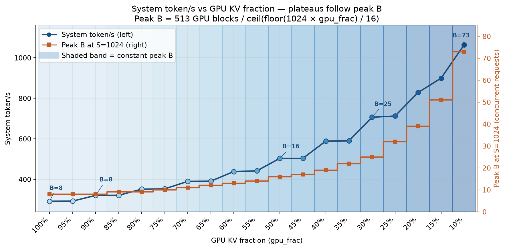
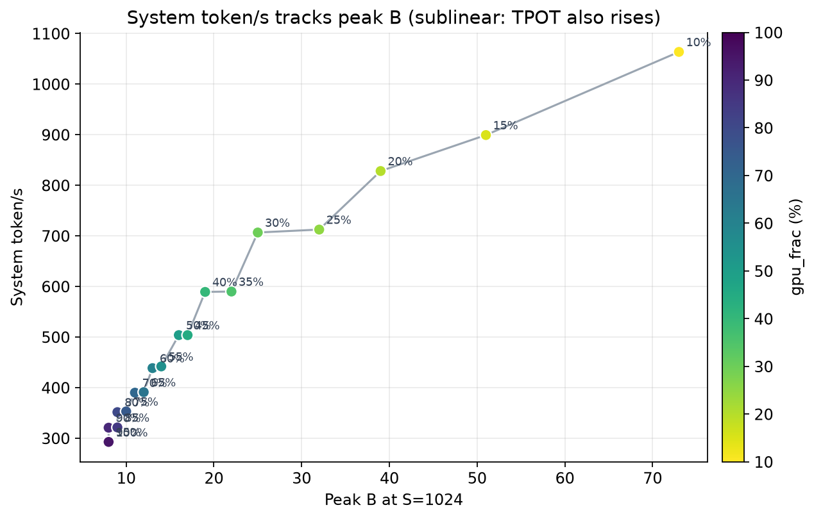
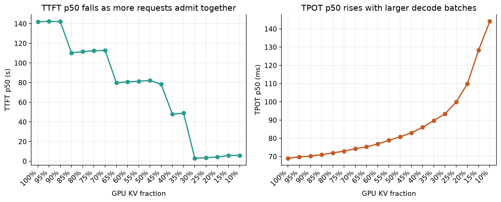
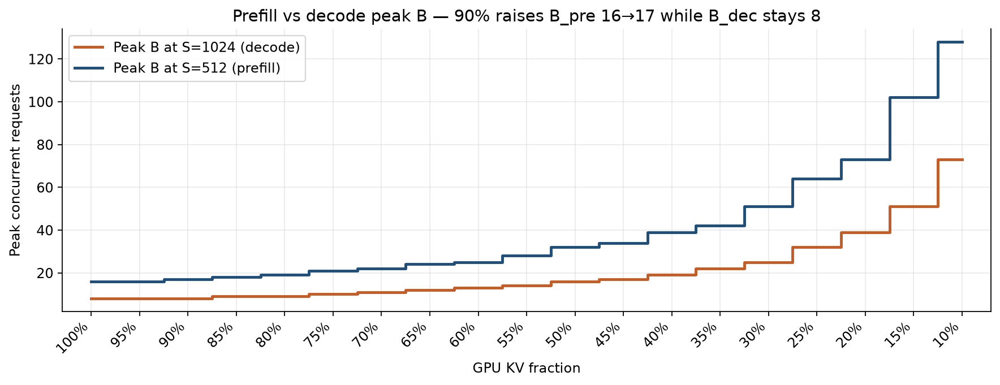

# GPU KV fraction vs inference speed

LLaMa2-70B / 1×H200 / paged-attn / burst 100 requests (prefill & decode 512±32).  
`gpu_frac` caps GPU KV occupancy: each request charges `floor(S × gpu_frac)` HBM tokens. Off-GPU remainder is DRAM:SSD = 5:2 with page-fault fetch.

Source: [`kv_working_set_test_report/gpu_frac_sweep/summary.json`](kv_working_set_test_report/gpu_frac_sweep/summary.json)

**Peak B** (decode, S=1024) is the HBM concurrency ceiling after watermark:

```text
Peak B = 513 / ceil(floor(1024 × gpu_frac) / 16)
```

513 = 518 leftover GPU blocks − 5 watermark. This is a **block-rounded** integer, so several `gpu_frac` values share one B — that is the staircase.

---

## 1. System token/s vs GPU KV fraction — peak B on the same axes



How to read this figure / 怎么读这张图:

- **Left axis, blue:** system token/s = (prefill + decode tokens) / makespan.
- **Right axis, orange step:** peak B at S=1024. A step stays flat until GPU block rounding admits one more concurrent request.
- **Shaded bands:** one band = one constant peak B. Token/s is mostly flat **inside** a band and jumps when the orange step jumps.

所以吞吐台阶不是 5% 本身有意义，而是 **peak B 变了**。`gpu_frac` 100%→95% 同为 B=8，token/s 几乎不动（292.0 → 292.6）；B 从 8 升到 9（约 85%→80%）才跳到 351 tok/s。

Exception inside the B=8 band / B=8 色带里的例外: at 90% token/s rises to 321 while **decode** peak B is still 8. Prefill peak B (S=512) goes 16→17, so the first packed prefill admits one extra request (see §4). Decode B 仍是主阶梯；prefill B 会在同一 decode-B 色带里造成一次小跳。

| gpu_frac | Peak B | token/s | vs 100% |
| ---: | ---: | ---: | ---: |
| 100% | 8 | 292 | 1.00× |
| 50% | 16 | 504 | 1.73× |
| 30% | 25 | 707 | 2.42× |
| 10% | 73 | 1064 | 3.64× |

---

## 2. Direct view: token/s as a function of peak B



横轴换成 peak B 以后，吞吐沿一条上升曲线走，和 `gpu_frac` 的 5% 刻度无关。关系是 **次线性**的：B 从 8 到 73（9.1×），token/s 只到 3.64×，因为更大的 decode batch 抬高了 TPOT（attention 按请求求和）。

---

## 3. TTFT vs TPOT (same sweep)



Peak B 变大以后：

- **TTFT p50 下降** — 更多请求能一起做 packed prefill，排队变短（100% 时 p50≈142 s，30% 起第一波就能进大部分 burst）。
- **TPOT p50 上升** — 同一步 decode 绑着更多请求，ITL 变长（69 ms → 144 ms）。

系统更快、单流更慢，是同一并发上升的两面。

---

## 4. Prefill peak B vs decode peak B



S=512 时每条请求占的 GPU block 更少，所以 **B_prefill > B_decode**。90% 那一次 token/s 小跳，对应蓝线 16→17，橙线仍停在 8。主图上的大台阶仍跟橙线（满长 decode B）对齐。

---

## 5. Full sweep table

| gpu_frac | Peak B (S=1024) | B_pre (S=512) | token/s | TPOT p50 | TTFT p50 | makespan | preempt |
| ---: | ---: | ---: | ---: | ---: | ---: | ---: | ---: |
| 100% | 8 | 16 | 292.0 | 69.0 ms | 141.9 s | 350.9 s | 73 |
| 95% | 8 | 16 | 292.6 | 69.8 ms | 142.3 s | 350.1 s | 72 |
| 90% | 8 | 17 | 320.7 | 70.3 ms | 142.0 s | 319.4 s | 64 |
| 85% | 9 | 18 | 321.2 | 71.0 ms | 110.2 s | 318.9 s | 65 |
| 80% | 9 | 19 | 351.5 | 72.0 ms | 111.4 s | 291.5 s | 65 |
| 75% | 10 | 21 | 352.9 | 72.9 ms | 112.4 s | 290.3 s | 66 |
| 70% | 11 | 22 | 390.0 | 74.2 ms | 112.8 s | 262.7 s | 63 |
| 65% | 12 | 24 | 391.0 | 75.3 ms | 79.9 s | 262.0 s | 65 |
| 60% | 13 | 25 | 438.5 | 76.8 ms | 80.7 s | 233.7 s | 64 |
| 55% | 14 | 28 | 441.8 | 78.9 ms | 81.3 s | 231.9 s | 64 |
| 50% | 16 | 32 | 503.7 | 80.8 ms | 82.1 s | 203.4 s | 57 |
| 45% | 17 | 34 | 503.7 | 83.0 ms | 78.3 s | 203.4 s | 63 |
| 40% | 19 | 39 | 589.1 | 86.0 ms | 47.8 s | 173.9 s | 54 |
| 35% | 22 | 42 | 589.9 | 89.7 ms | 48.9 s | 173.7 s | 57 |
| 30% | 25 | 51 | 706.6 | 93.4 ms | 2.94 s | 145.0 s | 46 |
| 25% | 32 | 64 | 712.3 | 99.9 ms | 3.51 s | 143.8 s | 50 |
| 20% | 39 | 73 | 828.1 | 109.9 ms | 4.20 s | 123.7 s | 41 |
| 15% | 51 | 102 | 899.2 | 128.3 ms | 5.77 s | 113.9 s | 49 |
| 10% | 73 | 128 | 1063.5 | 144.1 ms | 5.77 s | 96.3 s | 26 |

DRAM/SSD capacity is infinite in this model. Σ fetch at 10% is 8.6 s vs 96 s makespan.

Regenerate figures:

```bash
python3.11 kv_working_set_test_report/gpu_frac_sweep/plot_gpu_frac.py
```
