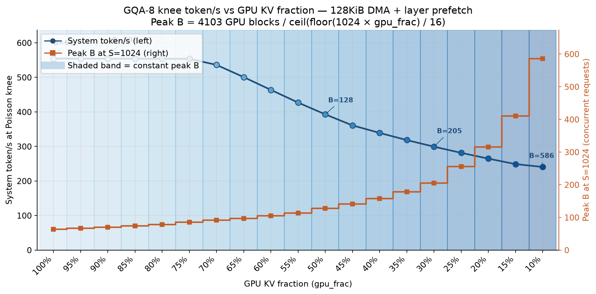
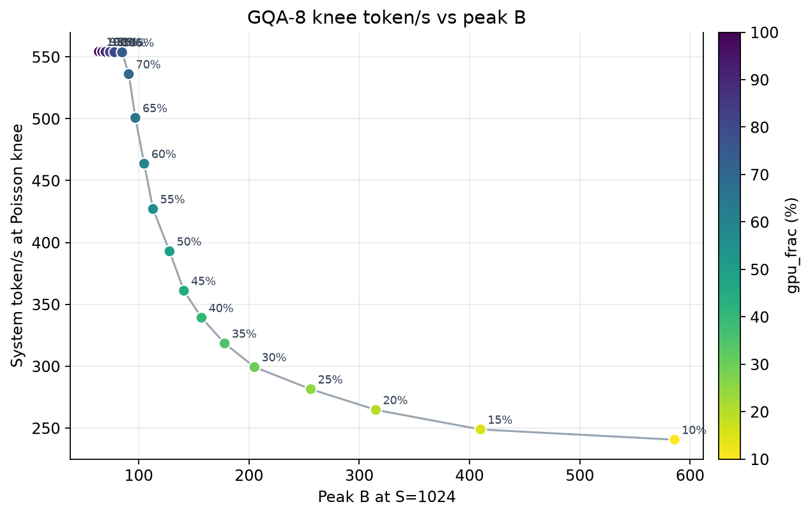
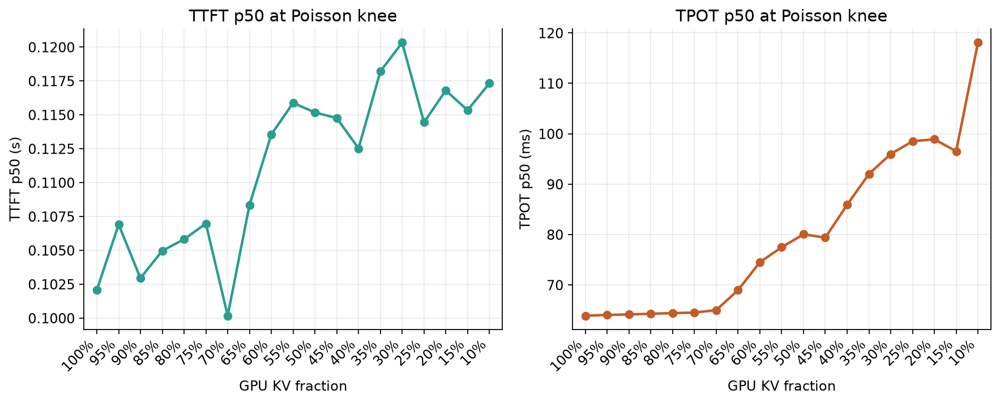
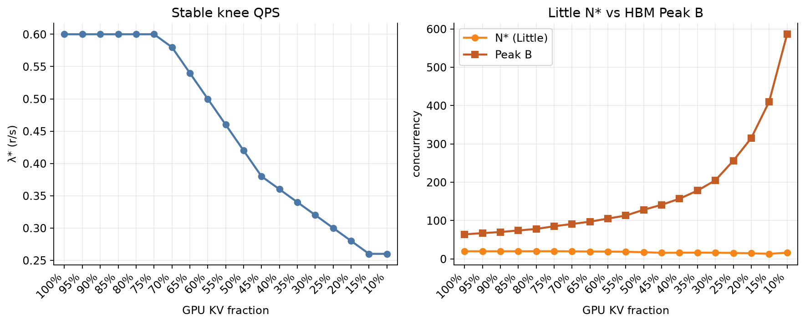
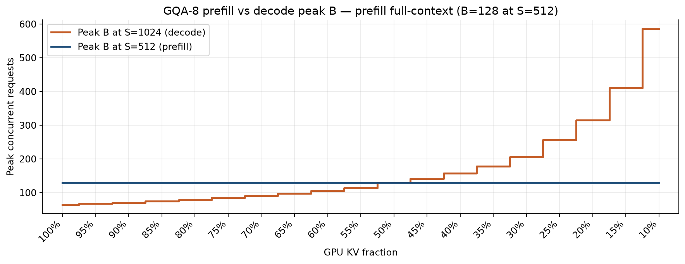

# GQA GPU KV fraction vs inference speed

**GQA-8** (`LLaMa2-70B-GQA`) / 1×H200 / paged-attn / **Poisson QPS knee** (prefill & decode 512±32).
Independent of the MHA occupancy note [`gpu_frac_inference_speed.md`](gpu_frac_inference_speed.md).

Prefill / recompute charge **full** context on HBM. After those steps, decode occupancy is `floor(S × gpu_frac)` HBM tokens and spill writes are charged once. Off-GPU remainder is DRAM:SSD = 5:2 and is read **every decode step**, overlapped with compute via layer-prefetch (`N=80`). SSD is N3X-SLC **128KiB** / `qd_cap=32` / 14 GB/s (same as official Case 2). KV is **0.3125 MiB/token** (1/8 of MHA-64).

Source: [`gqa_working_set_test_report/gpu_frac_sweep/summary.json`](gqa_working_set_test_report/gpu_frac_sweep/summary.json)

Each `gpu_frac` has its own `λ*` — **swept, not a target**: the largest stable offered QPS (goodput ≥ 0.90 and TTFT p99 ≤ 3× light-load). Token/s and TPOT are **at that knee**, not at a shared arrival rate. `N* = offered λ* × request_time.p50` is a Little **estimate** of average in-flight requests, not a scheduler count. Peak B is the HBM occupancy ceiling (4103 available GPU blocks after 1% watermark), not N*.

`λ*` 不是预期到达率，是该 `gpu_frac` 还能稳住的最大到达率。`N*` 是 Little 估计，不是数出来的并发。

**Peak B** (decode, S=1024) after watermark:

```text
Peak B = floor(4103 / ceil(floor(1024 × gpu_frac) / 16))
```

Prefill Peak B at S=512 is always **128**.

---

## 1. Knee token/s vs GPU KV fraction — peak B on the same axes



- **Left axis:** system token/s at `λ*`.
- **Right axis:** Peak B at S=1024.

Down to **75%** the knee matches all-GPU (**0.60 r/s**, **554 tok/s**). From 70% to 10%, `λ*` and token/s fall as the cold set grows. At 10% GQA still holds **0.26 r/s / 240.6 tok/s** (MHA companion was stuck at light-load 0.02 from 20% down).

75% 以上与全 GPU 膝点相同。10% 仍有 240.6 tok/s，没有退回轻载地板。

| gpu_frac | Peak B | λ* | N* | token/s | vs 100% |
| ---: | ---: | ---: | ---: | ---: | ---: |
| 100% | 64 | 0.60 | 19.64 | 554.2 | 1.00× |
| 50% | 128 | 0.42 | 17.38 | 392.9 | 0.71× |
| 30% | 205 | 0.32 | 15.96 | 299.3 | 0.54× |
| 10% | 586 | 0.26 | 15.99 | 240.6 | 0.43× |

---

## 2. Direct view: token/s as a function of peak B



Larger Peak B comes with a larger cold set. Token/s at the knee does not rise with occupancy.

Peak B 变大伴随着更大的冷集，膝点 token/s 不会随占用上升。

---

## 3. TTFT vs TPOT (same sweep, at λ*)



TPOT p50 stays near 64 ms through 75%, then rises as `gpu_frac` falls: **96.0 ms at 30%**, **98.5 ms at 25%**, **118.1 ms at 10%**. Each point is at **its own knee**. Small TPOT dips (50% → 45%: 80.0 → 79.4 ms; 20% → 15%: 98.9 → 96.5 ms) are `λ*` step-downs, not a faster loaded decode. 70% → 65% and 60% → 55% also step `λ*` down, but TPOT still rises (65.0 → 69.0 ms, 74.5 → 77.5 ms). TTFT p50 stays ~0.10–0.12 s at every row; TTFT p99 is ~0.20 s at 30% and 0.26 s at 10%.

TPOT 在 75% 以上约 64 ms，随后升到 30% 的 96 ms、10% 的 118 ms。50%→45%、20%→15% 有小回落，是 `λ*` 降档。70%→65%、60%→55% 也降档，但 TPOT 仍在升。膝点 TTFT p50 各行都在约 0.10–0.12 s；p99 在低 `gpu_frac` 升到 0.20–0.26 s。

---

## 4. λ* and N* vs Peak B



`N*` stays far below Peak B (at 30%, `N*=16` vs Peak B=205). I/O saturates before HBM is full.

`N*` 远低于 Peak B：HBM 还没装满，I/O 已经顶住。

---

## 5. Prefill peak B vs decode peak B



Prefill occupancy is full-context, so **B_prefill = 128** at S=512 for every `gpu_frac`. Decode Peak B rises from 64 to 586 after trim.

---

## 6. Full sweep table

| gpu_frac | Peak B | λ* | N* | token/s | TPOT p50 | TTFT p50 | TTFT p99 | preempt |
| ---: | ---: | ---: | ---: | ---: | ---: | ---: | ---: | ---: |
| 100% | 64 | 0.60 | 19.64 | 554.2 | 63.9 ms | 0.10 s | 0.16 s | 0 |
| 95% | 67 | 0.60 | 19.69 | 554.2 | 64.0 ms | 0.11 s | 0.15 s | 0 |
| 90% | 70 | 0.60 | 19.72 | 554.1 | 64.1 ms | 0.10 s | 0.14 s | 0 |
| 85% | 74 | 0.60 | 19.75 | 554.0 | 64.3 ms | 0.10 s | 0.15 s | 0 |
| 80% | 78 | 0.60 | 19.79 | 553.8 | 64.4 ms | 0.11 s | 0.14 s | 0 |
| 75% | 85 | 0.60 | 19.83 | 553.7 | 64.5 ms | 0.11 s | 0.14 s | 0 |
| 70% | 91 | 0.58 | 19.43 | 536.1 | 65.0 ms | 0.10 s | 0.18 s | 0 |
| 65% | 97 | 0.54 | 19.05 | 500.7 | 69.0 ms | 0.11 s | 0.15 s | 0 |
| 60% | 105 | 0.50 | 18.94 | 463.6 | 74.5 ms | 0.11 s | 0.17 s | 0 |
| 55% | 113 | 0.46 | 18.42 | 427.1 | 77.5 ms | 0.12 s | 0.17 s | 0 |
| 50% | 128 | 0.42 | 17.38 | 392.9 | 80.0 ms | 0.12 s | 0.18 s | 0 |
| 45% | 141 | 0.38 | 15.64 | 361.0 | 79.4 ms | 0.11 s | 0.17 s | 0 |
| 40% | 157 | 0.36 | 16.04 | 339.1 | 85.9 ms | 0.11 s | 0.19 s | 0 |
| 35% | 178 | 0.34 | 16.23 | 318.4 | 92.0 ms | 0.12 s | 0.18 s | 0 |
| **30%** | **205** | **0.32** | **15.96** | **299.3** | **96.0 ms** | **0.12 s** | **0.20 s** | 0 |
| 25% | 256 | 0.30 | 15.39 | 281.4 | 98.5 ms | 0.11 s | 0.22 s | 0 |
| 20% | 315 | 0.28 | 14.44 | 264.7 | 98.9 ms | 0.12 s | 0.22 s | 0 |
| 15% | 410 | 0.26 | 13.06 | 248.8 | 96.5 ms | 0.12 s | 0.20 s | 0 |
| 10% | 586 | 0.26 | 15.99 | 240.6 | 118.1 ms | 0.12 s | 0.26 s | 0 |

---

## 7. DRAM / SSD occupancy / DRAM 与 SSD 占用

**极限容量** is Peak B occupancy (HBM packed, S=1024), not `N*`. Official 30/50/20: provision **32 GiB DRAM + 13 GiB SSD** for both GQA and MHA. See [`gqa_working_set_test_report.md`](gqa_working_set_test_report.md) §8 for the formula.

| | MHA-64 Peak B | MHA DRAM | MHA SSD | GQA-8 Peak B | GQA DRAM | GQA SSD |
| --- | ---: | ---: | ---: | ---: | ---: | ---: |
| **30% (official)** | **25** | **31.25 GiB** | **12.51 GiB** | **205** | **32.03 GiB** | **12.83 GiB** |
| 10% | 73 | 117.27 GiB | 47.05 GiB | 586 | 117.67 GiB | 47.21 GiB |

GQA bytes/token are 1/8 but Peak B is ~8×, so host 极限几乎相同. `N*` columns below are Little estimates × a full S=1024 decode window (**upper bound**), not a measured watermark.

The simulator does **not** cap DRAM or SSD. Host GiB are derived after decode trim (`S=1024`, `size_per_token = 0.3125 MiB` here, remainder DRAM:SSD = 5:2):

```text
GiB = concurrency × tokens_tier × 0.3125 / 1024
```

**Peak** columns: HBM packed to Peak B (occupancy ceiling). **N\*** columns: Little N* × full S=1024 window (upper bound). Peak B host size tracks MHA (bytes/token are 1/8, Peak B is ~8×). The 1/8 saving shows up at **N\***, not at the Peak B ceiling.

模拟器不限制 DRAM/SSD。Peak 列与 MHA 几乎同量级；1/8 的节省在 N* 上界列。官方 30/50/20 极限 **32.03 + 12.83 GiB**。N* 上界 **2.49 + 1.00 GiB**。

| gpu_frac | tokens (GPU/DRAM/SSD) | Peak B | Peak DRAM | Peak SSD | N* | N* DRAM | N* SSD |
| ---: | --- | ---: | ---: | ---: | ---: | ---: | ---: |
| 100% | 1024 / 0 / 0 | 64 | 0 | 0 | 19.64 | 0 | 0 |
| 95% | 972 / 36 / 16 | 67 | 0.74 | 0.33 | 19.69 | 0.22 | 0.10 |
| 90% | 921 / 73 / 30 | 70 | 1.56 | 0.64 | 19.72 | 0.44 | 0.18 |
| 85% | 870 / 109 / 45 | 74 | 2.46 | 1.02 | 19.75 | 0.66 | 0.27 |
| 80% | 819 / 146 / 59 | 78 | 3.48 | 1.40 | 19.79 | 0.88 | 0.36 |
| 75% | 768 / 182 / 74 | 85 | 4.72 | 1.92 | 19.83 | 1.10 | 0.45 |
| 70% | 716 / 219 / 89 | 91 | 6.08 | 2.47 | 19.43 | 1.30 | 0.53 |
| 65% | 665 / 256 / 103 | 97 | 7.58 | 3.05 | 19.05 | 1.49 | 0.60 |
| 60% | 614 / 292 / 118 | 105 | 9.36 | 3.78 | 18.94 | 1.69 | 0.68 |
| 55% | 563 / 329 / 132 | 113 | 11.35 | 4.55 | 18.42 | 1.85 | 0.74 |
| 50% | 512 / 365 / 147 | 128 | 14.26 | 5.74 | 17.38 | 1.94 | 0.78 |
| 45% | 460 / 402 / 162 | 141 | 17.30 | 6.97 | 15.64 | 1.92 | 0.77 |
| 40% | 409 / 438 / 177 | 157 | 20.99 | 8.48 | 16.04 | 2.14 | 0.87 |
| 35% | 358 / 475 / 191 | 178 | 25.80 | 10.38 | 16.23 | 2.35 | 0.95 |
| **30%** | **307 / 512 / 205** | **205** | **32.03** | **12.83** | **15.96** | **2.49** | **1.00** |
| 25% | 256 / 548 / 220 | 256 | 42.81 | 17.19 | 15.39 | 2.57 | 1.03 |
| 20% | 204 / 585 / 235 | 315 | 56.24 | 22.59 | 14.44 | 2.58 | 1.04 |
| 15% | 153 / 621 / 250 | 410 | 77.70 | 31.28 | 13.06 | 2.48 | 1.00 |
| 10% | 102 / 658 / 264 | 586 | 117.67 | 47.21 | 15.99 | 3.21 | 1.29 |

Units: GiB (`1024³`). 100 concurrent S=1024 at 30/50/20 would be **15.63 GiB DRAM + 6.26 GiB SSD** (here GQA is ~1/8 of MHA because concurrency is pinned by the 100-request test, not Peak B).

Companion MHA occupancy: [`gpu_frac_inference_speed.md`](gpu_frac_inference_speed.md). Main report: [`gqa_working_set_test_report.md`](gqa_working_set_test_report.md) §8.

```bash
python3.11 gqa_working_set_test_report/gpu_frac_sweep/run_sweep.py
python3.11 gqa_working_set_test_report/gpu_frac_sweep/plot_gpu_frac.py
```
