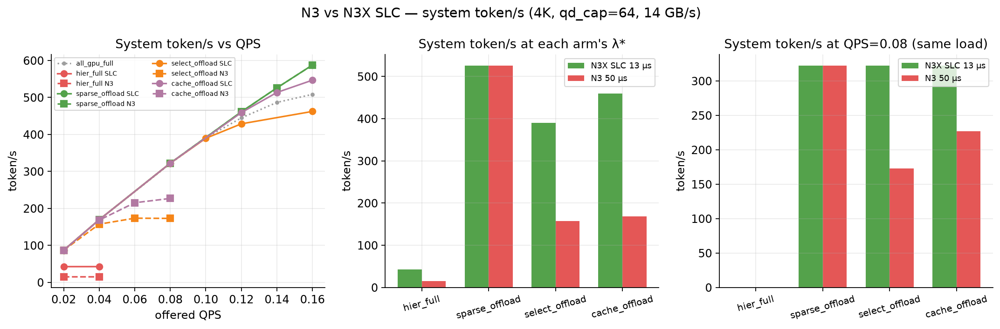

# GQA 末端上下文 4096：稀疏 attention + KV offload（30/0/70）

Date / 日期: 2026-09-05  
Simulator / 模拟器: TokenSim（Roofline 后端，Python 3.11）  
Script / 脚本: [`gqa_working_set_test_report/s4096_sparse/run_sweep.py`](gqa_working_set_test_report/s4096_sparse/run_sweep.py)（膝点、方案 C 网格、N3 对比）、[`plot_compare.py`](gqa_working_set_test_report/s4096_sparse/plot_compare.py)（§3 / §4.1 的图）、[`plot_gpu_frac_sparse.py`](gqa_working_set_test_report/s4096_sparse/plot_gpu_frac_sparse.py)（§5）

本文独立，不替换 [`gqa_working_set_test_report.md`](gqa_working_set_test_report.md) / [`offload_sim.md`](offload_sim.md)。

分层改为 **GPU / DRAM / SSD = 30% / 0% / 70%**：冷集全部在 SSD，主机内存不存 KV。用来看 DDR、SSD 的极限容量，以及全量 attention 每步 SSD 回读。

**稀疏注意力可以和 offload 一起用。** 两条稀疏臂都把完整 Key/Value 留下（中间不淘汰），decode **只回读、只计算** 选中集：

- `sparse_offload`：选中集 = sink ∪ **滑动窗口** 256。window 已在 GPU 30% 尾部里，decode **回读为 0**。  
- `select_offload`：选中集 = sink ∪ **按重要性选出的 256 个 token**（Quest 式 top-k）。选中的页大多落在 70% 冷集里，decode **每步从 SSD 回读**。  
- `cache_offload`：同 `select_offload`，再在 GPU 上给每条请求留 **512 token 的页缓存**，装最近选中过的冷页；命中的不再读盘。  

**KV 选中策略：方案 A 和方案 C 都做了，都是统计模型，没有真实 trace。** TokenSim 没有真实 Q/K，算不出注意力分数，仓库里也没有任何选页 trace，所以：

- **方案 A**（`select_offload`）：top-k 建模成「在非 sink 上下文里均匀选 k 个 token」，每步回读期望 = `k × 冷集 / (S − sink)`。这是**最悲观**的命中假设。  
- **方案 C**（`cache_offload`）：在 A 上加 GPU 页缓存 `select_cache_tokens` 和相邻步重选比例 `select_reuse`。冷页命中率 = `reuse + (1 − reuse) × min(1, 缓存 / 冷集)`。主臂用 `reuse = 0`（不假设任何局部性，只算缓存容量的效果）；`reuse` 是 Quest 观察到的相邻 query 选页高度重合现象，没有 trace 就只能当参数扫（§3.4）。  

细节见 §6.1。

**先说增益从哪来。** `sparse_offload` 的膝点 0.14 vs `all_gpu_full` 0.08，**全部来自 GPU KV 占用下降带来的并发上限**（decode 峰值并发 16 → 53，被 prefill 的 32 卡住），不是 attention 少算 16× 带来的：decode 一步只快约 0.7%（§2）；同一到达率 0.08 两臂系统 token/s 相同（322 vs 321）。

**质量口径。** `all_gpu_full` 是全量 attention 的性能与质量基准。TokenSim 不生成文本、不算 perplexity。五组相对基准的质量评价见 §0.5：`hier_full` 相同；`sparse_offload` 会差（看不见中间）；`select_offload` / `cache_offload` 好于滑窗、仍不是全量，且本文是均匀选页而非真实 Quest。

核心问题（性能）：

> 冷集全部放 SSD、不用 DDR 时，稀疏 decode 能否避开全量分层的每步 SSD 回读、提高可稳定的每秒请求数；如果选中集要从 SSD 里选页，代价是多少？

七条结论分开写：

1. **all_gpu_full vs hier_full** — 全量 attention 每步从 SSD 回读 70% 冷集的代价  
2. **all_gpu_full vs sparse_offload** — 滑窗稀疏 + offload 相对全量 GPU 的性能差  
3. **sparse_offload vs select_offload** — 从 SSD 里按重要性选页的回读代价（方案 A）  
4. **select_offload vs cache_offload** — GPU 页缓存能追回多少（方案 C，缓存 × 重选比例网格）  
5. **hier_full 的 SSD 读延迟扫描** — 只扫全量分层  
6. **N3 vs 当前 N3X SLC** — 4K 下只换盘延迟，看延迟更好的盘帮谁  
7. **gpu_frac 扫描（dram_frac=0）** — 滑窗、选页何时打到盘，以及 token/s 怎么变  

---

## 0. 名词与口径

### 0.1 上下文长度 S

**S 是当前请求的上下文长度（token 数）**：`S = prompt 长度 + 已经生成的 decode token 数`。每生成一个 token，S 加 1。

一条请求的时间线：

1. **Prefill** 结束时：S ≈ 2048。  
2. **Decode** 过程中：S 从约 2048 涨到约 4096。  
3. 请求结束时：S ≈ **4096**。实测末端 **4064–4128**（均值 **4096.5**）。

标题里的「4096」是 decode 结束时的最大上下文。

### 0.2 阶段、算法、存储

| 简称 | 全称 | 含义 |
| --- | --- | --- |
| Prefill | 前填 / 首 token 阶段 | 对完整 prompt 做 attention，写出 Key/Value。 |
| Decode | 逐 token 生成阶段 | 每个输出 token 时间只统计这段。 |
| GQA | Grouped Query Attention | 本模型 **GQA-8**。 |
| KV | Key/Value cache | FP16，每 token **0.3125 MiB**。 |
| sink | 注意力汇 | **4** 个，钉在 GPU，参与 decode attention。 |
| window | 滑动窗口 | **256** 个，最新 token。`sparse_offload` 的选中集。 |
| select / top-k | 按重要性选页 | **256** 个，Quest 式按分数选出的 token。`select_offload` / `cache_offload` 的选中集；本文用均匀分布建模。 |
| 页缓存 / `select_cache_tokens` | GPU 上的冷页缓存 | `cache_offload` 每请求 **512** token（32 页），装最近选中过的冷页；占 GPU 块。 |
| `select_reuse` | 相邻步重选比例 | 本步选中集里有多大比例在上一步也被选中。主臂 **0**；§3.4 扫 0 / 0.5 / 0.8。 |
| HBM | GPU 高带宽显存 | 算力与 GPU 驻留 KV。 |
| DRAM / DDR | 主机内存 | 本实验 **0%**：不存 KV。 |
| SSD | 固态盘 | 冷集 **70%**。`hier_full` 每步读全部冷集；`select_offload` 每步读选中 ∩ 冷集；`sparse_offload` 只存、本配方 decode 不读。 |
| SLC / N3X SLC | 本实验盘档 | **13 µs**、14 GB/s。当前所有主臂。 |
| N3 | 更慢的一档 | **50 µs**、14 GB/s。仓库 `hier_n3.json` 默认还是 128KiB DMA；§4.1 故意锁 4K，只换延迟。 |
| 30/0/70 | GPU / DRAM / SSD | 最新 30% 在 GPU，其余 70% 在 SSD。`sparse_offload` 的 GPU 再留 sink。 |
| 冷集 | 不在 GPU 上的 KV | 本实验 = 全部 SSD。 |
| fetch / spill | 回读 / 写出 | decode 读盘；prefill 结束后把洞写到 SSD。 |
| 4K / `qd_cap` | 命令大小 / 队列深度 | 4096 字节，上限 64。 |
| PCIe | 主机 ↔ GPU 链路 | `pcie_bw_gbps=50`。回读/写出延迟取 `max(t_dram, t_ssd, t_pcie)`；本文所有点都由 SSD 项决定（hier_full 一步 896 MiB 走 PCIe 17.5 ms < SSD 62.5 ms），PCIe 从未成为瓶颈。 |

### 0.2.1 gpu_frac / dram_frac / ssd_frac 是什么关系

三个数是 **每条请求当前上下文 S 的切分比例**，不是设备容量：

```text
gpu_frac + dram_frac + ssd_frac = 1                （配置校验强制）
GPU  = floor(S × gpu_frac)  最新的那一段         （sparse 时再加 sink 4 个）
DRAM = floor(S × dram_frac) 紧挨 GPU 段的更旧一段
SSD  = S − GPU − DRAM       最旧的一段（余数全归 SSD）
```

按「新 → 旧」排布：`[sink] [SSD 最旧 ... ] [DRAM ... ] [GPU 最新 ... S)`。S 每生成一个 token 加 1，三段随之重算，所以比例固定、token 数随 S 涨。

本文固定 `dram_frac = 0`，于是 **`ssd_frac = 1 − gpu_frac`**：第 5 节把 `gpu_frac` 从 30% 降到 4%，就是把 SSD 上的那段从 70% 放大到 96%，DRAM 始终为 0。S=4096 的例子：

| gpu_frac | GPU token（+sink） | DRAM token | SSD token | GPU MiB / 请求 | SSD MiB / 请求 |
| ---: | ---: | ---: | ---: | ---: | ---: |
| 1.00（all_gpu_full） | 4096 | 0 | 0 | 1280 | 0 |
| 0.30 | 1228（1232） | 0 | 2868（2864） | 385 | 895 |
| 0.15 | 614（618） | 0 | 3478 | 193 | 1087 |
| 0.04 | 163（167） | 0 | 3929 | 52 | 1228 |

三条推论：

- **设备容量** = 该段 token × 0.3125 MiB × 同时在跑的请求数，见 §0.7。比例本身不是 GB。  
- **谁被读回来** 由 attention 策略决定，不由比例决定：全量 attention 每步读 DRAM+SSD 全部；滑窗只读伸出 GPU 的那截；选页读 `top-k ∩ (DRAM ∪ SSD)`。  
- **方案 C 的页缓存** 是 GPU 段之外的**额外**驻留（`select_cache_tokens`），不改三段切分，只多占 GPU 块、少读冷集。  

旧的 30/50/20 就是 `dram_frac=0.5`：S=4096 时 DRAM 2048 token，SSD 拿余数——全量臂 **820**（无 sink，4096−1228−2048），稀疏臂 **816**（sink 占了 4 个）。§0.7 的 30/50/20 对照按全量臂的 820 算。

### 0.3 并行、占用

| 简称 | 含义 |
| --- | --- |
| TP/PP/DP | 均为 **1**（单卡）。 |
| `paged-attn` | 每块 **16** 个 token。 |
| Peak B | `floor(可用 GPU 块数 / 每请求占用块数)`。 |
| watermark | 4144 块预留 1% → 可用 **4103**。 |

### 0.4 指标

TTFT = 首 token 时间（含 prefill）。TPOT = 每输出 token 时间（不含 prefill）。λ* = 膝点到达率（goodput ≥ 0.90 且 TTFT p99 ≤ 3 × 轻载 TTFT p99）。轻载 λ=0.02。`hier_full` 在 λ=0.02 时 goodput 已是 0.52，**没有膝点**；下文标为「未找到（≤0.02）」，其 Little N\* 不列（排队请求占多数，与其他臂不可比）。

有效吞吐比（goodput）= 实际完成 r/s ÷ 到达率。**轻载时它可以略大于 1**（§3.3 的 0.02 行是 1.06、§4.1 的 `cache_offload` 是 1.03）：负载是开环泊松、只有 100 条请求，暖机和收尾让实际到达间隔的样本均值偏离标称 λ，不是系统吐出了比到达更多的请求。判膝点只看它有没有掉到 0.90 以下。

膝点搜索的到达率网格是 0.02 → 0.04 → 0.08 → 0.16 再二分，所以 `all_gpu_full` 原本没有 0.14 的点；本文为它补跑了 0.14，曲线图上 0.14 处各臂都是实测。同理，落在网格外的到达率在 `summary.json` 里查不到，个别表格会借用 §5 的同配置运行，都已就地注明。

### 0.5 五组对照（decode 这一步具体在干什么）

Prefill 五组一样：对完整 prompt 做 attention，写出全部 KV。差别只在 **decode 每生成一个 token 时**：softmax 看哪些 KV、缺的从哪读。下面用结束时 S=4096、下标 `0 … 4095`（0 是 prompt 第一个 token，4095 是刚生成的）。

30/0/70 把上下文切成「最旧 70% 在 SSD、最新 30% 在 GPU」。稀疏三臂再把 prompt 头 4 个（sink）钉在 GPU 上：

```text
下标     0    4                         2868              3840          4096
         |sink|--------- SSD 冷集 -------|-------- GPU 最新 30% --------|
                                          |                 |- window -|
hier_full 没有单独的 sink：SSD 是 [0, 2868)，GPU 是 [2868, 4096)，共 1228 个。
稀疏三臂：GPU = [0, 4) ∪ [2868, 4096)，共 1232 个；SSD = [4, 2868)，共 2864 个。
注意 GPU 尾部 1228 个里，滑窗只用最末 256 个：[2868, 3840) 的 972 个在 GPU 上但不进 softmax。
```

「不在 GPU」和「不进 softmax」是两回事，别混：`sparse_offload` 每步不算的是 [4, 3840) 共 3836 个，其中 **2864 个在 SSD 上、972 个就在 GPU 上白占着**。选页臂正是把这 972 个（以及盘上的 2864 个）重新纳入了可选范围。

| 简称 | KV 存在哪（4096 个都留下） | 这一步 softmax 看哪些下标 | 这一步从 SSD 读 | 和上一组的差别 | 相对 all_gpu_full 的推理质量 |
| --- | --- | --- | --- | --- | --- |
| all_gpu_full | 4096 个全在 GPU | **0 … 4095 全部** | 0 | 基准：完整 attention，不 offload | **基准。** 每步看全部 4096 个 KV。 |
| hier_full | 最新 1228 在 GPU，最旧 2868 在 SSD | **仍是 0 … 4095 全部**（要完整 attention，盘上的也得搬回来） | **2868**（≈896 MiB） | 输出与基准相同；代价是每步搬 70% 冷集 | **相同。** softmax 集合与基准一样，只是 70% 先从 SSD 搬再算；不量化、不丢 KV。 |
| sparse_offload | 同 hier，另加 sink 4 个在 GPU | **只有 [0,4) ∪ [3840,4096)**，共 260 个。中间 [4,3840) 共 3836 个本步看不见（其中 2864 在 SSD、**972 在 GPU 上但不算**） | **0**（window 已在 GPU 尾部里） | 不算中间 token，所以比完整 attention 少算、也不读盘 | **会差。** 只看 260/4096 ≈ **6.4%**，中间 3836 个永不进 softmax。StreamingLLM：续写往往还能用，要引用中间段落的任务（长文档 QA、needle）会掉。 |
| select_offload | 同 sparse | **[0,4) 再加从 [4,4096) 抽出的 256 个**，共 260。这 256 个均匀散布，期望 77 个已在 GPU 尾部、**179 个在 SSD** | **179**（≈56 MiB） | 算的个数与 sparse 相同，但能抽到中间（例如下标 1000）；抽到 SSD 上的要搬 | **好于 sparse，仍不是基准。** 真实 Quest 按分数选页，文献里 k=256–1024 接近无损；本文是均匀乱抽，质量应差于真实 Quest，也不能保证等于全量 attention。 |
| cache_offload | 同 select，GPU 再留 512 个「最近选过的冷页」副本 | **与 select 相同的 260 个下标**（缓存不改选谁） | **147**（179 里约 18% 命中缓存） | 选法和 select 一样；少搬 32 个 token，GPU 多占 512 | **与 select 相同。** 缓存只改从哪读，不改 softmax 看谁。 |

三句把 decode 差讲完：

1. **存和算是两件事。** 后四组都把 4096 个 KV 留下；hier_full 每步算全部，后三组每步只算 260。  
2. **260 个是哪 260 个，才是稀疏三臂的差别。** sparse 永远是「头 4 + 最末 256」；select / cache 是「头 4 + 从全文抽出的 256」，中间段落有机会进 softmax。  
3. **读盘只发生在「算到了、但不在 GPU 上」的那些 token。** sparse 的 256 个全在 GPU 尾部 → 读 0；select 的 256 个里约 179 个在 SSD → 每步读；cache 用 512 个 GPU 副本把这 179 削到 147。

**质量怎么评（相对 all_gpu_full）。** TokenSim 不生成文本，没有 perplexity / 准确率，表里的评价是按「softmax 看见哪些 token」，不是测出来的分数。

| 相对 all_gpu_full | 谁 | 依据 |
| --- | --- | --- |
| 相同 | `hier_full` | 每步仍 attend 全部 4096；搬 KV 不改数值。 |
| 会差，且差在中间 | `sparse_offload` | 固定看头 4 + 最末 256，中间 3836 个（约 94%）本步等于不存在。 |
| 好于 sparse，对齐不了基准 | `select_offload`、`cache_offload` | 260 个里可以包含中间；真实 Quest 按重要性选，文献接近无损。本文均匀乱抽，比 Quest 悲观，仍只看 6.4%。两臂选中集相同，质量相同。 |

排序（只谈覆盖，不谈测分）：`all_gpu_full` = `hier_full` > 真实 Quest 式 select（本文没跑）> 本文均匀 select / cache > `sparse_offload`。N3 vs N3X SLC 只改延迟，不改选中集，质量与盘无关。

### 0.6 实验配方

| 项 | 值 |
| --- | --- |
| 集群 | 1×H200 |
| 模型 | `LLaMa2-70B-GQA`，FP16 KV **0.3125 MiB/token** |
| 负载 | 100 条，prefill **2048±32**，decode = 该请求 prefill，`random_seed=0` |
| 实测 | 204,826 prefill + 204,826 decode |
| 选中集 | sink **4** + window **256**（sparse_offload）/ sink **4** + top-k **256**（select_offload、cache_offload） |
| 页缓存 | cache_offload：**512** token / 请求，`select_reuse=0` |
| Offload | **30/0/70** |

```text
全量 attention 峰值并发（S=4096）                     = floor(4103 / 256) = 16
hier_full / sparse_offload / select_offload（30% 尾部）= floor(4103 / 77)  = 53
cache_offload（30% 尾部 + 512 缓存 = 1744 token）     = floor(4103 / 109) = 37
Prefill 峰值并发（prompt ≈2048）                      = floor(4103 / 128) = 32
```

---

## 0.7 DDR / SSD 极限容量

口径：结束时 S=4096，每 token **0.3125 MiB**（整网 80 层）。一条请求完整 KV = **1280 MiB**。  
**极限驻留** = 该层每请求 token × **该臂自己的 decode 峰值并发 Peak B**。前四臂 Peak B = 53（GPU 块刚好塞满 53 条 decode），`cache_offload` 因为页缓存多占 GPU 块只有 **37**，所以它那一列是 ×37 而不是 ×53。这是「要同时撑住 Peak B 条满上下文请求」时，DDR/SSD 至少要备的容量，不是仿真过程中累计读写流量。**Peak B 是理论墙**：本负载 prefill 墙 32 先卡住，膝点处 Little N\* 只有 14–18，几十条满上下文 decode 同时在跑的情形没出现过；按实测并发折算的驻留见最后一行。

| | all_gpu_full | hier_full | sparse_offload | select_offload | cache_offload |
| --- | ---: | ---: | ---: | ---: | ---: |
| GPU token / 请求 | 4096 | 1228 | 1232（sink+尾部） | 1232 | **1744**（+512 缓存） |
| DDR token / 请求 | 0 | **0** | **0** | **0** | **0** |
| SSD token / 请求 | 0 | **2868** | **2864** | **2864** | **2864**（缓存是副本，洞仍全写盘） |
| GPU MiB / 请求 | 1280 | 383.8 | 385.0 | 385.0 | 545.0 |
| **DDR MiB / 请求** | 0 | **0** | **0** | **0** | **0** |
| **SSD MiB / 请求** | 0 | **896.3** | **895.0** | **895.0** | **895.0** |
| GPU 峰值并发（理论） | 16 | 53 | 53 | 53 | **37** |
| **DDR 极限** | 0 | **0** | **0** | **0** | **0** |
| **SSD 极限（×Peak B）** | 0 | **46.4 GiB** | **46.3 GiB** | **46.3 GiB** | **32.3 GiB** |
| 膝点实测 Little N\* | 10.6 | —（未找到膝点） | 17.9 | 14.2 | 15.8 |
| SSD 按实测 N\* 折算 | 0 | — | **15.6 GiB** | **12.4 GiB** | **13.8 GiB** |

对照：若仍用旧的 30/50/20，同样 Peak B=53 时 DDR 极限约 **33.1 GiB**、SSD 约 **13.3 GiB**。30/0/70 把那 33 GiB DDR 全部改到盘上，DDR 极限为 0，SSD 极限约 **46 GiB**。

Prefill 峰值 32 条、每条约 2048 token 全在 GPU：32 × 2048 × 0.3125 = **20.0 GiB**，与可用 4103 块（约 20.0 GiB）对齐。

仿真累计 I/O（100 条请求、不是驻留容量）：

- `hier_full`：SSD **读** 4.404×10⁸ token，回读合计 **9600 s**；写出 47.0 GB  
- `sparse_offload`：SSD **读 0**；写出 46.9 GB（只 spill，不每步读）  
- `select_offload`：SSD **读** 3.665×10⁷ token（hier_full 的 **1/12**），回读合计 **799 s**；写出 46.9 GB  
- `cache_offload`：SSD **读** 2.758×10⁷ token（select_offload 的 **0.75×**），回读合计 **601 s**；写出 46.9 GB

---

## 1. 五组对照

配置和复现命令。decode 每步看哪些下标、读多少，见 §0.5。

| 对照 | 配置 |
| --- | --- |
| **all_gpu_full** | 无 working-set |
| **hier_full** | [`hier_30_0_70_slc_4k.json`](data/kv_working_set/hier_30_0_70_slc_4k.json) |
| **sparse_offload** | [`hier_30_0_70_slc_4k_sparse256.json`](data/kv_working_set/hier_30_0_70_slc_4k_sparse256.json) |
| **select_offload** | [`hier_30_0_70_slc_4k_select256.json`](data/kv_working_set/hier_30_0_70_slc_4k_select256.json) |
| **cache_offload** | [`hier_30_0_70_slc_4k_cache512.json`](data/kv_working_set/hier_30_0_70_slc_4k_cache512.json) |

```bash
python3.11 gqa_working_set_test_report/s4096_sparse/run_sweep.py
```

```bash
python3.11 benchmark.py --batching paged-attn --qps 0.08 --distribution poisson \
  --cluster data/clusters/1_h200/h1.json --model data/psla/llama-70b-gqa-4k.json \
  --verbose none --results_path gqa_working_set_test_report/s4096_sparse/all_gpu

python3.11 benchmark.py --batching paged-attn --qps 0.02 --distribution poisson \
  --cluster data/clusters/1_h200/h1.json --model data/psla/llama-70b-gqa-4k.json \
  --verbose none --results_path gqa_working_set_test_report/s4096_sparse/hier_full \
  --kv_working_set_config data/kv_working_set/hier_30_0_70_slc_4k.json

python3.11 benchmark.py --batching paged-attn --qps 0.14 --distribution poisson \
  --cluster data/clusters/1_h200/h1.json --model data/psla/llama-70b-gqa-4k.json \
  --verbose none --results_path gqa_working_set_test_report/s4096_sparse/sparse_offload \
  --kv_working_set_config data/kv_working_set/hier_30_0_70_slc_4k_sparse256.json

python3.11 benchmark.py --batching paged-attn --qps 0.1 --distribution poisson \
  --cluster data/clusters/1_h200/h1.json --model data/psla/llama-70b-gqa-4k.json \
  --verbose none --results_path gqa_working_set_test_report/s4096_sparse/select_offload \
  --kv_working_set_config data/kv_working_set/hier_30_0_70_slc_4k_select256.json

python3.11 benchmark.py --batching paged-attn --qps 0.12 --distribution poisson \
  --cluster data/clusters/1_h200/h1.json --model data/psla/llama-70b-gqa-4k.json \
  --verbose none --results_path gqa_working_set_test_report/s4096_sparse/cache_offload \
  --kv_working_set_config data/kv_working_set/hier_30_0_70_slc_4k_cache512.json
```

---

## 2. Decode 计算：attention 变稀疏，前馈网络不变

| 口径 | 上下文 S | Roofline (prompt, step) | attention 原始 | projection 原始 | 一步合计（校准后） |
| --- | ---: | ---: | ---: | ---: | ---: |
| 全量，decode 开始 | ≈2049 | 2048+1 | 0.127 ms | 32.55 ms | 59.42 ms |
| 全量，decode 结束 | 4096 | 2048+2048 | **0.254 ms** | 32.55 ms | 59.65 ms |
| 稀疏，只算 260 | 逻辑 S=4096 | 259+1 | **0.016 ms** | 32.55 ms | 59.22 ms |

一步 decode 只少约 **0.7%**（projection 主导）。30/0/70 不改这张表，只改占用和回读。`select_offload` 的 attention 行与「稀疏，只算 260」相同；Quest 的页元数据打分（每页一次小点积）未计入，量级远小于 projection。

---

## 3. 膝点（N3X SLC，13 µs）

§3 的表和图全部是 **N3X SLC**：读延迟 13 µs、带宽 14 GB/s、IO 4K、`qd_cap=64`。`all_gpu_full` 不读盘，与用哪块盘无关。N3（50 µs）的同口径表和图在 §4.1。

| 指标 | all_gpu_full | hier_full | sparse_offload | select_offload | cache_offload |
| --- | ---: | ---: | ---: | ---: | ---: |
| **膝点到达率 λ\*** | **0.08** | **未找到（≤0.02）** | **0.14** | **0.10** | **0.12** |
| **Little 并发 N\*** | 10.61 | — | 17.91 | 14.21 | 15.79 |
| 有效吞吐比 | 0.98 | **0.52**（λ=0.02） | 0.92 | 0.95 | 0.93 |
| 峰值并发（decode，理论） | **16** | **53** | **53** | **53** | **37** |
| 峰值并发（prefill） | 32 | 32 | **32** | 32 | 32 |
| 存 / 算的 KV token | 4096 / 4096 | 4096 / 4096 | **4096 / 260** | **4096 / 260** | **4096 / 260** |
| 系统 decode token/s | **321.0** | **42.5** | **525.9** | **389.6** | **459.0** |
| 实际完成 r/s | 0.0784 | 0.0104 | 0.1284 | 0.0951 | 0.1120 |
| 首 token 时间 p50 | 0.288 s | 0.769 s | 0.311 s | 0.314 s | 0.311 s |
| 首 token 时间 p99 | 0.322 s | 2.65 s | 0.462 s | 0.426 s | 0.432 s |
| 每输出 token 时间 p50 | **64.6 ms** | **2545 ms** | **62.3 ms** | **69.5 ms** | **64.3 ms** |
| 每输出 token 时间 p99 | 66.5 ms | 2821 ms | 63.5 ms | 77.9 ms | 67.1 ms |
| 抢占次数 | 0 | 0 | 0 | 0 | 0 |
| SSD 读 token 数 | 0 | **4.404×10⁸** | **0** | **3.665×10⁷** | **2.758×10⁷** |
| 回读合计 / 写出合计 | 0 / 0 | **9600 s / 3.13 s** | **0 / 3.12 s** | **799 s / 3.12 s** | **601 s / 3.12 s** |

`hier_full` 一列是 λ=0.02 的实测值，不是膝点。


图注：五组都在 **N3X SLC 13 µs**。左：膝点处系统 token/s；中：TPOT p50；右：TTFT p50 / p99。`hier_full` 没有膝点，柱子是 λ=0.02。


图注：仍是 N3X SLC。虚线是该臂自己的 λ\*。左图纵轴是**系统** token/s（100 条请求吐出的 token ÷ 墙钟），到达率越高分母越短，所以过膝之后曲线还会涨。`all_gpu_full` 在 0.14 实测 486.5 token/s，但 TTFT p99 已经 **64 s**、抢占 28 次——那是把请求挤在更短时间里的算术，不是能稳定接待 0.14。各臂在同一到达率下（如 0.08）系统 token/s 几乎一样；差别在**能稳到多高**。

### 3.1 all_gpu_full vs hier_full — SSD 读取在这里

`hier_full` 的 token/s 是 all_gpu 的 **0.13×**。TPOT 从 64.6 ms 升到 **2.55 s**。70% 冷集每步从 SSD 回读：读 4.404×10⁸ token，回读合计 9600 s，DRAM 读 **0**。这就是「能体现出 SSD 读取」的臂。

λ=0.02 时 goodput 只有 **0.52**，已经不稳。λ=0.04 时 TTFT p99 升到 **4918 s**（10 次抢占）。搜索仍把 0.02 记为下限。

相对旧的 30/50/20（当时轻载还能 goodput 0.97、TPOT 179 ms）：去掉 DDR 之后，原先走 50 GB/s DRAM 的那一半改走 14 GB/s SSD，全量分层从「能跑」变成「轻载就饱和」。

### 3.2 all_gpu_full vs sparse_offload

`sparse_offload` 的 token/s 是 all_gpu 的 **1.64×**，是 hier_full 的 **12.4×**。中间 KV 写在 SSD 上（spill 3.12 s），decode **不读盘**。

这两个倍数是**各自膝点处**的系统 token/s 之比（0.14 vs 0.08 vs 0.02），到达率不同，不是同一负载下的加速比——它衡量的是「能稳到多高」。同负载的比较看下表：0.08 上两臂 token/s 只差 0.4%。

同一到达率 **0.08**：

| 指标 | all_gpu_full | sparse_offload |
| --- | ---: | ---: |
| 系统 decode token/s | 321.0 | **322.4** |
| 每输出 token 时间 p50 | 64.59 ms | **60.87 ms** |
| 首 token 时间 p99 | 0.322 s | 0.357 s |
| SSD 读 token | 0 | **0** |

轻载 0.02：TPOT **60.76 vs 59.69 ms**（all_gpu vs sparse；稀疏臂快 1.8%，§2 单请求 Roofline 的差是 0.7%，其余来自轻载下仍有的少量批处理）。膝点 0.08 → 0.14 仍是占用（prefill 峰值 32），不是 SSD。λ=0.16 时 goodput 落到 0.90 以下（0.143/0.16）。

**结论：** 30/0/70 能展示 SSD **容量**（两臂都约 46 GiB）和全量臂的 SSD **读取**。滑窗稀疏臂在 `gpu_frac=0.30` 下读不到盘；要让稀疏 decode 也读 SSD，需要 window 伸进 70% 冷集（更小的 `gpu_frac`，§5），或者像 §3.3 那样从中间选页。

### 3.3 sparse_offload vs select_offload — 从 SSD 里选页的代价

两臂存储、占用完全一样（GPU 1232 token、SSD 2864、Peak B 53），attention 都只算 260。唯一区别是选中集在哪：

- `sparse_offload`：window 全在 GPU 尾部，每步回读 **0**。  
- `select_offload`：均匀选 256 个，期望 **179** 个落在 SSD 冷集，每步每请求约 **56 MiB**、**14,320** 个 4K IO；14 GB/s 下约 3.9 ms/请求。

| 到达率 | sparse TPOT p50 | select TPOT p50 | select goodput | select TTFT p99 |
| ---: | ---: | ---: | ---: | ---: |
| 0.02 | 59.7 ms | 59.8 ms | 1.06 | 0.342 s |
| 0.08 | 60.9 ms | 61.8 ms | 0.98 | 0.350 s |
| **0.10** | — | **69.5 ms** | **0.95** | 0.426 s |
| 0.12 | 61.7 ms | 96.9 ms | **0.87** | 0.412 s |
| 0.14 † | 62.3 ms | 130.8 ms | 0.79 | 0.467 s |
| 0.16 | 62.8 ms | 168.6 ms | 0.71 | 0.634 s |

† 膝点搜索的网格没有落在 0.14 上，所以 `select_offload` 的 0.14 一行在 `select_offload/summary.json` 里查不到；这三个数取自 §5 的 `gsel_0p30` 运行（`mode=select, gpu_frac=0.30`，配置与 [`hier_30_0_70_slc_4k_select256.json`](data/kv_working_set/hier_30_0_70_slc_4k_select256.json) 逐字相同），见 [`gpu_frac_tokens.json`](gqa_working_set_test_report/s4096_sparse/gpu_frac_tokens.json)。sparse 臂同格 0.10 为空，是因为它的网格同样没有 0.10。

- 轻载时 `layer_prefetch` 把 3.9 ms 的回读藏在 80 层逐层计算后面，TPOT 几乎不变。  
- 并发到 14 条以上，每步 SSD 总读量 ≈ 14 × 56 MiB ≈ 0.8 GB、约 55 ms，和 59 ms 的计算持平，重叠不住了；TPOT 从 0.10 起随并发线性上涨，0.12 goodput 掉到 0.87。  
- 膝点 **0.10** vs `sparse_offload` 0.14：选页回读把稀疏臂的增益从 1.64× 压到 **1.21×**（相对 all_gpu），但仍比 `hier_full`（每步读 2868 token）好一个数量级：累计 SSD 读 3.7×10⁷ vs 4.4×10⁸。  
- 这是均匀选择（方案 A）的悲观值。若真实选页有近因偏置（更多命中 GPU 尾部），或者加页缓存（方案 C，§3.4），回读会更少。

### 3.4 select_offload vs cache_offload — 方案 C 能追回多少

`cache_offload` 在 `select_offload` 之上给每条 decode 请求留 **512 token（32 页）** 的 GPU 页缓存，装最近选中过的冷页。代价是每请求 GPU 占用 1232 → **1744** token（77 → 109 块），decode 理论并发 53 → **37**；prefill 墙 32 仍先卡住，所以对本负载没有实际损失。

主臂 `select_reuse = 0`：不假设相邻步有任何重合，命中率只来自「缓存装了冷集的多大比例」= 512/2864 = **17.9%**。每步回读 179 → **147** token。

| | select_offload | cache_offload（512, reuse 0） |
| --- | ---: | ---: |
| 膝点 λ\* | 0.10 | **0.12** |
| 系统 token/s | 389.6 | **459.0** |
| TPOT p50 @膝点 | 69.5 ms | 64.3 ms |
| TPOT p50 @0.14 | 130.8 ms † | 72.4 ms |
| goodput @0.14 | 0.79 † | **0.895**（差 0.005 没过 0.90） |
| 累计 SSD 读 | 3.665×10⁷ | 2.758×10⁷（**−25%**） |

† `select_offload` 的 0.14 两格来源同 §3.3 的脚注（借用 `gsel_0p30`）。

**缓存 × 重选比例网格**（都是膝点搜索，`reuse` 是假设值，无 trace）：

| 缓存 token | reuse | 每步冷读（S=4096） | λ\* | 系统 token/s | TPOT p50 | 累计 SSD 读 | Peak B |
| ---: | ---: | ---: | ---: | ---: | ---: | ---: | ---: |
| 0（select_offload） | 0 | 179 | 0.10 | 389.6 | 69.5 ms | 3.665×10⁷ | 53 |
| 512 | 0 | 147 | 0.12 | 459.0 | 64.3 ms | 2.758×10⁷ | 37 |
| 512 | 0.5 | 74 | **0.14** | 525.5 | 62.7 ms | 1.379×10⁷ | 37 |
| 512 | 0.8 | 29 | **0.14** | 525.7 | 62.5 ms | 0.551×10⁷ | 37 |
| 1024 | 0 | 115 | **0.14** | 525.3 | 62.9 ms | 1.849×10⁷ | 29 |
| 1024 | 0.5 | 58 | **0.14** | 525.6 | 62.6 ms | 0.924×10⁷ | 29 |
| 1024 | 0.8 | 23 | **0.14** | 525.7 | 62.5 ms | 0.370×10⁷ | 29 |
| —（sparse_offload 滑窗） | — | 0 | **0.14** | 525.9 | 62.3 ms | 0 | 53 |

读法：

- 决定膝点的是「每步全体请求的 SSD 读能不能被 `layer_prefetch` 藏在 59 ms 的计算后面」。每步冷读 ≤ 约 115 token（≈36 MiB/请求，18 条并发 ≈ 45 ms）就能追平滑窗的 0.14；179 token 时 SSD 时间超过计算，膝点掉到 0.10。  
- **只靠容量、不假设局部性**（reuse 0）：512 token 缓存不够（0.12），1024 才够（0.14）。但 1024 缓存让 Peak B 掉到 **29**，低于 prefill 墙 32——decode 占用反过来成了瓶颈，只是本负载 N\* 18 还没碰到。  
- **有局部性**（reuse ≥ 0.5）：512 缓存就够到 0.14，累计 SSD 读只有 select_offload 的 1/3–1/7。Quest 报告相邻 query 的选页高度重合，方向上支持 reuse 不为 0，但具体数值没有 trace 不能定。  
- 网格里所有到 0.14 的配置，TPOT 都在 62.5–62.9 ms，和滑窗（62.3）几乎一样：一旦回读藏得住，选页与滑窗在性能上等价，差别只剩「是否触达中间 token」。

---

## 4. hier_full 的 SSD 读延迟

固定 30/0/70、4K、14 GB/s、`qd_cap=64`，到达率 **0.02**。不扫 `sparse_offload`（decode 无 SSD 读）。

模拟器饱和 IOPS = `min(qd_cap / L, BW / io_size)`（`fetch.py::media_queue_latency`）。这是 **Little 定律下本步能完成的命令数**，不是盘规格书上的「峰值 4K IOPS」：

```text
同时在飞的命令 QD = min(本步 IO 数, qd_cap)     本文 qd_cap = 64
每条命令服务时间 L = read_latency_us            无 qd_latency_us 表时不随 QD 涨
IOPS_延迟 = QD / L                              64 / 13 µs = 4.92M；64 / 50 µs = 1.28M
IOPS_带宽 = BW / 4K                             14 GiB/s ÷ 4096 B = 3.67M
取两者较小值。
```

13 µs 时延迟侧 4.92M 高于带宽侧 3.67M，打在带宽屋顶；25 µs 起 `64 / L` 更小（2.56M、1.28M、0.64M），打在队列屋顶。把 `qd_cap` 提到 `⌈3.67M × L⌉`（50 µs 大约 184）时，N3 也会坐回带宽屋顶，两盘 4K 对比消失——所以 **1.28M 是「50 µs × 队列 64」推出来的，不是 N3 这块盘出厂最高 IOPS**。仓库 [`hier_n3.json`](data/kv_working_set/hier_n3.json) 默认还是 `qd_cap=32`，且 QD=64 时 L 升到 100 µs（饱和 IOPS 0.64M）；§4.1 没用那张曲线。

**带宽的单位是 GiB/s。** 模拟器里 `read_bw_gbps=14` 走的是 `bytes / _GB / bw`，而 `_GB = 1 << 30`（`TokenSim/config/constants.py`），所以带宽项是 14 GiB/s = 15.0 GB/s，带宽侧 IOPS 屋顶为 `14 × 2³⁰ / 4096 = 3.67M`（按十进制 GB 算会得到 3.42M，与模拟器不符）。全文写「14 GB/s」的地方都指这一个配置值。


| SSD 读延迟 (µs) | 重叠方式 | IOPS 上限 | 系统 token/s | TPOT p50 | TTFT p50 | TTFT p99 | 回读合计 | goodput |
| ---: | --- | ---: | ---: | ---: | ---: | ---: | ---: | ---: |
| 13 | 层间预取 | 3.67M | **42.5** | **2545 ms** | 0.769 s | 2.65 s | 9600 s | 0.52 |
| 13 | 阻塞 | 3.67M | 40.2 | 2774 ms | 1.02 s | 2505 s | 9600 s | 0.49 |
| 25 | 层间预取 | 2.56M | 29.7 | 4222 ms | 1.38 s | 5843 s | 13762 s | 0.36 |
| 25 | 阻塞 | 2.56M | 28.7 | 4293 ms | 1.37 s | 6051 s | 13762 s | 0.35 |
| 50 | 层间预取 | 1.28M | 14.9 | 8892 ms | 2.61 s | 15516 s | 27525 s | 0.18 |
| 50 | 阻塞 | 1.28M | 14.6 | 9001 ms | 2.39 s | 15737 s | 27525 s | 0.18 |
| 100 | 层间预取 | 0.64M | 7.4 | 18404 ms | 5.32 s | 34421 s | 55050 s | 0.09 |
| 100 | 阻塞 | 0.64M | 7.4 | 18495 ms | 4.49 s | 34582 s | 55050 s | 0.09 |

全部点的 SSD 读 token 都是 **4.404×10⁸**（同一负载、同一 70% 冷集）。延迟加大只拉长排队，不改变读量。层间预取相对阻塞的优势被 SSD 带宽淹没（13 µs 时 42.5 vs 40.2 token/s）。

### 4.1 N3 vs N3X SLC

两套盘的配方只差读延迟，其余相同：30/0/70、**4K**、14 GB/s、`qd_cap=64`、层间预取。

| | N3X SLC（§3 的盘） | N3 |
| --- | --- | --- |
| 读延迟 | **13 µs** | **50 µs** |
| 带宽 | 14 GB/s | 14 GB/s |
| IO / 队列 | 4K / 64 | 4K / 64 |
| 饱和 IOPS（模拟器，不是规格书） | **3.67M**（`14 GiB/s ÷ 4K`，带宽更紧） | **1.28M**（`64 ÷ 50 µs`，队列更紧） |

**1.28M 不是 N3 的出厂最高 IOPS。** 两边 `qd_cap` 都锁 64，SLC 的 `64 / 13 µs = 4.92M` 已经超过带宽屋顶，N3 的 `64 / 50 µs = 1.28M` 还没摸到带宽。规格书上的 4K random IOPS 一般在另一个 QD 下测；本实验没有用那张数，只换了 `read_latency_us`。

仓库里 N3 默认是 128KiB DMA（[`hier_n3.json`](data/kv_working_set/hier_n3.json)）。128KiB 时两边都坐在 14 GB/s 屋顶上，延迟差不出来（GQA QoS 报告）。这里故意锁 4K，才让 N3 打在 `qd_cap / L` 上。

`all_gpu_full` 不读盘，N3 与 SLC 相同，不再重跑。下面四臂都做了膝点搜索。

#### N3X SLC 数据（与 §3 同一列，便于对照）

| 臂 | λ\* | 系统 token/s | TPOT p50 | TTFT p99 | 累计 SSD 读 | 回读合计 |
| --- | ---: | ---: | ---: | ---: | ---: | ---: |
| hier_full | 未找到（≤0.02） | 42.5 | 2545 ms | 2.65 s | 4.404×10⁸ | 9600 s |
| sparse_offload | 0.14 | 525.9 | 62.3 ms | 0.462 s | 0 | 0 |
| select_offload | 0.10 | 389.6 | 69.5 ms | 0.426 s | 3.665×10⁷ | 799 s |
| cache_offload | 0.12 | 459.0 | 64.3 ms | 0.432 s | 2.758×10⁷ | 601 s |

对应图：[`fig_knee_ttft_tpot_tokens.png`](gqa_working_set_test_report/s4096_sparse/fig_knee_ttft_tpot_tokens.png)、[`fig_qps_ttft_tpot_tokens.png`](gqa_working_set_test_report/s4096_sparse/fig_qps_ttft_tpot_tokens.png)。

#### N3 数据（50 µs，其余同 SLC）

| 指标 | hier_full | sparse_offload | select_offload | cache_offload |
| --- | ---: | ---: | ---: | ---: |
| **膝点到达率 λ\*** | **未找到（≤0.02）** | **0.14** | **0.04** | **0.04** |
| **Little 并发 N\*** | — | 18.08 | 9.62 | 5.63 |
| 有效吞吐比 | **0.18**（λ=0.02） | 0.92 | 0.96 | 1.03 |
| 系统 decode token/s | **14.9** | **525.8** | **157.3** | **168.2** |
| 实际完成 r/s | 0.0036 | 0.1284 | 0.0384 | 0.0411 |
| 首 token 时间 p50 | 2.61 s | 0.375 s | 0.392 s | 0.373 s |
| 首 token 时间 p99 | 15516 s | 0.561 s | 0.556 s | 0.430 s |
| 每输出 token 时间 p50 | **8892 ms** | **62.9 ms** | **116.4 ms** | **68.7 ms** |
| 每输出 token 时间 p99 | 11224 ms | 64.3 ms | 225.4 ms | 106.7 ms |
| 抢占次数 | 15 | 0 | 0 | 0 |
| SSD 读 token 数 | **4.404×10⁸** | **0** | **3.665×10⁷** | **2.758×10⁷** |
| 回读合计 / 写出合计 | **27525 s / 10.6 s** | **0 / 8.94 s** | **2290 s / 8.94 s** | **1724 s / 8.94 s** |

`hier_full` 一列是 λ=0.02：goodput 0.18，已经不稳，TTFT p99 一万秒、抢占 15 次。这一列与 §4 表里「50 µs / 层间预取」那行是同一配置的同一次结果，两处口径一致，不是两次独立测量。读 token 数与 SLC 相同（同一 100 条 trace），回读墙钟变成 SLC 的 **2.87×**（9600 s → 27525 s），正好等于两边 IOPS 屋顶之比 **3.67 / 1.28 = 2.867**：SLC 侧被带宽封顶、N3 侧被队列延迟封顶，读量不变时墙钟就按屋顶反比放大。

`sparse_offload` 与 SLC 数字重合：decode 不读盘，写出慢一点（spill 3.12 s → 8.94 s）不影响膝点。

`select_offload` / `cache_offload` 的 SSD 读 token 也与 SLC 相同，但排队更长，膝点从 0.10 / 0.12 掉到 **0.04**。

单请求、S=4096 的一步回读（解释上面的倍率）：

| 臂 | SSD token / 步 | 4K IO | N3X SLC | N3 |
| --- | ---: | ---: | ---: | ---: |
| hier_full | 2868 | 229,440 | 62.5 ms | **179 ms** |
| select_offload | 179 | 14,320 | 3.90 ms | **11.2 ms** |
| cache_offload | 147 | 11,760 | 3.20 ms | **9.19 ms** |
| sparse_offload | 0 | 0 | 0 | 0 |

14 条并发时 select 共享队列：SLC **54.6 ms**（还能藏进 59 ms 计算），N3 **157 ms**（藏不住）。

#### token 速度对比图



图注三块都是系统 token/s（不是 1/TPOT）：

- **左**：随到达率。实线 = N3X SLC，虚线 = N3，颜色按臂。灰点线是 `all_gpu_full`（不读盘，两盘相同）。`sparse_offload` 实线虚线重合，一直贴着灰线往上走；N3 上 `select` 到 0.06 就压平（157 → 173 → 173 token/s），`cache` 到 0.08 还在缓慢爬（168 → 215 → 227），而两者的 SLC 曲线能爬到 0.10–0.12；`hier_full` 贴底。  
- **中**：各臂自己膝点处的 token/s。sparse 两边都是 **526**；select **390 vs 157**；cache **459 vs 168**；hier **42.5 vs 14.9**。注意膝点 QPS 不同，柱高不能直接当「同一负载谁快」。  
- **右**：同一到达率 **0.08**（`hier_full` 到不了，没有柱）。sparse 两边都是 **322**；select **322 vs 173**（N3 已过膝）；cache **322 vs 227**。

膝点 λ\* 和 TPOT 的对照柱图：[`fig_drive_n3_vs_slc.png`](gqa_working_set_test_report/s4096_sparse/fig_drive_n3_vs_slc.png)。

同一到达率 0.08 的 TPOT：

| 臂 @0.08 | SLC token/s | N3 token/s | SLC TPOT | N3 TPOT |
| --- | ---: | ---: | ---: | ---: |
| sparse_offload | 322.4 | **322.4**（1.00×） | 60.9 ms | 61.2 ms |
| select_offload | 322.2 | **172.8**（0.54×） | 61.8 ms | 629.5 ms |
| cache_offload | 322.2 | **226.8**（0.70×） | 61.3 ms | 253.7 ms |

读法：

- **decode 不读盘，更快的盘帮不上 token 速度。** sparse 左右中三块柱/线都重合。  
- **decode 每步打 4K IO，延迟就是速度。** 同一 0.08 下 select 的 token/s 掉到 54%，TPOT 变成 10×。cache 少读一点，掉到 70%。  
- `cache_offload` 在 N3 膝点（0.04）TPOT 仍是 69 ms、token/s 168——那是负载已经被压低了；同一 0.08 才是 227 token/s vs SLC 的 322。  
- `hier_full` 两边都找不到膝点；0.02 的 token/s 42.5 → 14.9，救不活。

**结论：** 4K 随机读下，N3X SLC 相对 N3 的 token 速度增益 **不是均匀的 50/13 ≈ 3.8×**，而是「谁在打盘」：滑窗稀疏 ≈ 1.0×；同一 0.08 的选页 1.86×、页缓存 1.42×；全量分层 2.85×。128KiB 顺序 DMA 下这个对比会消失。

复现：

```bash
python3.11 gqa_working_set_test_report/s4096_sparse/run_sweep.py --drive-only
python3.11 gqa_working_set_test_report/s4096_sparse/plot_compare.py
```

---

## 5. gpu_frac 扫描（dram_frac=0）：两种选中策略何时读盘

固定：`sparse=true`，sink=4，**dram_frac=0**（冷集全在 SSD），`ssd_frac = 1 - gpu_frac`（三者关系见 §0.2.1）。两种选中集：**window256**（实线）和 **select256 均匀选页**（点线）；不含页缓存。  
左图、表里的回读来自现有 `fetch_cost`（一步、单请求）。右图是同一套函数给出的该步回读延迟。虚线是滑窗的阈值：`gpu_frac < window/S`。

```text
window：decode 开始 S=2048：gpu_frac < 256/2048 = 12.5% 才读盘
        decode 结束 S=4096：gpu_frac < 256/4096 =  6.25% 才读盘
select：任何 gpu_frac < 1 都读盘；每步期望 256 × (1 - gpu_frac) 左右
```


横轴从 30% 减到 2%（和「越降越容易出尾」一致）。滑窗在 `gpu_frac=0.30` 两条线都是 0；过了 12.5%，S=2048 的 window 开始伸出 GPU；过了 6.25%，结束时也开始读盘，多出来的 token 数 ≈ `256 - floor(S × gpu_frac)`。选页与 S 无关（比例式），30% 时每步 179 个，2% 时 251 个，接近全部 256。延迟大约每 50 个 token 1 ms 量级。

| gpu_frac | window S=2048 尾部 / SSD 读 / ms | window S=4096 尾部 / SSD 读 / ms | select S=2048 与 4096 SSD 读 / ms | decode Peak B |
| ---: | --- | --- | --- | ---: |
| 0.30 | 614 / **0** / 0 | 1228 / **0** / 0 | **179** / 3.90 | 53 |
| 0.15 | 307 / **0** / 0 | 614 / **0** / 0 | 218 / 4.75 | 105 |
| 0.12 | 245 / **11** / 0.24 | 491 / **0** / 0 | 225 / 4.90 | 132 |
| 0.10 | 204 / **52** / 1.13 | 409 / **0** / 0 | 230 / 5.01 | 157 |
| 0.08 | 163 / **93** / 2.03 | 327 / **0** / 0 | 236 / 5.14 | 195 |
| **0.06** | 122 / **134** / 2.92 | 245 / **11** / 0.24 | 241 / 5.25 | 256 |
| **0.05** | 102 / **154** / 3.36 | 204 / **52** / 1.13 | 243 / 5.30 | 315 |
| 0.04 | 81 / **175** / 3.81 | 163 / **93** / 2.03 | 246 / 5.36 | 373 |

滑窗 0.12–0.07：只有 decode **前半段**读盘；**0.06 及以下**全程都读。选页：全程都读。

推理速度用 **每请求 decode token/s = 1 / TPOT**（不受到达率钉住）。右图是 Roofline 一步 59.22 ms 加上该步 `fetch_cost`：`1000 / (59.22 + fetch_ms)`。


| gpu_frac | window 1/TPOT @0.08 | window 1/TPOT @0.14 | window token/s @0.14 | select 1/TPOT @0.08 | select 1/TPOT @0.14 | select token/s @0.14 |
| ---: | ---: | ---: | ---: | ---: | ---: | ---: |
| 0.30 | **16.43** | **16.04** | **525.9** | **16.19** | **7.65** | **450.8** |
| 0.15 | 16.42 | 16.02 | 525.8 | 15.01 | 4.68 | 389.4 |
| 0.12 | 16.42 | 16.02 | 525.8 | 14.29 | 4.35 | 379.0 |
| 0.10 | 16.41 | 16.01 | 525.8 | 13.85 | 4.13 | 371.9 |
| 0.08 | 16.39 | 15.98 | 525.8 | 13.22 | 3.93 | 363.8 |
| 0.06 | 16.35 | 15.91 | 525.6 | 12.59 | 3.77 | 357.0 |
| 0.05 | 16.33 | 15.84 | 525.4 | 12.31 | 3.71 | 354.4 |
| 0.04 | **16.30** | **13.65** | **516.4** | **11.90** | **3.63** | **350.6** |

滑窗（window256）：

- 轻载 0.08：单请求速度 16.43 → 16.30 token/s（**−0.8%**），系统 token/s 几乎不动（到达率钉住）。  
- 膝点附近 0.14：0.30–0.05 仍约 16.0 → 15.8；**0.04** 掉到 **13.65** token/s，系统 **525.9 → 516.4**，TPOT 62.4 → **73.2 ms**，goodput 贴到 0.90。  
- Roofline+fetch：过 12.5% / 6.25% 之后一步速度从 16.9 往下走，和左图同一方向，幅度小于 0.14×0.04 的排队放大。

选页（select256，均匀）：

- 轻载 0.08：`gpu_frac` 从 0.30 降到 0.04，单请求 16.19 → 11.90 token/s（**−27%**），TPOT 61.8 → 84.0 ms；系统 token/s 322 → 310。每步读盘 179 → 246 个 token，`layer_prefetch` 在低并发下只能藏住一部分。  
- 0.14 已经过了选页臂的膝点（0.10）：TPOT 131 → 276 ms，单请求 7.65 → 3.63 token/s。这一列是「SSD 排队饱和」状态，不是稳态服务。  
- 降 `gpu_frac` 对选页几乎没有换来什么：GPU 驻留从 1232 降到 167 token，Peak B 从 53 升到 373，但 prefill 墙仍是 32，而每步读盘量还多了 37%。

系统 token/s 与累计 SSD 读（对照；右图只画到达率 0.08）：


和 `hier_full`（30/0/70、每步读约 2868 个 token、TPOT 2.55 s、token/s 42.5）比：滑窗打到盘时，读的是 window 多出来的几十到一百多个 token；选页每步读 179–251 个，都比全量的 2868 少一个数量级，但选页是每步都读，累计 SSD 读 3.7–5.0×10⁷ token，滑窗最多 2.7×10⁷（0.04）。

复现：

```bash
python3.11 gqa_working_set_test_report/s4096_sparse/plot_gpu_frac_sparse.py
```

---

## 6. 实现

- 配置：[`hier_30_0_70_slc_4k.json`](data/kv_working_set/hier_30_0_70_slc_4k.json)、[`hier_30_0_70_slc_4k_sparse256.json`](data/kv_working_set/hier_30_0_70_slc_4k_sparse256.json)、[`hier_30_0_70_slc_4k_select256.json`](data/kv_working_set/hier_30_0_70_slc_4k_select256.json)、[`hier_30_0_70_slc_4k_cache512.json`](data/kv_working_set/hier_30_0_70_slc_4k_cache512.json)  
- `sparse=true`：存完整 KV；decode 只 attend / 只 fetch 选中集  
  - `select_tokens=0`（默认）：选中集 = sink ∪ window；fetch = window ∩ 冷集  
  - `select_tokens=k>0`：选中集 = sink ∪ top-k；fetch = `k × 冷集 / (S − sink)` 的期望值，按 DRAM/SSD 在冷集中的比例拆分（`TokenSim/kv_working_set/fetch.py::_selected_cold_tokens`）。此时 json 里残留的 `window_tokens=256` 不参与 attention 与 fetch（`config.attended_span()` 只返回 `select_tokens`），select256 / cache512 两个配置文件里的这个字段是无效字段  
  - `select_cache_tokens=C`、`select_reuse=p`：冷页命中率 `p + (1 − p) × min(1, C / 冷集)`，fetch 乘 `(1 − 命中率)`；C 计入每请求 GPU 块（`placement.py::gpu_resident_tokens`、`block_manager._gpu_target_blocks`），要求 `C ≥ k`  
- 膝点配方：`sparse_offload` fetch = 0（`gpu_frac=0.30`）；`select_offload` 每步 179 token；`cache_offload` 每步 147 token；spill 全部写 SSD  
- `gpu_frac < window/S` 时滑窗 decode 开始读 SSD，见第 5 节。第 5 节没有扫页缓存。  
- 方案 C 网格：`run_sweep.py::run_cache_grid` → `cache_grid.json`  
- N3 vs N3X SLC：`run_sweep.py::run_drive_compare`（`--drive-only`）→ `drive_compare.json`；N3 配置只改 `ssd.read_latency_us=50`；图 `fig_drive_tokens.png`、`fig_drive_n3_vs_slc.png`

### 6.1 KV 选中策略：方案 A 与方案 C，都是统计模型

| | 方案 A `select_offload` | 方案 C `cache_offload` |
| --- | --- | --- |
| 选中哪些页 | 均匀分布在非 sink 上下文上；每步算期望值 | 同 A |
| GPU 上放什么 | sink + 最新 30% 尾部 | 同 A + `select_cache_tokens` 页缓存（装最近选中过的冷页） |
| 每步回读 | `k × 冷集 / (S − sink)`，S=4096 时 179 | 再乘 `(1 − 命中率)`；命中率 = `reuse + (1 − reuse) × 缓存/冷集` |
| 状态 | 无；`fetch_cost` 是纯函数 | **仍然无**：均匀选择下 demand-paging 缓存的命中率≈「缓存 / 冷集」，相邻步重选的那部分必然还在缓存里（配置强制 `C ≥ k`），所以闭式期望≈逐页 LRU 仿真的均值。**略偏乐观**，见下 |
| 假设 | 均匀（悲观） | 均匀 + `reuse`（这一层略乐观）；`reuse` 无 trace，只能扫 |
| 主臂参数 | k=256 | k=256，C=512，reuse=0 |

**为什么 C 也不做逐页 LRU 状态机。** 没有真实 trace 时，选页只能是随机模型；在随机模型下逐页 LRU 基本只是给同一个期望值加噪声。`reuse` 参数已经把「相邻步高度重合」这一 Quest 观察到的结构表达出来了；要再往前走，缺的是 trace，不是状态机。

**这一层偏乐观，方向与方案 A 相反。** 闭式命中率 `C / 冷集` 假设缓存装着 C 个**互不相同**的冷页，但均匀 iid 抽样填充缓存时会重复抽到同一页，实际驻留的不同页少于 C：`冷集=2864`、`C=512` 时期望只有 `2864 × (1 − (1 − 1/2864)^512) ≈ 469` 个（占槽位 92%），命中率 17.9% → **16.4%**（相对低 8.4%），每步冷读 147 → 约 **150**；`C=1024` 时更明显，35.8% → 30.1%，每步冷读 115 → 约 **125**。所以方案 A 的均匀选页是悲观下界，而方案 C 的缓存收益是略乐观的上界。量级不改 §3.4 的排序（150 仍远低于压垮膝点的 179，125 仍在能追平滑窗的 115 附近），但「1024 才够到 0.14」这一条本身就贴着边界，用真实 LRU 可能要更大的缓存才够。

**C 相对 A 的结论**：容量本身（reuse=0）要到 1024 token 才追平滑窗，且把 decode 并发墙压到 29；局部性（reuse ≥ 0.5）让 512 就够。没有 trace 前，报告只把 reuse=0 作为主臂。

未做：质量评测（TokenSim 不算 perplexity / 准确率）；Quest 页元数据打分开销；基于真实 trace 的选页分布（方案 B）；页缓存的 `gpu_frac` 扫描；PD 分离与更激进的 KV 下沉见 §7。

### 6.2 结果目录里的历史遗留

`gqa_working_set_test_report/s4096_sparse/` 下的 `hier_sparse256/`、`streaming_sparse/`，以及 `data/kv_working_set/hier_30_50_20_*.json`，来自更早的实验设计（30/50/20 分层、StreamingLLM 淘汰），本文不引用。

---

## 7. TODO（可行性）

本文是 **1×H200 hybrid**：prefill 和 decode 抢同一块显存。稀疏 decode 的理论并发 53 被 prefill 墙 **32** 先卡住（§0.6、§3.2），再往下减 `gpu_frac` 也换不来系统 token/s（§5）。下面两件事就是冲着这堵墙：分开两块卡、以及 decode 侧再少占 HBM。

### 7.1 PD 分离（Prefill / Decode 拆卡）

**要做什么。** 不再用 hybrid。Prefill worker 只做首 token、写出全部 KV；decode worker 只做逐 token，KV 经连接器搬过去。对照仍用本文五组（`all_gpu_full` / `hier_full` / `sparse_offload` / `select_offload` / `cache_offload`），看膝点 λ\*、系统 token/s、TPOT、TTFT（TTFT 会多一段 P→D 传输）。

**模拟器已经有的。** 角色 `prefill` / `decode`、`LLMEngine.dispatch_prefill_to_decode`、容量校验已经按角色拆开（prefill 按满上下文占块，decode 按 `gpu_frac` + sink/cache）。现成例子：[`data/clusters/8_a100/p2d5.json`](data/clusters/8_a100/p2d5.json)（2P+6D，A100）。连接器用 `P2PConnector` 或 `MooncakeConnector`（见 [`docs/parallelism.md`](docs/parallelism.md)、[`docs/mooncake.md`](docs/mooncake.md)）。

**还缺的。**

- 没有 H200 的 PD 集群 JSON。最小配方是 **1P+1D H200**（和本文 1 卡 hybrid 比「拆开之后 decode 还能不能吃到 Peak B 53」）；下一档 1P+N D 才谈 decode 扩容。
- 本文从未把 `kv_working_set` 和 PD 一起跑。传输按块搬完后，decode 侧要不要立刻 trim + spill 到 DRAM/SSD，需要先写一条集成测试，确认不会重复占块、不会漏计 spill。
- P→D 传输量：prefill 结束时约 **2048 × 0.3125 MiB ≈ 640 MiB / 请求**。PCIe 50 GiB/s 约 12 ms，100Gb 以太约 50 ms，进 TTFT，不进 TPOT。稀疏不减小这笔（中间 KV 仍要留下）。

**可行性：高。** 调度和传输路径现成，工作量主要是 H200 集群文件 + 与 working-set 的联跑回归 + 膝点扫描。不改 attention 模型。

**和本文结论的关系。** 若 PD 后 `sparse_offload` 的 λ\* 明显超过 0.14，就能坐实「hybrid 上那 0.14 是 prefill 墙，不是 SSD」。`hier_full` 即使拆卡，decode 每步仍读 70% 冷集，预期仍然不稳。

### 7.2 再降显存占用：更多 KV 下到 DRAM / SSD

**要做什么。** decode 侧 GPU 只留选中集（或更短的尾部），其余进 DRAM 或 SSD，看 TPOT 和系统 token/s 随 HBM 占用怎么变。指标仍是 1/TPOT（单请求速度）和膝点 token/s（系统速度），并报每请求 GPU/DRAM/SSD MiB。

**本文已经排除的。** §5 在 **hybrid + dram_frac=0** 下把 `gpu_frac` 从 30% 降到 4%：滑窗几乎不掉速（window 还在 GPU 里），选页掉 27%（每步多读盘）；系统 token/s 几乎不动，因为 prefill 墙仍是 32。所以 **只在 hybrid 上继续降 `gpu_frac` 研究不了「省显存换并发」**，必须和 §7.1 一起做，或至少让 decode 不再和 prefill 抢块。

**三条可跑的路径（都不需要新的选页模型）。**

| 路径 | 做法 | 可行性 | 预期 |
| --- | --- | --- | --- |
| A. 把 DRAM 加回来 | 固定较小 `gpu_frac`（如 0.06 ≈ window/S），扫 `dram_frac` / `ssd_frac`（例如 6/94/0、6/50/44、6/0/94） | **高**：配置字段现成，§5 脚本加一维即可 | 选页冷读从 SSD 14 GiB/s 改走 DRAM ~50 GiB/s、~2 µs；滑窗在 `gpu_frac ≥ window/S` 时仍不读冷集 |
| B. GPU 只留 sink+window | `gpu_frac ≈ 260/4096 ≈ 6.3%`（或新 placement：驻留 = attended set，不留 30% 尾部里那 972 个白占的 token，§0.5） | **中**：比例扫描已有；「驻留=选中集」要改 `gpu_resident_tokens`，Peak B 从 53 升到约 `floor(4103/17)≈241` | 必须 PD 或 decode 专用卡，否则 hybrid 上 Peak B 再高也被 prefill 32 卡住 |
| C. 选页 + 页缓存的 `gpu_frac` 扫描 | 第 5 节没扫 `cache_offload`；缓存 512 在更小尾部上占比更大 | **高**：`select_cache_tokens` 已计入占块 | 尾部变短后命中率公式仍是 `C/冷集`，冷集变大，reuse=0 时命中更差 |

**不要做的。** 在 hybrid 上重复 §5 的 30%→4%、dram=0 网格——结论已经有了。也不要把 StreamingLLM 淘汰（中间 KV 丢掉）混进这条 TODO：本文口径是「存完整 KV，只少算」。

**和 §7.1 的顺序。** 先做 7.1 的 1P+1D，确认 decode 并发能离开 32；再在 decode worker 上跑路径 A/B。否则「更多 KV 下沉」只会改 TPOT（回读变多），改不了可稳定 QPS。
