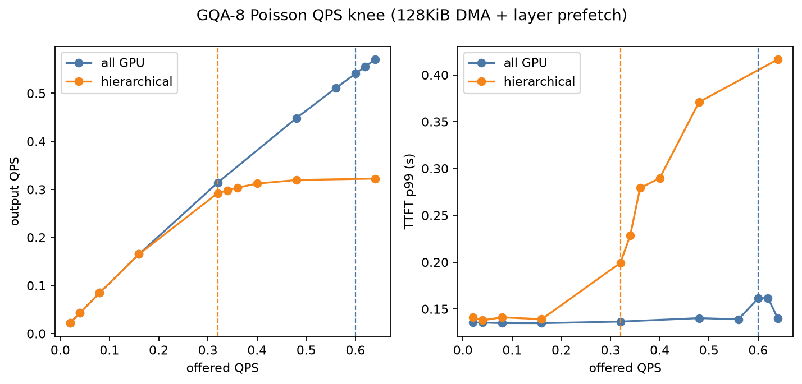
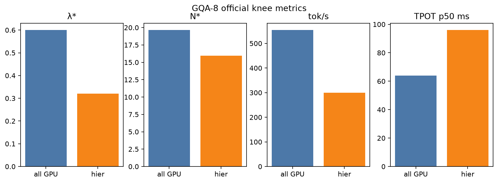
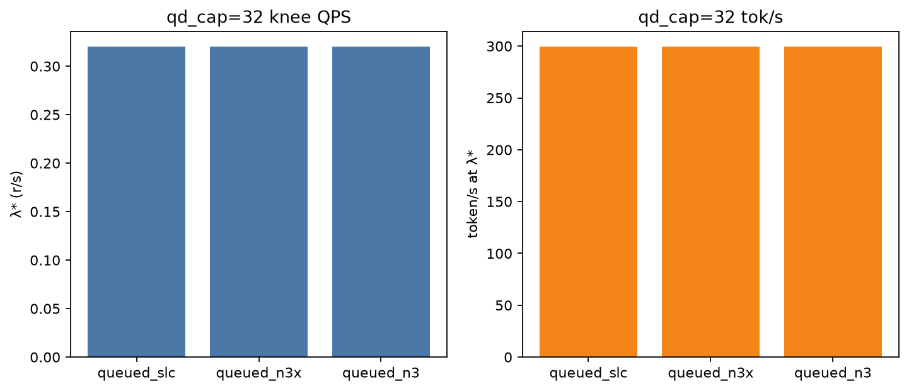
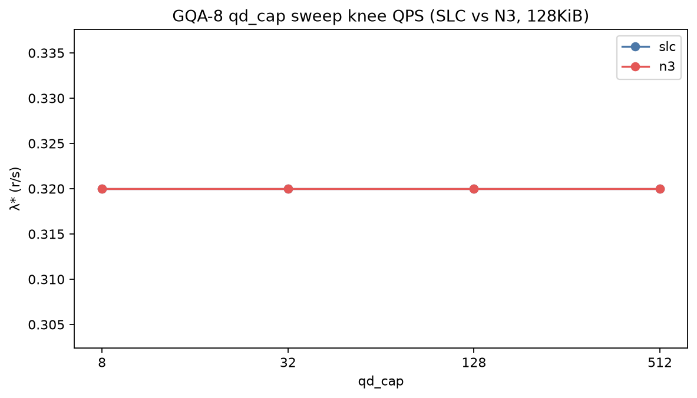

# GQA KV Working-Set Offload Test Report / GQA KV 工作集分层测试报告

Date / 日期: 2026-09-04  
Simulator / 模拟器: TokenSim (roofline backend, Python 3.11)  
Primary arrival / 主测试到达: `--distribution poisson`, per-config **QPS knee**  
Companion MHA report / MHA 对照: [`kv_working_set_test_report.md`](kv_working_set_test_report.md)

This report is **independent** of the MHA-64 run. Same cluster, workload, media, and Poisson-knee recipe; the only model change is **`LLaMa2-70B-GQA`** (`Grouped_Num=8`). Real Llama-2-70B uses 8 KV heads, so KV is **1/8** of the MHA-64 companion (~2.50 → **0.3125 MiB/token**). Working-set I/O and HBM occupancy scale with that byte size. Decode **compute** in TransformerRoofline is still the MHA-shaped roofline (all-GPU TPOT stays ~64 ms); GQA here is a KV-volume experiment.

本报告与 MHA 报告独立。同一套 1×H200、泊松膝点、128KiB DMA、层间预取；只把 Roofline 模型换成 **GQA-8**。KV 为 MHA 的 **1/8**。Compute roofline 未按 GQA 缩 FLOPs，全 GPU TPOT 仍约 64 ms；收益来自 KV 体积、占用和分层 I/O。

KV **FP8 quantization** and **sparse cold-set** policies (StreamingLLM / SnapKV / H2O) are **not implemented** in this simulator. §10 scales the measured GQA I/O to those knobs; they were not run.

KV FP8 与稀疏淘汰本轮未跑，第 10 节用实测 GQA 流量做外推。

---

## 1. Hardware and model / 硬件与模型

This run uses **GQA-8** (~**0.3125 MiB/token**, 8 KV heads). The MHA-64 companion is ~2.50 MiB/token. I/O and occupancy here are the production Llama-2-70B KV shape, not the MHA heavy-load bound.

本期是 **GQA-8**（约 **0.3125 MiB/token**）。MHA 对照是 2.50 MiB/token。本报告代表真实 LLaMA-2-70B 的 KV 体积，不是 MHA 极端重载。

| Item / 项 | Value / 值 |
| --- | ---: |
| Cluster | `data/clusters/1_h200/h1.json` — 1 hybrid worker, **H200** |
| HBM | **141 GiB**, 1 card |
| Compute / BW | 1979 TFLOPS, **4.8 TB/s** HBM (Roofline `BW_TBs`; not `hbm.read_bw_gbps`) |
| Parallelism | TP=PP=DP=1 |
| Model JSON | `data/psla/llama-70b-gqa.json` → **`LLaMa2-70B-GQA`** (GQA-8, 80 layers) |
| Workload | 100 synthetic requests, prefill **512±32**, decode length **= prefill** (not a second draw), `block_size=16` |
| Batching | `paged-attn` |
| Arrival | Poisson; `λ*` search from 0.02 r/s, double then binary, resolution 0.02 |

Working-set media is the same file as the MHA official Case 2 (`data/kv_working_set/hier_30_50_20.json`):

| Tier | Fraction | Latency | Bandwidth | Queue | Used? |
| --- | ---: | ---: | ---: | --- | --- |
| GPU / HBM | 0.3 (newest) | — | **4.8 TB/s** (Roofline internal) | — | TransformerRoofline H200 `BW_TBs`; not working-set I/O |
| DRAM | 0.5 | 2 µs | 50 GB/s | coalesced | Yes |
| SSD | 0.2 (oldest) | 13 µs | **14 GB/s** | **128KiB**, `qd_cap=32` | Yes |
| Host PCIe | — | — | 50 GB/s | spill contention | Trim writes |

Decode step:

```text
T_fetch = T(dram) + T(ssd)          # full cold set [0, gpu_start)
T_step  = T_fetch/N + max(T_roofline, T_fetch*(N-1)/N)   # N=80
```

After prefill/recompute:

```text
T_spill = max(T_dram_wr, T_ssd_wr, (dram_bytes+ssd_bytes)/pcie_bw)
```

Official Case 2 Σ spill ≈ **0.225 s** across 100 prompts (~2.3 ms each), about **1/8** of the MHA companion’s 1.80 s.

---

## 2. Minimum GPU memory for 70B GQA / 70B GQA 最小显存

TokenSim `CacheConfig` (TP=1, FP16-style `×2` on the param estimate):

```text
W = (12 × Nlayer × Dmodel² + 50000 × Dmodel) × 2
  = 120.763 GiB

size_per_token = kv_heads × head_dim × 2 × 2 × Nlayer
               = 8 × 128 × 2 × 2 × 80
               = 0.3125 MiB / token     # MHA-64 was 2.50 MiB
```

| Meaning / 含义 | Memory / 显存 | Note / 说明 |
| --- | --- | --- |
| **Minimum to load weights** | **> 120.763 GiB** | Same weights as MHA; GQA only shrinks KV |
| + one request S=1024 | **121.07 GiB** | One full GQA request |
| **H200 leftover for KV** | **20.237 GiB** | ≈ **4144** blocks of 16 (watermark 1% → 41; avail **4103**) |
| Concurrent S=1024 at `gpu_frac=1` | **64** (Peak B) | Prefill Peak B at S=512 is **128** |
| **Host DRAM / SSD** | derived, **not capped** | Official 30/50/20 Peak B: **32.03 GiB + 12.83 GiB** (§8) |

H200 leftover is the same 20.237 GiB as MHA, but each token is 1/8 the bytes, so Peak B is **8×** (8 → 64). Under Poisson at the all-GPU knee (`λ*=0.60`) Little `N*` is **19.64** with **0** preemptions. DRAM/SSD GiB are occupancy after decode trim, not a simulated hard limit. Peak B host size is almost the same as MHA because occupancy concurrency also scales ~8×.

---

## 3. Test cases / 测试用例

`λ*` is **not a target QPS**. It is searched: Poisson arrival starts at 0.02 r/s, doubles, then binary-searches the **largest stable offered rate** for that config (`output_qps / λ ≥ 0.90` and `ttft_p99 ≤ 3 × ttft_p99(λ=0.02)`). `N*` is then Little's law at that knee using **offered** `λ*` (not `output_qps`): `N* = λ* × request_time.p50`. It is an **estimate** of average in-flight requests (queue + prefill + decode), not a scheduler count and not Peak B. Scripts share `TokenSim/kv_working_set/knee.py`.

`λ*` **不是预期到达率**，是扫出来的：该配置还能稳住的最大到达率。`N*` 是 Little 估计（到达率 × 中位停留时间），不是调度器数出来的并发，也不是 HBM 上限 Peak B。

`gqa_working_set_test_report/ssd_qos_eval/run_eval.py` is the **pipeline**: Case 1, Case 2, QoS (§9), and `fig_qps_knee.png` / `fig_ttft_tpot.png`. Occupancy (§8) is a separate script. It does **not** overwrite the MHA artifacts under `kv_working_set_test_report/`.

该脚本是 Case 1、Case 2 与 §9 的总控，产物写在 `gqa_working_set_test_report/`，不覆盖 MHA 报告。

```bash
python3.11 gqa_working_set_test_report/ssd_qos_eval/run_eval.py
```

To replay one reported knee without the search / 只复现已报膝点：

### Case 1 (official) — Poisson knee, all GPU

No working-set config. Result dir `gqa_working_set_test_report/all_gpu_poisson`. Reported `λ* = 0.60`.

```bash
python3.11 benchmark.py --batching paged-attn --qps 0.60 --distribution poisson \
  --cluster data/clusters/1_h200/h1.json --model data/psla/llama-70b-gqa.json \
  --verbose none --results_path gqa_working_set_test_report/all_gpu_poisson
```

### Case 2 (official) — Poisson knee, hierarchical 30/50/20

`--kv_working_set_config data/kv_working_set/hier_30_50_20.json`. Result dir `gqa_working_set_test_report/hier_poisson`. Reported `λ* = 0.32`.

```bash
python3.11 benchmark.py --batching paged-attn --qps 0.32 --distribution poisson \
  --cluster data/clusters/1_h200/h1.json --model data/psla/llama-70b-gqa.json \
  --verbose none --results_path gqa_working_set_test_report/hier_poisson \
  --kv_working_set_config data/kv_working_set/hier_30_50_20.json
```

---

## 4. Metric definitions / 指标定义

| Report name | Meaning |
| --- | --- |
| **λ\*** | Swept, not a target: largest **stable** offered Poisson QPS for this config. / 扫出来的膝点，不是预期 QPS：该配置还能稳住的最大到达率 |
| **N\*** | Little **estimate** at λ\*: `offered_qps × request_time.p50` (queue + prefill + decode). Not a scheduler count; uses offered rate even when goodput is below 1. A float (e.g. 15.96) is an average. / Little 估计，不是数出来的并发 |
| **Peak B** | HBM occupancy **ceiling** at S=1024 after watermark: `floor(4103 / ceil(floor(1024×gpu_frac)/16))`. How many decode windows fit, not how many are in flight. / 显存装得下多少条，不是 N* |
| **Peak DRAM / SSD** | Derived host occupancy at Peak B, S=1024. Simulator does **not** cap DRAM or SSD. |
| **TTFT** | `prefill_time` (queue wait + prefill + trim spill) |
| **TPOT** | `decode_time` **p50**: median across requests of each request's **mean** inter-token interval. Tables labeled TPOT p50. / 每条请求先对 decode 步取均值，再对 100 条取中位数 |
| **System token/s** | JSON `output_token_ps` at `λ*` |
| **Σ fetch** | Unoverlapped DRAM+SSD read time (stats); wall clock uses layer-prefetch |

Both arms process **102,452** tokens (51,226 prefill + 51,226 decode). Decode length equals prefill length on every request, so the two sums match.

两臂都是 102,452 token；每条请求的 decode 长度等于 prefill，所以两边和相同。

---

## 5. Official results (Poisson knee, 128KiB + layer prefetch) / 正式结果

| Metric | Case 1 all GPU | Case 2 hierarchical SLC | Ratio (hier / GPU) |
| --- | ---: | ---: | ---: |
| **λ\*** | **0.60** r/s | **0.32** r/s | **0.53×** |
| **N\*** (Little) | **19.64** | **15.96** | 0.81× |
| Peak B (S=1024) | 64 | 205 | 3.20× |
| TTFT p50 | **0.102 s** | **0.120 s** | 1.18× |
| TTFT p99 | **0.161 s** | **0.199 s** | 1.24× |
| TPOT p50 | **63.9 ms** | **96.0 ms** | **1.50×** |
| TPOT p99 | 65.3 ms | 144.0 ms | 2.20× |
| System token/s | **554.2** | **299.3** | **0.54×** |
| Achieved r/s | 0.541 | 0.292 | 0.54× |
| Preemptions | **0** | **0** | — |
| Σ fetch (unoverlapped) | 0 | 292 s | stats, not wall |
| Σ spill | 0 | **0.225 s** | ~2.3 ms / prompt |
| SSD IOs (128KiB) | 0 | **1.975e7** | 2.59 TB read; count in §7 |

All-GPU fails at 0.62 r/s on **goodput** (`output_qps/λ = 0.90` borderline fails at 0.62); TTFT p99 stays ~0.16 s. Hierarchical fails at 0.34 r/s on **goodput** (`0.298/0.34 = 0.88`); TTFT p99 is 0.23 s, still under the 3× light-load cap. Saturated output QPS is ~0.32. `N*` (16) is far below Peak B (205): I/O saturates before HBM fills.

全 GPU 在 0.62 r/s 因 goodput 不够而不稳，TTFT 仍短。分层在 0.34 r/s 也是 goodput 不够（不是 TTFT 崩），吞吐封顶在约 0.32 r/s。`N*` 远小于 Peak B，仍是 I/O 先饱和。

Case 2 host occupancy is derived, not capped: Peak B **32.03 GiB DRAM + 12.83 GiB SSD** (≈ MHA, not 1/8). The N* row in §8 (**2.49 + 1.00 GiB**) is an **upper bound** (Little N* × full S=1024 decode window). Offered-rate N*=15.96; completed-rate Little would be ~14.6 because goodput is 0.91.

Case 2 host 占用未做硬上限：Peak B **32.03 GiB DRAM + 12.83 GiB SSD**（与 MHA 几乎相同，不是 1/8）。§8 的 N* 行是上界，不是测得的水位。

4K command-amplification control (same 30/50/20, `io_size=4096`): **λ\* = 0.26**, 240.1 tok/s, TPOT p50 119.5 ms. 128KiB still wins, but the 4K penalty is mild (0.26 vs 0.32) compared with MHA (0.02 vs 0.04).





### vs MHA companion (same recipe, not a second experiment)

| Arm | MHA-64 λ* | GQA-8 λ* | MHA tok/s | GQA tok/s |
| --- | ---: | ---: | ---: | ---: |
| All GPU | 0.12 | **0.60** (5.0×) | 128.4 | **554.2** (4.3×) |
| Hierarchical 30/50/20 | 0.04 | **0.32** (8.0×) | 39.9 | **299.3** (7.5×) |

All-GPU TPOT is **63.2 ms vs 63.9 ms**: compute did not shrink. The all-GPU QPS jump is occupancy (Peak B 8 → 64). The hierarchical jump is occupancy **plus** 1/8 fetch bytes (TPOT 311 ms → 96 ms).

全 GPU TPOT 几乎不变，λ* 升高是因为 KV 占用从 Peak B=8 变成 64。分层还叠加了 1/8 的冷 KV 流量。

---

## 6. How to read token/s / 如何读 token/s

Use JSON **`output_token_ps` at λ\*** for cluster throughput. Light-load 0.02 r/s is ~22 tok/s on both arms (arrival-limited). The knee is where the server stops keeping up.

集群吞吐看膝点上的 **`output_token_ps`**。轻载 0.02 r/s 两臂都约 22 tok/s。

Per-request generation speed is `1000 / TPOT_ms` (15.6 vs 10.4 tok/s at the knees).

---

## 7. Per-step cold-set fetch and overlap / 每步读冷 KV 与重叠

Full attention still rereads `[0, gpu_start)` every decode token. GQA only shrinks **bytes per token**, not the token count. Measured `kv_ws_ssd_read_tokens = 7,895,265` (same as MHA) and `0.3125 MiB / 128 KiB = 2.5` IOs/token:

```text
IOs = 100 req × ~512 decode steps × ~154 SSD tokens/step × 2.5 IOs/token
    ≈ 1.975e7
    = 7,895,265 tokens × 2.5 IOs/token
```

At 128KiB that is **2.59 TB** (decimal; 2.35 TiB) of SSD read for 100 requests (MHA companion **20.70 TB**). Still no sparsity: every historical SSD token is read on every step.

GQA 把每 token 字节缩到 1/8，token 次数不变，所以 SSD 读从 **20.70 TB** 降到 **2.59 TB**。仍然是每步全量回读冷 KV。

Stats record unoverlapped fetch (292 s at the hierarchical knee). Wall-clock TPOT is 96 ms, not seconds. Spill after prompt trim is **~2.3 ms** per request.

---

## 8. gpu_frac occupancy sweep / 占用扫描

Same Poisson-knee search at each `gpu_frac` from 100% to 10% (step 5%). Off-GPU remainder DRAM:SSD = 5:2. Media matches Case 2. Prefill Peak B at S=512 stays **128**.

Decode 占用随 `gpu_frac` 变；每个点自己扫 `λ*`。Prefill Peak B 为 128。

| gpu_frac | Peak B | λ* | N* | token/s | TPOT p50 | TTFT p50 | TTFT p99 | preempt |
| ---: | ---: | ---: | ---: | ---: | ---: | ---: | ---: | ---: |
| 100% | 64 | **0.60** | 19.64 | **554.2** | 63.9 ms | 0.10 s | 0.16 s | 0 |
| 95% | 67 | 0.60 | 19.69 | 554.2 | 64.0 ms | 0.11 s | 0.15 s | 0 |
| 90% | 70 | 0.60 | 19.72 | 554.1 | 64.1 ms | 0.10 s | 0.14 s | 0 |
| 85% | 74 | 0.60 | 19.75 | 554.0 | 64.3 ms | 0.10 s | 0.15 s | 0 |
| 80% | 78 | 0.60 | 19.79 | 553.8 | 64.4 ms | 0.11 s | 0.14 s | 0 |
| 75% | 85 | 0.60 | 19.83 | 553.7 | 64.5 ms | 0.11 s | 0.14 s | 0 |
| 70% | 91 | 0.58 | 19.43 | 536.1 | 65.0 ms | 0.10 s | 0.18 s | 0 |
| 65% | 97 | 0.54 | 19.05 | 500.7 | 69.0 ms | 0.11 s | 0.15 s | 0 |
| 60% | 105 | 0.50 | 18.94 | 463.6 | 74.5 ms | 0.11 s | 0.17 s | 0 |
| 55% | 113 | 0.46 | 18.42 | 427.1 | 77.5 ms | 0.12 s | 0.17 s | 0 |
| 50% | 128 | 0.42 | 17.38 | 392.9 | 80.0 ms | 0.12 s | 0.18 s | 0 |
| 45% | 141 | 0.38 | 15.64 | 361.0 | 79.4 ms | 0.11 s | 0.17 s | 0 |
| 40% | 157 | 0.36 | 16.04 | 339.1 | 85.9 ms | 0.11 s | 0.19 s | 0 |
| 35% | 178 | 0.34 | 16.23 | 318.4 | 92.0 ms | 0.12 s | 0.18 s | 0 |
| **30%** | **205** | **0.32** | **15.96** | **299.3** | **96.0 ms** | **0.12 s** | **0.20 s** | 0 |
| 25% | 256 | 0.30 | 15.39 | 281.4 | 98.5 ms | 0.11 s | 0.22 s | 0 |
| 20% | 315 | 0.28 | 14.44 | 264.7 | 98.9 ms | 0.12 s | 0.22 s | 0 |
| 15% | 410 | 0.26 | 13.06 | 248.8 | 96.5 ms | 0.12 s | 0.20 s | 0 |
| 10% | 586 | 0.26 | 15.99 | 240.6 | 118.1 ms | 0.12 s | 0.26 s | 0 |

Down to **75%** the knee matches all-GPU (`λ*=0.60`, ~554 tok/s). Then `λ*` and token/s fall smoothly as the cold set grows. At 10% GQA still holds `λ*=0.26` / **240.6** tok/s — the MHA companion collapsed to the light-load floor (`λ*=0.02`) at 20%. There is **no TTFT p50 cliff**. Small TPOT wiggles (50% → 45%, 20% → 15%) are `λ*` step-downs at each row’s own knee, not a faster decode at lower HBM. 70% → 65% and 60% → 55% also step `λ*` down, but TPOT still rises.

75% 以上与全 GPU 膝点相同。10% 仍能稳住 0.26 r/s；MHA 在 20% 已退回轻载 0.02。没有 TTFT p50 悬崖。

### DRAM / SSD capacity / DRAM 与 SSD 容量

The simulator **does not enforce** DRAM or SSD capacity (only GPU HBM blocks are finite). **极限容量** below is host occupancy **if leftover HBM is packed to Peak B** at decode `S=1024` after trim. That is the size to provision. `λ*` is swept (not a target). `N*` host GiB is **not** the provision number: it is Little N* × a full decode window, an **upper bound**.

模拟器不限制 DRAM/SSD。**极限容量**按 Peak B 配。`N*` 行不是测得的水位，也不是配置目标。

```text
tokens_gpu  = floor(S × gpu_frac)                 # official 30% → 307
tokens_dram = floor(S × dram_frac)                 # official 50% → 512
tokens_ssd  = S − tokens_gpu − tokens_dram         # official 20% → 205
GiB         = PeakB × tokens_tier × size_per_token / 1024   # MiB → GiB; 1 GiB = 1024³
```

Worked example, official 30/50/20:

```text
MHA: size=2.50 MiB, Peak B=25
  DRAM = 25 × 512 × 2.50 / 1024 = 31.25 GiB
  SSD  = 25 × 205 × 2.50 / 1024 = 12.51 GiB

GQA: size=0.3125 MiB, Peak B=205
  DRAM = 205 × 512 × 0.3125 / 1024 = 32.03 GiB
  SSD  = 205 × 205 × 0.3125 / 1024 = 12.83 GiB
```

Prefill keeps the full context on GPU, so these GiB are **decode** only.

#### Peak B 极限容量 (provision this)

| | MHA-64 | GQA-8 | Note / 说明 |
| --- | ---: | ---: | --- |
| `size_per_token` | 2.50 MiB | 0.3125 MiB | GQA = 1/8 |
| HBM leftover | 20.237 GiB | 20.237 GiB | Same weights; GQA only shrinks KV |
| Avail GPU blocks | 513 | 4103 | 1% watermark |
| Official split tokens | 307 / **512** / **205** | same | GPU / DRAM / SSD at S=1024 |
| Peak B (30%) | **25** | **205** | `avail / ceil(307/16)` |
| **DRAM 极限** | **31.25 GiB** | **32.03 GiB** | Peak B × 512 tokens |
| **SSD 极限** | **12.51 GiB** | **12.83 GiB** | Peak B × 205 tokens |
| **建议配置** | **32 GiB DRAM + 13 GiB SSD** | **32 GiB DRAM + 13 GiB SSD** | Same host kit |

GQA Peak B is ~8× (25 → 205) while bytes/token are 1/8, so **host 极限几乎相同**. Do not divide the MHA GiB by 8 to size GQA DRAM/SSD.

GQA 每 token 是 1/8，但 HBM 能装的条数大约也是 8 倍，host **极限对消**。不要把 MHA 的 31+13 GiB 除以 8 给 GQA 配盘。

#### 不是极限：膝点 N* 上界与测试堆积

`N*` is Little's law with **offered** `λ*` (`N* = λ* × request_time.p50`). The GiB row multiplies that N* by a **full** decode window (S=1024, 512/205 tokens). Prefill uses no DRAM/SSD; mid-decode S is shorter. So this is an **upper bound**, not a measured watermark. GQA Case 2 goodput is 0.91, so completed-rate Little would be ~14.6 instead of 15.96. 100 live is a hypothetical pile-up, not Peak B.

`N*` 是 Little 估计（用到达率，不是完成率）。再乘满窗 S=1024 得到 host GiB，是**上界**：prefill 不占 DRAM/SSD，decode 中途更短。配容量用上一张 Peak B 表。

| Basis / 口径 | MHA DRAM | MHA SSD | GQA DRAM | GQA SSD |
| --- | ---: | ---: | ---: | ---: |
| Per request S=1024 | 1.25 GiB | 0.50 GiB | 0.156 GiB | 0.063 GiB |
| **Peak B 极限 (上表)** | **31.25** | **12.51** | **32.03** | **12.83** |
| N* upper bound (S=1024) | 7.96 (N*=6.37) | 3.19 | 2.49 (N*=15.96) | 1.00 |
| 100 live S=1024 | 125.00 | 50.05 | 15.63 | 6.26 |

At this **fixed-concurrency** view (N* or 100 live), GQA host occupancy **is** ~1/8 of MHA. That is not the HBM-packed ceiling.

按固定并发看，GQA 才是 MHA 的约 1/8（并发不再被 Peak B 放大）。

#### gpu_frac 扫描下的极限

Off-GPU remainder DRAM:SSD = 5:2. Pushing `gpu_frac` down raises Peak B, so host 极限跟着涨。Full rows: [`gqa_gpu_frac_inference_speed.md`](gqa_gpu_frac_inference_speed.md) §7 and [`gpu_frac_inference_speed.md`](gpu_frac_inference_speed.md) §7. Companion MHA report: [`kv_working_set_test_report.md`](kv_working_set_test_report.md).

| gpu_frac | MHA Peak B | MHA DRAM | MHA SSD | GQA Peak B | GQA DRAM | GQA SSD |
| ---: | ---: | ---: | ---: | ---: | ---: | ---: |
| 100% | 8 | 0 | 0 | 64 | 0 | 0 |
| 50% | 16 | 14.26 GiB | 5.74 GiB | 128 | 14.26 GiB | 5.74 GiB |
| **30%** | **25** | **31.25 GiB** | **12.51 GiB** | **205** | **32.03 GiB** | **12.83 GiB** |
| 10% | 73 | 117.27 GiB | 47.05 GiB | 586 | 117.67 GiB | 47.21 GiB |

At 10% both models need ~**118 GiB DRAM + 47 GiB SSD** if HBM is packed. Official Case 2 stays **32 + 13**.

10% 两边极限都约 118+47 GiB。官方 Case 2 配 **32 + 13** 即可。

Figures: [`gqa_gpu_frac_inference_speed.md`](gqa_gpu_frac_inference_speed.md).

```bash
python3.11 gqa_working_set_test_report/gpu_frac_sweep/run_sweep.py
python3.11 gqa_working_set_test_report/gpu_frac_sweep/plot_gpu_frac.py
```

---

## 9. SSD QoS / SSD 评估

Same Poisson-knee recipe, `gpu_frac=0.3`. Official granularity is **128KiB**.

128KiB sequential DMA sits on the bandwidth roof, so SLC / MLC / N3 and `qd_cap` 8–512 **tie at λ\*=0.32 / 299 tok/s**. Drive latency does not set the knee. 4K is **λ\*=0.26** / 240 tok/s.

128KiB 仍打在带宽屋顶上，盘速与 `qd_cap` 拉不开正式膝点。

| Arm | io_size | λ* | token/s | TPOT p50 | TTFT p99 |
| --- | ---: | ---: | ---: | ---: | ---: |
| queued SLC 128KiB (Case 2) | 131072 | **0.32** | 299.3 | 96.0 ms | 0.20 s |
| queued MLC / N3 128KiB | 131072 | 0.32 | 299.3 | 96.0 ms | 0.20 s |
| coalesced SLC / MLC / N3 | 0 | 0.32 | 297.8–298.9 | 96.6–98.8 ms | 0.19–0.21 s |
| queued SLC **4K** | 4096 | **0.26** | 240.1 | 119.5 ms | 0.25 s |
| `qd_cap` 8 / 128 / 512 SLC or N3 | 131072 | 0.32 | 299.3 | 96.0 ms | 0.20 s |





Same pipeline as §3:

```bash
python3.11 gqa_working_set_test_report/ssd_qos_eval/run_eval.py
```

---

## 10. Not run: FP8 quantization and sparse cold-set / 未跑：FP8 与稀疏

These knobs are **not in the working-set simulator**. Numbers below are scalings of the measured GQA Case 2 SSD read (**2.59 TB** decimal, **1.975e7** 128KiB IOs). They are not new simulation points.

这两项模拟器里还没有。下面是按 GQA Case 2 实测流量做的比例外推，不是新实验。

### KV quantization (FP8)

FP16 → FP8 is another **2×** on KV bytes (4-bit KV would be ~4× vs FP16). Applied on top of GQA-8:

| KV format | Bytes/token (GQA-8) | Case 2 SSD read (100 req) |
| --- | ---: | ---: |
| FP16 (this report) | 0.3125 MiB | **2.59 TB** (measured) |
| FP8 (not run) | ~0.156 MiB | ~**1.3 TB** |
| 4-bit (not run) | ~0.078 MiB | ~**0.65 TB** |

Peak B would rise another 2–4× if `CacheConfig.size_per_token` shrank. Fetch/spill latency would drop with the bandwidth term. A real FP8 run also needs a roofline dtype for compute; this report does not claim that.

### Sparse / eviction (StreamingLLM, SnapKV, H2O)

The current fetch is **full-history cold-set reread** every decode step: bytes scale as `O(S)` per token and `O(S²)` per request. StreamingLLM (sink + window), SnapKV, and H2O keep a **bounded** important set of size `k ≪ S`. Then per-step I/O is `O(k)` and the 2.59 TB figure no longer applies.

当前每步回读全部冷 KV，是自回归平方流量。稀疏/淘汰只保留重要局部后，才能打破这个回读。本轮未实现。

---

## 11. Next-phase (not run) / 下阶段

- **Prefill-Decode split** on 1×H200 vs multi-node, same GQA KV.
- **Implement** FP8 `size_per_token` and a sparse working-set policy, then rerun this knee recipe.
- Do **not** change `data/psla/llama-70b.json`; GQA stays on `llama-70b-gqa.json`.

---

## 12. Reproduce / 复现

Python 3.11, repo root. MHA artifacts stay under `kv_working_set_test_report/`.

| Artifact | Path |
| --- | --- |
| All-GPU knee JSON | [`gqa_working_set_test_report/all_gpu_poisson.json`](gqa_working_set_test_report/all_gpu_poisson.json) |
| Hierarchical knee JSON | [`gqa_working_set_test_report/hier_poisson.json`](gqa_working_set_test_report/hier_poisson.json) |
| SSD QoS summary | [`gqa_working_set_test_report/ssd_qos_eval/summary.json`](gqa_working_set_test_report/ssd_qos_eval/summary.json) |
| gpu_frac summary | [`gqa_working_set_test_report/gpu_frac_sweep/summary.json`](gqa_working_set_test_report/gpu_frac_sweep/summary.json) |
| gpu_frac MD | [`gqa_gpu_frac_inference_speed.md`](gqa_gpu_frac_inference_speed.md) |
| Official PNG | [`fig_qps_knee.png`](gqa_working_set_test_report/fig_qps_knee.png), [`fig_ttft_tpot.png`](gqa_working_set_test_report/fig_ttft_tpot.png) |
| MHA companion | [`kv_working_set_test_report.md`](kv_working_set_test_report.md) |
| Design | [`offload_sim.md`](offload_sim.md) |
