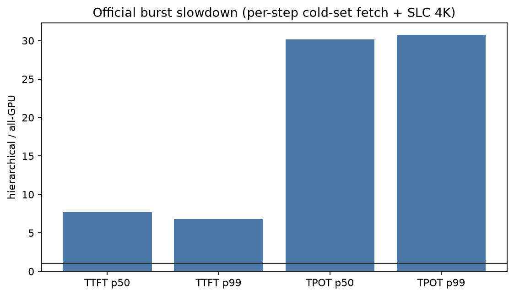
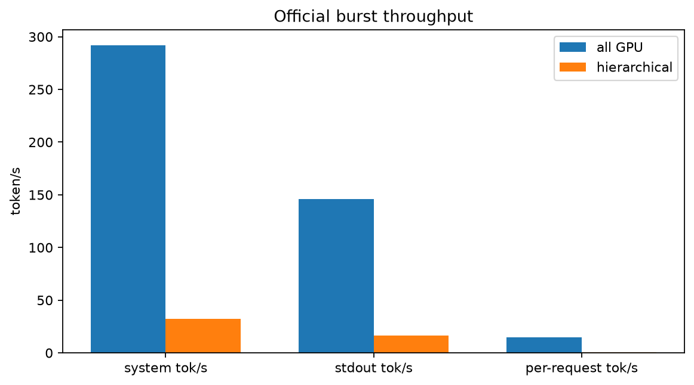

# KV Working-Set Offload Test Report / KV 工作集分层测试报告

Date / 日期: 2026-09-04  
Simulator / 模拟器: TokenSim (roofline backend, Python 3.11)  
Primary arrival / 主测试到达: `--distribution burst`

This report documents the 70B / H200 comparison of **all-GPU decode** vs **hierarchical KV working-set fetch** (GPU 30% / DRAM 50% / SSD 20%, N3X-SLC 4K / `qd_cap=32`). Burst is the official case so `--qps` does not set inter-arrival time. Fetch is **per-step cold-set read**: every decode token pays DRAM/SSD I/O for `[0, gpu_start)`, because full attention needs the whole history and GPU only keeps the newest `gpu_frac`. Prefill / recompute stay on GPU (no fetch, full occupancy); after those steps GPU blocks are trimmed to `gpu_frac` (spill writes are not charged).

本报告记录 LLaMa2-70B + 1×H200 上 **全 GPU decode** 与 **分层 KV 工作集读取**（GPU 30% / DRAM 50% / SSD 20%，N3X-SLC 4K / `qd_cap=32`）的对照。正式用例使用 **burst**。Fetch 为 **每步读冷 KV**：全注意力每步都要碰全部历史，GPU 只留最新 `gpu_frac`，因此 `[0, gpu_start)` 每个 decode token 都从 DRAM/SSD 读。Prefill / 重算在 GPU 上完成（不加 fetch、占位按全量）；结束后把 GPU 块裁到 `gpu_frac`（写回不计）。

---

## 1. Hardware and model / 硬件与模型

| Item / 项 | Value / 值 |
| --- | --- |
| Cluster | `data/clusters/1_h200/h1.json` — 1 hybrid worker, **H200** |
| HBM | **141 GiB**, 1 card (`MM_Card_Num=1`, `Capacity=141`) |
| Compute / BW | 1979 TFLOPS, 4.8 TB/s HBM |
| Parallelism | TP=PP=DP=1 |
| Model JSON | `data/psla/llama-70b.json` → roofline name **`LLaMa2-70B`** |
| Architecture | 80 layers, `Dmodel=8192`, 64 heads (MHA, not GQA), `Max_Token=4096` |
| Workload | 100 synthetic requests, prefill **512±32**, decode **512±32**, `block_size=16` |
| Batching | `paged-attn` |

Working-set media (`data/kv_working_set/hier_30_50_20.json` = `hier_n3x_slc.json`):

| Tier | Fraction | Fixed latency | Bandwidth | Queue | Used in v1 latency? |
| --- | ---: | ---: | ---: | --- | --- |
| GPU / HBM | 0.3 (newest) | 0 µs (metadata) | 2000 GB/s | — | No — still roofline |
| DRAM | 0.5 | **2 µs** (PCIe DMA) | **50 GB/s** | coalesced (`io_size=0`) | Yes |
| SSD | 0.2 (oldest) | **13 µs** 4K@QD1 (N3X-SLC) | **14 GB/s** | 4K, `qd_cap=32` | Yes |

Other shipped SSDs (same 30/50/20, DRAM unchanged): `hier_n3x.json` MLC **18 µs**, `hier_n3.json` N3 **50 µs**. All three use 14 GB/s. See §9.

v1 decode step: `T_step = T_roofline + T(dram) + T(ssd)` for the **whole** cold set `[0, gpu_start)` every decode token. Prefill / recompute do **not** add fetch and charge **full** GPU occupancy; after those steps the engine trims to `floor(S * gpu_frac)` HBM blocks. SSD with `io_size_bytes=4096` uses `T = max(n_ios × L(QD) / QD, bytes / BW)`.

v1 decode：每步读完整冷 KV。Prefill / 重算不加 fetch，占位按全量 GPU；结束后裁到 `gpu_frac`。SSD 按 4K 命令排队。

---

## 2. Minimum GPU memory for 70B / 70B 最小显存

TokenSim `CacheConfig` (TP=1, FP16-style `×2` on the param estimate):

```text
W = (12 × Nlayer × Dmodel² + 50000 × Dmodel) × 2
  = (12 × 80 × 8192² + 50000 × 8192) × 2
  = 129,668,218,880 B  =  120.763 GiB

size_per_token = n_kv_heads × head_dim × 2(K/V) × 2(bytes) × Nlayer
               = 64 × 128 × 2 × 2 × 80
               = 2,621,440 B  =  2.50 MiB / token
```

GPU bytes = `MM_Card_Num × Capacity × 2^30`. If `gpu_bytes <= W`, the engine raises `ConfigurationError` and **never starts**.

GPU 字节 = `MM_Card_Num × Capacity × 2^30`。若 `gpu_bytes <= W`，直接 `ConfigurationError`，**仿真起不来**。

| Meaning / 含义 | Memory / 显存 | Note / 说明 |
| --- | --- | --- |
| **Minimum to load weights / 仅能装权重** | **> 120.763 GiB** | Strictly greater than `W`. A100-40G / A100-80G **cannot** run this 70B config at TP=1 |
| + 1 token KV | 120.765 GiB | Smallest runnable KV |
| + one request S=512 (prefill done) | 122.01 GiB | Typical prompt resident |
| + one request S=1024 (prefill+decode ~512+512) | **123.26 GiB** | One full request in this test |
| + one request S=4096 (`Max_Token`) | 130.76 GiB | Still fits 141 GiB |
| **This H200 leftover for KV** | **141 − 120.763 = 20.237 GiB** | ≈ **8288 tokens** ≈ **518** blocks of 16 |
| Concurrent S=1024 requests in leftover (`gpu_frac=1`) | **8** | 100 burst requests ⇒ GPU cache overflow ⇒ preempt/recompute |

**Practical minimum for this test (one in-flight 70B request ~1k context):** about **123 GiB** HBM. **Minimum for the process to start:** just over **120.76 GiB**. H200 141 GiB is enough for weights and a short KV window, **not** for 100 concurrent full contexts. All-GPU therefore preempts 73 times; hierarchical `gpu_frac=0.3` preempts 26 times (§5). Prefill occupancy is full-context, so hierarchical prefill concurrency matches all-GPU (~16 at S=512); decode then trims to 30% HBM.

对本测试「同时保住一条 ~1k 上下文的 70B 请求」，大约需要 **123 GiB**。进程能启动的下限是刚超过 **120.76 GiB**。H200 141 GiB 装得下权重和一小段 KV，**装不下** 100 条并发满上下文。全 GPU 抢占 73 次；分层 `gpu_frac=0.3` 抢占 26 次（§5）。Prefill 占位按全量，并发与全 GPU 相同；decode 再裁到 30%。

TP>1 would split `W` across ranks; these numbers are **TP=1**.

---

## 3. Test cases / 测试用例

`--qps` is required by `benchmark.py`. Under **burst**, `benchmark.py` sets `args.qps = inf` before `main()`, so arrival is not 10 r/s. Result files are named `result_inf.json`.

`--qps` 仍是 CLI 必填。**burst** 时会改成 `inf`，到达不再是 10 r/s。结果文件为 `result_inf.json`。

### Case 1 (official) — burst, all GPU / 正式用例：burst 全 GPU

All 100 requests arrive at simulated t=0. No working-set config. Decode latency is roofline only (KV treated as on HBM). Paged-attn still uses the 20 GiB KV budget.

100 个请求在 t=0 同时到达。不传工作集配置。Decode 只走 roofline（KV 当在 HBM）。Paged-attn 仍受 20 GiB KV 预算限制。

```bash
python3.11 ./benchmark.py --batching paged-attn --qps 10 \
  --distribution burst \
  --cluster ./data/clusters/1_h200/h1.json \
  --model ./data/psla/llama-70b.json \
  --verbose none \
  --results_path kv_working_set_test_report/all_gpu_burst
```

### Case 2 (official) — burst, hierarchical 30/50/20 / 正式用例：burst 分层

Same arrival and cluster. Every decode step reads DRAM/SSD for `[0, gpu_start)`. **Prefill charges full prompt KV on GPU; decode then trims to `gpu_frac=0.3`.** SSD is N3X-SLC 4K / `qd_cap=32` / 14 GB/s.

到达与集群相同。每个 decode 步读 `[0, gpu_start)`。**Prefill 按全量 prompt 占 GPU；decode 再裁到 `gpu_frac=0.3`。** SSD 为 N3X-SLC 4K。

```bash
python3.11 ./benchmark.py --batching paged-attn --qps 10 \
  --distribution burst \
  --cluster ./data/clusters/1_h200/h1.json \
  --model ./data/psla/llama-70b.json \
  --kv_working_set_config ./data/kv_working_set/hier_30_50_20.json \
  --verbose none \
  --results_path kv_working_set_test_report/hier_burst
```

---

## 4. Metric definitions / 指标定义

| Report name | TokenSim field | Meaning |
| --- | --- | --- |
| **TTFT** | `prefill_time` / `g_time.prefill_time` | Simulated time from last event (arrival for the first step) to first token. Includes **queue wait**. |
| **TPOT** | `decode_time` / `g_time.decode_time` | Mean inter-token interval of decode steps. |
| **System token/s** | JSON `output_token_ps` | `(Σ prefill_len + Σ decode_len) / duration` |
| **Stdout token/s** | printed `Thoughput ... token/s` | `Σ prefill_len / duration` only — **decode tokens omitted** |
| **Per-request decode tok/s** | `1 / TPOT` | One request’s generation rate; not cluster throughput |
| **Offered QPS** | CLI `--qps` (burst → `inf`) | Arrival rate |
| **Achieved r/s** | JSON `output_qps` | `request_count / duration` |

Both official arms processed **102,452** tokens (51,226 prefill + 51,226 decode).

两臂处理的 token 数相同，均为 **102,452**。

---

## 5. Official results (burst, per-step fetch + SLC 4K) / 正式结果

Re-run 2026-09-04 with current code: every decode token reads the cold set, prefill occupancy is full-context, decode occupancy is `gpu_frac=0.3`, N3X-SLC 4K / `qd_cap=32` / 14 GB/s. All-GPU is unchanged.

本次重跑：decode 每步读冷 KV；prefill 全量占位；decode 占用 30%；SLC 4K。全 GPU 臂与此前一致。

| Metric | Case 1 all GPU | Case 2 hierarchical (SLC) | Ratio (hier / GPU) |
| --- | ---: | ---: | ---: |
| TTFT p50 | **141.88 s** | 1091.44 s | **7.69×** |
| TTFT p99 | **316.77 s** | 2151.04 s | 6.79× |
| TTFT min | **0.871 s** | **0.871 s** | 1.00× |
| TTFT avg | **146.92 s** | 881.12 s | 6.00× |
| TPOT p50 | **69.0 ms** | **2080.1 ms** | **30.1×** |
| TPOT p99 | 131.3 ms | 4038.7 ms | 30.8× |
| TPOT avg | 82.0 ms | 2316.0 ms | 28.2× |
| Per-request 1/TPOT p50 | 14.48 tok/s | 0.48 tok/s | 0.033× |
| System token/s | **292.0** | **32.5** | **0.11×** |
| Stdout prefill token/s | 146.0 | 16.2 | 0.11× |
| Achieved r/s | 0.285 | 0.032 | 0.11× |
| Simulated duration | **350.91 s** | 3155.61 s | 8.99× |
| Preemptions / recomputes | 73 / 73 | **26 / 26** | 0.36× |
| Σ `kv_ws_fetch_latency` | 0 | **3011.65 s** | 95% of makespan |
| SSD 4K IOs | 0 | **5.05e9** | every decode step |

Hierarchical **system** token/s is 0.11× all-GPU because each decode token streams the off-GPU 70% from DRAM/SSD. Occupancy still cuts preemptions (73 → 26) and decode Peak B is still ~25, but the shared SSD queue turns extra concurrency into more I/O. TTFT p50 rises from 142 s to 1091 s: prefill itself has no fetch, but later prompts wait behind I/O-bound decode. TPOT p50 is 2.08 s vs 69 ms. Σ fetch is 3012 s of a 3156 s makespan.

分层系统 token/s 是全 GPU 的 **0.11×**：每个 decode token 都要把不在 GPU 的 70% 从 DRAM/SSD 读回来。占用限制仍减少抢占（73 → 26），但共享 SSD 队列让更大的 batch 变成更多 I/O。TTFT p50 从 142 s 升到 1091 s：prefill 本身不加 fetch，但后续 prompt 卡在 I/O 受限的 decode 后面。Σ fetch 3012 s，占 3156 s 时长的 95%。

Implied peak DRAM/SSD at this 30% split (S=1024, Peak B=25, **not enforced**): **31.3 GiB + 12.5 GiB** (see §8).

该 30% 拆分的估算峰值占用（S=1024、Peak B=25，**模拟器不限制**）：**31.3 GiB DRAM + 12.5 GiB SSD**（见 §8）。

### Comparison figures / 数据对比图

PNG + JSON: `kv_working_set_test_report/` (this re-run).

**Figure 1 — hierarchical / all-GPU**

TTFT ratios are **above 1** (queue wait behind I/O-bound decode). TPOT ratios are **~30×**.

TTFT 倍数 > 1（排在慢 decode 后面）。TPOT 约 30×。



**Figure 2 — absolute TTFT and TPOT**

Left: TTFT p50 142 s vs 1091 s. Right: TPOT p50 69 vs 2080 ms.

左：TTFT p50。右：TPOT p50。


**Figure 3 — token/s**

Same 102,452 tokens; duration 351 s vs 3156 s. System token/s **292 vs 32.5**.

两边仍是 102,452 token；时长 351 s vs 3156 s。系统 token/s **292 vs 32.5**。



---

## 6. How to read token/s / 如何读 token/s

Use JSON **`output_token_ps`** for cluster throughput (prefill+decode). The terminal line **omits decode tokens** (~half of this workload).

集群吞吐看 JSON 的 **`output_token_ps`**。终端 `Thoughput ... token/s` **不含 decode token**（本负载大约少一半）。

Per-request generation speed is `1000 / TPOT_ms` (14.48 vs 0.48 tok/s). That is **not** 292 or 32.5 tok/s: the worker interleaves other requests’ prefills and recomputes.

单请求生成速度是 `1000 / TPOT_ms`（14.48 vs 0.48 tok/s）。这不是系统 token/s：worker 会穿插别人的 prefill 和重算。

---

## 7. Per-step cold-set fetch / 每步读冷 KV

Full attention needs K/V of the entire history each decode token. GPU occupancy after prefill is only `gpu_frac`, so `[0, gpu_start)` is read from DRAM/SSD **every** decode step. Prefill / recompute rebuild KV on GPU (no fetch). Spill writes when trimming off GPU are still phase 2. Official Case 2 (30% + SLC 4K): **32.5 tok/s**, 26 preemptions, Σ fetch 3012 s (§5).

全注意力每步都要历史 K/V。Prefill 结束后 GPU 只留 `gpu_frac`，因此 `[0, gpu_start)` **每个 decode token 都读**。Prefill / 重算在 GPU 上重建 KV（不加 fetch）。挤出 GPU 的写回仍是 phase 2。正式 Case 2：**32.5 tok/s**。

---

## 8. gpu_frac occupancy sweep / 占用扫描

Decode occupancy is `floor(S * gpu_frac)` GPU tokens after prefill/recompute trim. Prefill / recompute charge the **full** context on HBM (Peak B at S=512 is always **16**). Remainder of `(1 - gpu_frac)` is DRAM:SSD = 5:2 and is read **every decode step**. Burst recipe unchanged. DRAM/SSD **capacity** is still infinite. Media matches official Case 2: DRAM 2 µs / 50 GB/s coalesced; SSD N3X-SLC 13 µs / 14 GB/s / 4K / `qd_cap=32`.

Decode 占用是 prefill 结束后裁到 `floor(S * gpu_frac)`。Prefill / 重算按全量占 GPU（S=512 时 Peak B 恒为 **16**）。其余按 DRAM:SSD = 5:2，**每个 decode 步都读**。Burst 与正式用例相同。DRAM/SSD **容量**仍无限。介质与正式 Case 2 相同。

Peak decode concurrency at S=1024 is leftover blocks after watermark (`513`) / `ceil(floor(1024*gpu_frac)/16)`.

| gpu_frac | Peak B (S=1024) | token/s | vs 100% | TPOT p50 | per-user | TTFT p50 | makespan | preempt | Σ fetch |
| ---: | ---: | ---: | ---: | ---: | ---: | ---: | ---: | ---: | ---: |
| 100% | 8 | 292.0 | 1.00× | 69.0 ms | 14.5 | 141.9 s | 350.9 s | 73 | 0 |
| 95% | 8 | 178.0 | 0.61× | 117.4 ms | 8.5 | 239.3 s | 575.6 s | 69 | 226 s |
| 90% | 8 | 134.9 | 0.46× | 168.3 ms | 5.9 | 340.7 s | 759.3 s | 59 | 441 s |
| 85% | 9 | 105.3 | 0.36× | 225.4 ms | 4.4 | 348.4 s | 972.6 s | 62 | 655 s |
| 80% | 9 | 88.4 | 0.30× | 290.1 ms | 3.4 | 446.3 s | 1158.9 s | 52 | 870 s |
| 75% | 10 | 74.7 | 0.26× | 362.4 ms | 2.8 | 556.7 s | 1370.9 s | 53 | 1083 s |
| 70% | 11 | 65.8 | 0.23× | 445.9 ms | 2.2 | 683.3 s | 1557.5 s | 47 | 1298 s |
| 65% | 12 | 57.9 | 0.20× | 541.9 ms | 1.8 | 565.8 s | 1769.9 s | 49 | 1512 s |
| 60% | 13 | 52.4 | 0.18× | 651.8 ms | 1.5 | 676.9 s | 1954.4 s | 37 | 1726 s |
| 55% | 14 | 47.2 | 0.16× | 783.9 ms | 1.3 | 805.8 s | 2169.6 s | 37 | 1942 s |
| 50% | 16 | 43.5 | 0.15× | 938.1 ms | 1.1 | 953.9 s | 2354.0 s | 37 | 2153 s |
| 45% | 17 | 39.9 | 0.14× | 1130.1 ms | 0.88 | 1078.2 s | 2568.0 s | 33 | 2371 s |
| 40% | 19 | 37.2 | 0.13× | 1363.4 ms | 0.73 | 898.4 s | 2750.7 s | 26 | 2584 s |
| 35% | 22 | 34.5 | 0.12× | 1694.6 ms | 0.59 | 883.5 s | 2966.5 s | 28 | 2800 s |
| **30%** | **25** | **32.5** | **0.11×** | 2080.1 ms | 0.48 | **1091.4 s** | 3155.6 s | 26 | 3012 s |
| 25% | 32 | 30.5 | 0.10× | 2681.1 ms | 0.37 | **3.1 s** | 3363.9 s | 29 | 3228 s |
| 20% | 39 | 28.8 | 0.10× | 3511.7 ms | 0.28 | 3.1 s | 3562.5 s | 33 | 3442 s |
| 15% | 51 | 27.2 | 0.09× | 4908.5 ms | 0.20 | 3.3 s | 3766.0 s | 46 | 3658 s |
| 10% | 73 | 25.9 | 0.09× | 7029.0 ms | 0.14 | 3.2 s | 3960.3 s | 26 | 3872 s |

**EN.** Lowering `gpu_frac` enlarges the per-step cold set, so token/s and TPOT get worse even though decode Peak B rises. Σ fetch is most of the makespan. TTFT p50 stays high until 25%: after trim there is enough free HBM to prefill the rest of the burst quickly, so p50 collapses to ~3 s while makespan keeps growing.

**中文。** `gpu_frac` 越低，每步要读的冷 KV 越大，token/s 和 TPOT 变差，尽管 decode Peak B 在上升。Σ fetch 占满大部分时长。TTFT p50 在 25% 才掉到约 3 s：裁块之后腾出的 HBM 够把剩余 burst 很快做完 prefill，但 decode 更慢、makespan 继续变长。

At `gpu_frac=10%`, TTFT p50 = 3.2 s and TTFT p99 = 5.95 s: the whole burst prefills early; decode then pays a 7.0 s TPOT.

`gpu_frac=10%` 时 TTFT p50=3.2 s、p99=5.95 s：100 条 prompt 都能较早完成 prefill；随后 TPOT 7.0 s。

### Peak DRAM / SSD occupancy (not enforced) / 峰值占用（模拟器不限制）

v1 does **not** cap DRAM or SSD. Bytes below are Peak B × per-request split × **2.50 MiB/token** at S=1024 (same Peak B as the table above). This workload has 100 requests, so concurrency cannot exceed 100; decode Peak B stays ≤ 73.

模拟器 **不检查** DRAM/SSD 是否装得下。下表按 decode 满长 S=1024 估算。正式 Case 2（30%）约 **31 GiB DRAM + 13 GiB SSD**。

```text
S_gpu  = floor(S × gpu_frac)
S_dram = floor(S × dram_frac)     # dram_frac = (1 − gpu_frac) × 5/7
S_ssd  = S − S_gpu − S_dram
peak   = Peak_B × S_tier × 2.50 MiB
```

| gpu_frac | Peak B | S_dram | S_ssd | Peak DRAM | Peak SSD |
| ---: | ---: | ---: | ---: | ---: | ---: |
| 100% | 8 | 0 | 0 | 0 | 0 |
| 95% | 8 | 36 | 16 | 0.70 GiB | 0.31 GiB |
| 90% | 8 | 73 | 30 | 1.43 GiB | 0.59 GiB |
| 85% | 9 | 109 | 45 | 2.40 GiB | 0.99 GiB |
| 80% | 9 | 146 | 59 | 3.21 GiB | 1.30 GiB |
| 75% | 10 | 182 | 74 | 4.44 GiB | 1.81 GiB |
| 70% | 11 | 219 | 89 | 5.88 GiB | 2.39 GiB |
| 65% | 12 | 256 | 103 | 7.50 GiB | 3.02 GiB |
| 60% | 13 | 292 | 118 | 9.27 GiB | 3.75 GiB |
| 55% | 14 | 329 | 132 | 11.3 GiB | 4.51 GiB |
| 50% | 16 | 365 | 147 | 14.3 GiB | 5.74 GiB |
| 45% | 17 | 402 | 162 | 16.7 GiB | 6.72 GiB |
| 40% | 19 | 438 | 177 | 20.3 GiB | 8.21 GiB |
| 35% | 22 | 475 | 191 | 25.5 GiB | 10.3 GiB |
| **30%** | **25** | **512** | **205** | **31.3 GiB** | **12.5 GiB** |
| 25% | 32 | 548 | 220 | 42.8 GiB | 17.2 GiB |
| 20% | 39 | 585 | 235 | 55.7 GiB | 22.4 GiB |
| 15% | 51 | 621 | 250 | 77.3 GiB | 31.1 GiB |
| 10% | 73 | 658 | 264 | 117.3 GiB | 47.1 GiB |

Figures: [`gpu_frac_inference_speed.md`](gpu_frac_inference_speed.md) (token/s chart includes peak B).

```bash
python3.11 kv_working_set_test_report/gpu_frac_sweep/run_sweep.py
python3.11 kv_working_set_test_report/gpu_frac_sweep/plot_gpu_frac.py
```

---

## 9. SSD 4K / QD eval / SSD 排队评估

Same burst 70B / H200 / `gpu_frac=0.3`. DRAM stays coalesced 2 µs / 50 GB/s. SSD `read_bw_gbps=14` for all drives. Script: `kv_working_set_test_report/ssd_qos_eval/run_eval.py`.

同一 burst 配方。DRAM 不排队。三盘带宽都是 14 GB/s。

`L(QD)`: `L = L1` for `QD ≤ 32`; `L = L1 × QD / 32` above the knee. For `n_ios > qd_cap ≥ 32` this cancels:

```text
t_iops = n_ios × L(QD) / qd_cap = n_ios × L1 / 32
```

Raising `qd_cap` above 32 therefore **does not** add IOPS; the knee already sets peak command rate `32 / L1`. `qd_cap=8` does serialize (4× the knee `t_iops`). Knee sequential bandwidth `32 / L1 × 4KiB` is ~10.1 GB/s (SLC) and ~2.6 GB/s (N3), both below 14 GB/s, so these cold reads stay IOPS-bound at the knee. That is why 32 / 128 / 512 tie, and why N3 never meets SLC even at `qd_cap=512`.

`qd_cap` 提到 32 以上不会再加快：膝点之后延迟随 QD 线性涨，IOPS 钉在 `32/L1`。只有 `qd_cap=8` 会更串行。

### 9.1 Queued 4K, `qd_cap=32` — SLC > MLC > N3

Official Case 2 is the SLC row (same as `hier_30_50_20.json`).

| Drive | L1 | token/s | vs SLC | TPOT p50 | TTFT p50 | TTFT p99 | Σ fetch | SSD IOs |
| --- | ---: | ---: | ---: | ---: | ---: | ---: | ---: | ---: |
| SLC | 13 µs | **32.5** | 1.00× | 2080 ms | 1091 s | 2151 s | **3012 s** | 5.05e9 |
| MLC | 18 µs | **26.0** | 0.80× | 2602 ms | 1365 s | 2690 s | 3801 s | 5.05e9 |
| N3 | 50 µs | **11.4** | 0.35× | 5943 ms | 3115 s | 6141 s | 8854 s | 5.05e9 |

SLC is fastest, then MLC, then N3. The gap is large because **every** decode token re-reads the SSD tail (7.90e6 SSD tokens × 640 4K commands). SSD IOs are the same across drives; L1 sets `t_iops`. Prefill still has no fetch, but TTFT p50 moves with the drive: later prompts wait behind slower decode.

排序是 SLC > MLC > N3。每步都重读 SSD 冷尾，所以差距大。三盘 SSD IO 数相同，L1 决定 `t_iops`。Prefill 不加 fetch，但 TTFT p50 仍随盘变化：后续 prompt 排在更慢的 decode 后面。


### 9.2 `qd_cap` sweep

| `qd_cap` | SLC tok/s | SLC fetch | N3 tok/s | N3 fetch |
| ---: | ---: | ---: | ---: | ---: |
| **8** | 11.0 | 9170 s | 3.1 | 32540 s |
| **32** | 32.5 | 3012 s | 11.4 | 8854 s |
| **128** | 32.5 | 3012 s | 11.4 | 8854 s |
| **512** | 32.5 | 3012 s | 11.4 | 8854 s |

`qd_cap=8` serializes more, so fetch grows and token/s drops. At 32 and above, IOPS stays at the knee (`32 / L1`); SLC and N3 stay apart because their knees differ (~10 GB/s vs ~2.6 GB/s), not because of the 14 GB/s cap.

`qd_cap=8` 更串行，fetch 变大、token/s 下降。32 以上钉在膝点 IOPS；SLC 与 N3 不会打平，因为膝点带宽不同（约 10 GB/s vs 2.6 GB/s）。


```bash
python3.11 kv_working_set_test_report/ssd_qos_eval/run_eval.py
```

---

## 10. Reproduce / 复现

Python 3.11, repo root. Official two-arm commands in §3. Occupancy sweep in §8. SSD QoS in §9.

| Artifact | Path |
| --- | --- |
| Burst all-GPU JSON | [`kv_working_set_test_report/all_gpu_burst.json`](kv_working_set_test_report/all_gpu_burst.json) |
| Burst hierarchical JSON (per-step fetch + SLC 4K) | [`kv_working_set_test_report/hier_burst.json`](kv_working_set_test_report/hier_burst.json) |
| SSD QoS summary | [`kv_working_set_test_report/ssd_qos_eval/summary.json`](kv_working_set_test_report/ssd_qos_eval/summary.json) |
| gpu_frac inference-speed MD | [`gpu_frac_inference_speed.md`](gpu_frac_inference_speed.md) |
| Figure 1–3 PNG | [`fig_slowdown.png`](kv_working_set_test_report/fig_slowdown.png), [`fig_ttft_tpot.png`](kv_working_set_test_report/fig_ttft_tpot.png), [`fig_tokens.png`](kv_working_set_test_report/fig_tokens.png) |
| SSD QoS PNG | [`fig_drive_rank.png`](kv_working_set_test_report/ssd_qos_eval/fig_drive_rank.png), [`fig_qd_cap.png`](kv_working_set_test_report/ssd_qos_eval/fig_qd_cap.png) |
| Canvas (official burst) | [TTFT / TPOT / token/s](/home/kewei/.cursor/projects/home-kewei-projects-TokenSim/canvases/ttft-tpot-working-set.canvas.tsx) |
| Canvas (occupancy sweep) | [gpu_frac occupancy sweep](/home/kewei/.cursor/projects/home-kewei-projects-TokenSim/canvases/gpu-frac-occupancy-sweep.canvas.tsx) |

设计说明见 [offload_sim.md](offload_sim.md)。
