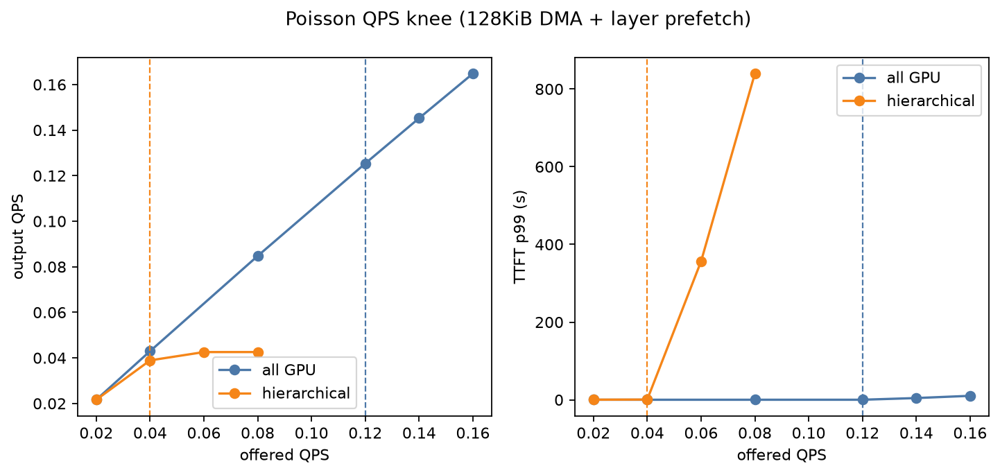
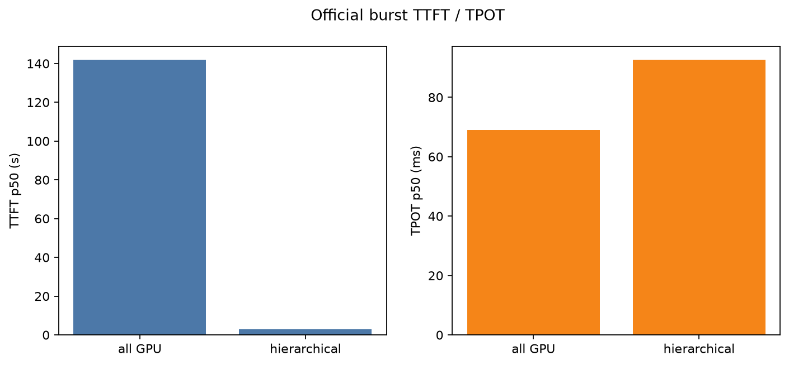
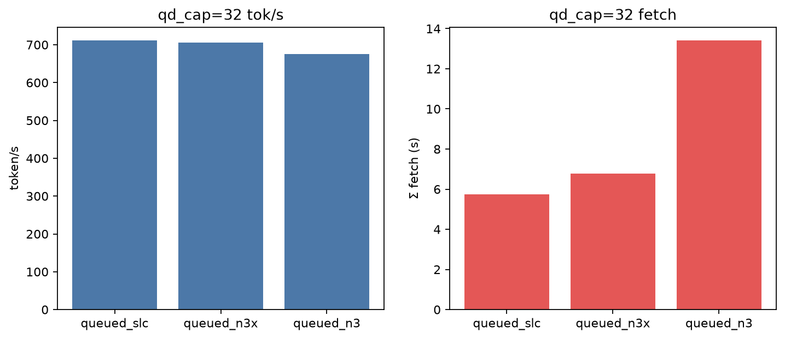
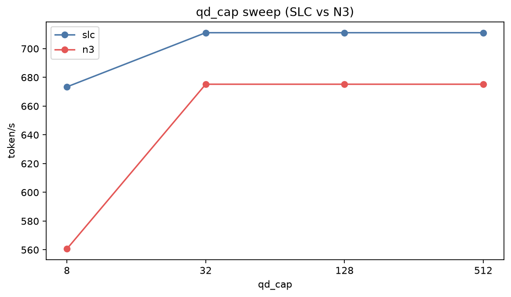

# KV Working-Set Offload Test Report / KV 工作集分层测试报告

Date / 日期: 2026-09-04  
Simulator / 模拟器: TokenSim (roofline backend, Python 3.11)  
Primary arrival / 主测试到达: `--distribution poisson`, per-config **QPS knee**

This report documents the 70B / H200 comparison of **all-GPU decode** vs **hierarchical KV working-set fetch** (GPU 30% / DRAM 50% / SSD 20%, N3X-SLC **128KiB** DMA, `qd_cap=32`, **layer-prefetch** overlap). Each configuration is swept with open-loop Poisson arrivals until the largest stable offered QPS `λ*` (goodput ≥ 0.90 and TTFT p99 ≤ 3× light-load). Fetch is **per-step cold-set read**. Prefill / recompute stay on GPU; after those steps GPU blocks trim to `gpu_frac` and spill writes plus PCIe contention are charged on that step.

本报告记录 LLaMa2-70B + 1×H200 上 **全 GPU decode** 与 **分层 KV 工作集读取**（GPU 30% / DRAM 50% / SSD 20%，N3X-SLC **128KiB** DMA，层间预取）的对照。每种配置用泊松到达扫到稳定膝点 `λ*`。Fetch 为每步读冷 KV。Prefill / 重算在 GPU 上完成；结束后裁到 `gpu_frac` 并计写回与 PCIe 争用。

Burst (100 requests at t=0) previously produced a TTFT p50 cliff from hybrid + prefill-priority scheduling. That is a scheduling artifact, not the official operating point.

Burst（t=0 同时 100 条）曾出现 TTFT p50 悬崖，那是 hybrid + prefill 优先的调度假象，正式结论以膝点为准。

---

## 1. Hardware and model / 硬件与模型

This run uses **MHA-64** (~**2.50 MiB/token**). Production Llama-2-70B is typically **GQA-8** (~**0.31 MiB/token**, **1/8** the KV). I/O volume and throughput drop here are an MHA heavy-load bound; GQA pressure is much lower (GQA control is next-phase, §10).

本期是 **MHA-64**（约 **2.50 MiB/token**）。真实 LLaMA-2-70B 多为 **GQA-8**（约 **0.31 MiB/token**，KV 为 **1/8**）。本报告的 I/O 瓶颈与吞吐下降代表 MHA 极端重载；GQA 下压力会显著降低（对照见第 10 节，本轮未跑）。

| Item / 项 | Value / 值 |
| --- | ---: |
| Cluster | `data/clusters/1_h200/h1.json` — 1 hybrid worker, **H200** |
| HBM | **141 GiB**, 1 card |
| Compute / BW | 1979 TFLOPS, 4.8 TB/s HBM |
| Parallelism | TP=PP=DP=1 |
| Model JSON | `data/psla/llama-70b.json` → **`LLaMa2-70B`** (MHA-64, 80 layers) |
| Workload | 100 synthetic requests, prefill **512±32**, decode **512±32**, `block_size=16` |
| Batching | `paged-attn` |
| Arrival | Poisson; `λ*` search from 0.02 r/s, double then binary, resolution 0.02 |

Working-set media (`data/kv_working_set/hier_30_50_20.json` = `hier_n3x_slc.json`):

| Tier | Fraction | Latency | Bandwidth | Queue | Used? |
| --- | ---: | ---: | ---: | --- | --- |
| GPU / HBM | 0.3 (newest) | — | **4.8 TB/s** (Roofline internal) | — | TransformerRoofline H200 `BW_TBs`; not working-set I/O |
| DRAM | 0.5 | 2 µs | 50 GB/s | coalesced | Yes |
| SSD | 0.2 (oldest) | 13 µs | **14 GB/s** | **128KiB**, `qd_cap=32` | Yes |
| Host PCIe | — | — | 50 GB/s | spill contention | Trim writes |

`hier_30_50_20.json` still carries `"hbm": {"read_bw_gbps": 2000.0}`. That field is a **placeholder**: `fetch_cost` / `spill_cost` only charge DRAM and SSD. GPU-resident KV and matmul use TransformerRoofline H200 (`TFLOPS=1979`, `BW_TBs=4.8`). The JSON entry does **not** throttle HBM to 2000 GB/s.

出厂 JSON 里的 `hbm.read_bw_gbps=2000` 不参与计时。GPU 侧带宽以 Roofline 的 **4.8 TB/s** 为准。

Decode step:

```text
T_fetch = T(dram) + T(ssd)          # full cold set [0, gpu_start)
T_step  = T_fetch/N + max(T_roofline, T_fetch*(N-1)/N)   # N=80
```

After prefill/recompute:

```text
T_spill = max(T_dram_wr, T_ssd_wr, (dram_bytes+ssd_bytes)/pcie_bw)
```

`T_spill` is added to that step so TTFT includes writeback. Official Case 2 Σ spill ≈ **1.80 s** across 100 prompts (~18 ms each).

---

## 2. Minimum GPU memory for 70B / 70B 最小显存

TokenSim `CacheConfig` (TP=1, FP16-style `×2` on the param estimate):

```text
W = (12 × Nlayer × Dmodel² + 50000 × Dmodel) × 2
  = 120.763 GiB

size_per_token = 64 × 128 × 2 × 2 × 80 = 2.50 MiB / token
```

| Meaning / 含义 | Memory / 显存 | Note / 说明 |
| --- | --- | --- |
| **Minimum to load weights** | **> 120.763 GiB** | A100-40G / A100-80G cannot run this 70B config at TP=1 |
| + one request S=1024 | **123.26 GiB** | One full request in this test |
| **H200 leftover for KV** | **20.237 GiB** | ≈ **518** blocks of 16 |
| Concurrent S=1024 at `gpu_frac=1` | **8** (Peak B) | Prefill Peak B at S=512 is **16** |

H200 141 GiB fits weights plus a short KV window, not 100 full contexts. Under Poisson at the all-GPU knee (`λ*=0.12`) Little `N*` is **3.89** and preemptions are **2**, not the burst-100 figure of 73.

---

## 3. Test cases / 测试用例

Stable knee: `output_qps / λ ≥ 0.90` and `ttft_p99 ≤ 3 × ttft_p99(λ=0.02)`. `N* = λ* × request_time.p50`. Scripts share `TokenSim/kv_working_set/knee.py`.

`kv_working_set_test_report/ssd_qos_eval/run_eval.py` is the **pipeline**, not an SSD-only job. It runs **Case 1**, **Case 2**, the QoS arms in §9, and writes `fig_qps_knee.png` / `fig_ttft_tpot.png`. The file lives under `ssd_qos_eval/` because that directory owns the shared knee harness. Occupancy (§8) is a separate script.

该脚本是 Case 1、Case 2 与 §9 QoS 的总控，并出官方对比图。路径在 `ssd_qos_eval/` 只是评测目录归属，不是“只跑 SSD”。

```bash
python3.11 kv_working_set_test_report/ssd_qos_eval/run_eval.py
```

To replay one reported knee without the search / 只复现已报膝点、不重新搜 `λ*`：

### Case 1 (official) — Poisson knee, all GPU

No working-set config. Result dir `kv_working_set_test_report/all_gpu_poisson`. Reported `λ* = 0.12`.

```bash
python3.11 benchmark.py --batching paged-attn --qps 0.12 --distribution poisson \
  --cluster data/clusters/1_h200/h1.json --model data/psla/llama-70b.json \
  --verbose none --results_path kv_working_set_test_report/all_gpu_poisson
```

### Case 2 (official) — Poisson knee, hierarchical 30/50/20

`--kv_working_set_config data/kv_working_set/hier_30_50_20.json` (128KiB + `layer_prefetch`). Result dir `kv_working_set_test_report/hier_poisson`. Reported `λ* = 0.04`.

```bash
python3.11 benchmark.py --batching paged-attn --qps 0.04 --distribution poisson \
  --cluster data/clusters/1_h200/h1.json --model data/psla/llama-70b.json \
  --verbose none --results_path kv_working_set_test_report/hier_poisson \
  --kv_working_set_config data/kv_working_set/hier_30_50_20.json
```

---

## 4. Metric definitions / 指标定义

| Report name | Meaning |
| --- | --- |
| **λ\*** | Largest stable offered Poisson QPS |
| **N\*** | Little's law `λ* × request_time.p50` (in-system, including queue) |
| **Peak B** | HBM occupancy cap at S=1024 after watermark (`513 / ceil(floor(1024×gpu_frac)/16)`) |
| **TTFT** | `prefill_time` (queue wait + prefill + trim spill) |
| **TPOT** | `decode_time` mean inter-token interval |
| **System token/s** | JSON `output_token_ps` at `λ*` |
| **Σ fetch** | Unoverlapped DRAM+SSD read time (stats); wall clock uses layer-prefetch |

Both arms process **102,452** tokens (51,226 prefill + 51,226 decode).

---

## 5. Official results (Poisson knee, 128KiB + layer prefetch) / 正式结果

| Metric | Case 1 all GPU | Case 2 hierarchical SLC | Ratio (hier / GPU) |
| --- | ---: | ---: | ---: |
| **λ\*** | **0.12** r/s | **0.04** r/s | **0.33×** |
| **N\*** (Little) | **3.89** | **6.37** | 1.64× |
| Peak B (S=1024) | 8 | 25 | 3.13× |
| TTFT p50 | **0.104 s** | **0.185 s** | 1.78× |
| TTFT p99 | **0.159 s** | **0.651 s** | 4.10× |
| TPOT p50 | **63.2 ms** | **311.2 ms** | **4.92×** |
| TPOT p99 | 66.9 ms | 776.7 ms | 11.6× |
| System token/s | **128.4** | **39.9** | **0.31×** |
| Achieved r/s | 0.125 | 0.039 | 0.31× |
| Preemptions | 2 | **0** | — |
| Σ fetch (unoverlapped) | 0 | 2336 s | stats, not wall |
| Σ spill | 0 | **1.80 s** | ~18 ms / prompt |
| SSD IOs (128KiB) | 0 | **1.58e8** | vs 5.05e9 at 4K; count in §7 |

All-GPU fails at 0.14 r/s: output still tracks offered but TTFT p99 jumps to 4.5 s. Hierarchical fails at 0.06 r/s: output QPS plateaus at ~0.043 and TTFT p99 goes to hundreds of seconds. `N*` (6.4) is far below Peak B (25): the SSD/DRAM path saturates before HBM fills.

全 GPU 在 0.14 r/s 因 TTFT p99 超过轻载 3 倍而不稳。分层在 0.06 r/s 吞吐跟不上且排队崩掉。`N*` 小于 Peak B，说明 I/O 先饱和。

4K command-amplification control (same 30/50/20, `io_size=4096`): **λ\* = 0.02**, 22.1 tok/s, TPOT p50 132 ms. 128KiB restores the 14 GB/s roof and doubles stable QPS versus 4K.





---

## 6. How to read token/s / 如何读 token/s

Use JSON **`output_token_ps` at λ\*** for cluster throughput. Light-load 0.02 r/s is ~22 tok/s on both arms (mostly arrival-limited). The knee is where the server stops keeping up.

集群吞吐看膝点上的 **`output_token_ps`**。轻载 0.02 r/s 两臂都约 22 tok/s（到达限制）。膝点才是服务器跟不上的地方。

Per-request generation speed is `1000 / TPOT_ms` (15.8 vs 3.2 tok/s at the knees).

---

## 7. Per-step cold-set fetch and overlap / 每步读冷 KV 与重叠

Full attention needs the whole history each decode token. After trim, GPU keeps `gpu_frac`, so `[0, gpu_start)` is read every step. Layer-prefetch hides fetch under 80-layer compute when I/O is small; when the shared SSD queue fills, `T_step ≈ T_fetch`.

Case 2's **1.58e8** SSD IOs (128KiB) is that full cold-set reread, not a once-per-request page-in. Measured `kv_ws_ssd_read_tokens = 7.90e6` and `2.50 MiB / 128 KiB = 20` IOs/token:

```text
IOs = 100 req × ~512 decode steps × ~154 SSD tokens/step × 20 IOs/token
    ≈ 1.58e8
    = 7.90e6 tokens × 20 IOs/token
```

At 128KiB that is ~20 TB of SSD read for 100 requests. There is no sparsity or GQA shrinkage in this MHA run. The 4K control is ~32× more commands (5.05e9) for the same bytes.

Case 2 的 1.58e8 次 128KiB IO 来自每步全量回读冷 KV，不是每条请求只读一次。无稀疏、无压缩；GQA 会把每 token 字节（因而 IO 次数）缩到约 1/8。

Stats still record unoverlapped fetch (2336 s at the hierarchical knee) so the report can show how much was masked. Wall-clock TPOT is 311 ms, not seconds.

Spill writes after prompt trim are charged (`T_spill ≈ 18 ms` per request). Decode window-slide writes are not.

---

## 8. gpu_frac occupancy sweep / 占用扫描

Same Poisson-knee search at each `gpu_frac` from 100% to 10% (step 5%). Off-GPU remainder DRAM:SSD = 5:2. Media matches Case 2 (128KiB + layer-prefetch). Prefill Peak B at S=512 stays **16**.

Decode 占用随 `gpu_frac` 变；每个点自己扫 `λ*`。Prefill Peak B 仍为 16。

| gpu_frac | Peak B | λ* | N* | token/s | TPOT p50 | TTFT p50 | TTFT p99 | preempt |
| ---: | ---: | ---: | ---: | ---: | ---: | ---: | ---: | ---: |
| 100% | 8 | **0.12** | 3.89 | **128.4** | 63.2 ms | 0.10 s | 0.16 s | 2 |
| 95% | 8 | 0.12 | 3.91 | 128.4 | 63.5 ms | 0.11 s | 0.15 s | 1 |
| 90% | 8 | 0.12 | 3.92 | 128.4 | 63.7 ms | 0.11 s | 0.15 s | 0 |
| 85% | 9 | 0.10 | 3.28 | 107.8 | 63.4 ms | 0.10 s | 0.15 s | 0 |
| 80% | 9 | 0.08 | 2.63 | 86.8 | 63.5 ms | 0.10 s | 0.16 s | 0 |
| 75% | 10 | 0.08 | 3.20 | 86.1 | 76.4 ms | 0.12 s | 0.23 s | 0 |
| 70% | 11 | 0.08 | 4.07 | 83.4 | 100.4 ms | 0.11 s | 0.33 s | 0 |
| 65% | 12 | 0.06 | 2.92 | 64.4 | 94.9 ms | 0.12 s | 0.30 s | 0 |
| 60% | 13 | 0.06 | 3.61 | 62.8 | 118.7 ms | 0.12 s | 0.36 s | 0 |
| 55% | 14 | 0.04 | 1.72 | 44.0 | 84.7 ms | 0.12 s | 0.28 s | 0 |
| 50% | 16 | 0.04 | 2.43 | 43.5 | 118.9 ms | 0.13 s | 0.32 s | 0 |
| 45% | 17 | 0.04 | 2.87 | 42.8 | 142.4 ms | 0.13 s | 0.34 s | 0 |
| 40% | 19 | 0.04 | 3.26 | 42.1 | 161.1 ms | 0.13 s | 0.40 s | 0 |
| 35% | 22 | 0.04 | 4.13 | 41.3 | 200.4 ms | 0.14 s | 0.61 s | 0 |
| **30%** | **25** | **0.04** | **6.37** | **39.9** | **311.2 ms** | **0.18 s** | **0.65 s** | 0 |
| 25% | 32 | 0.04 | 9.01 | 38.2 | 430.4 ms | 0.20 s | 0.96 s | 0 |
| 20% | 39 | 0.02 | 1.02 | 22.1 | 100.0 ms | 0.11 s | 0.41 s | 0 |
| 15% | 51 | 0.02 | 1.13 | 22.1 | 110.2 ms | 0.11 s | 0.46 s | 0 |
| 10% | 73 | 0.02 | 1.29 | 22.1 | 129.7 ms | 0.13 s | 0.52 s | 0 |

TPOT p50 is sawtoothed because **each row is taken at that row's own `λ*`**, not at a fixed offered QPS. When `λ*` drops, Little `N*` collapses and SSD queueing disappears, so per-step fetch falls back to light-load. The 25% → 20% step is the clearest: `λ*` 0.04 → 0.02, `N*` **9.01 → 1.02**, TPOT **430.4 → 100.0 ms**. The same effect shows at 70% → 65% (`λ*` 0.08 → 0.06) and 60% → 55% (`λ*` 0.06 → 0.04). Less GPU KV does **not** make a loaded decode step faster; the later rows are simply no longer at the same load.

各行 TPOT 是在各自膝点采集的，不是固定 QPS 对比。`λ*` 下降时并发 `N*` 掉到 ~1，SSD 争用消失，单步 fetch 回到轻载。25%→20% 最明显；不是“留更少显存反而更快”。

Down to ~90% the knee matches all-GPU (`λ*=0.12`, ~128 tok/s): layer-prefetch still hides the small cold set. Below that `λ*` and token/s fall as the cold set grows. `N*` stays below Peak B except that Peak B is an occupancy ceiling, not a measured in-flight count. There is **no TTFT p50 cliff** under Poisson.

90% 以上膝点与全 GPU 相同。再往下冷集变大，`λ*` 和 token/s 下降。泊松下没有 burst 那种 TTFT p50 悬崖。

Peak DRAM/SSD occupancy (not enforced) is unchanged from the occupancy formula in the previous report: Case 2 (30%) ≈ **31.3 GiB DRAM + 12.5 GiB SSD** at Peak B=25, S=1024.

Figures: [`gpu_frac_inference_speed.md`](gpu_frac_inference_speed.md).

```bash
python3.11 kv_working_set_test_report/gpu_frac_sweep/run_sweep.py
python3.11 kv_working_set_test_report/gpu_frac_sweep/plot_gpu_frac.py
```

---

## 9. SSD QoS / SSD 评估

Same Poisson-knee recipe, `gpu_frac=0.3`. DRAM coalesced 2 µs / 50 GB/s. SSD 14 GB/s. Official granularity is **128KiB**.

128KiB sequential DMA sits on the bandwidth roof, so SLC / MLC / N3 and `qd_cap` 8–512 **tie at λ\*=0.04 / 39.9 tok/s** (N3 coalesced light-load TTFT trips the 3× rule at 0.04, so that one arm reports `λ*=0.02`). Drive latency no longer sets the knee.

128KiB 顺序 DMA 打在带宽屋顶上，盘速与 `qd_cap` 不再拉开正式膝点。

4K control (command-amplified): **λ\*=0.02**, 22.1 tok/s — the old IOPS knee.

| Arm | io_size | λ* | token/s | TPOT p50 | TTFT p99 |
| --- | ---: | ---: | ---: | ---: | ---: |
| queued SLC 128KiB (Case 2) | 131072 | **0.04** | 39.9 | 311 ms | 0.65 s |
| queued MLC / N3 128KiB | 131072 | 0.04 | 39.9 | 311 ms | 0.65 s |
| coalesced SLC / MLC | 0 | 0.04 | 39.9 | 312 ms | 0.82–0.89 s |
| queued SLC **4K** | 4096 | **0.02** | 22.1 | 132 ms | 0.54 s |
| `qd_cap` 8 / 128 / 512 SLC or N3 | 131072 | 0.04 | 39.9 | 311 ms | 0.65 s |





Same pipeline as §3 (Case 1 + Case 2 + these QoS arms):

```bash
python3.11 kv_working_set_test_report/ssd_qos_eval/run_eval.py
```

---

## 10. Next-phase research (not run) / 下阶段（本轮不做）

- **Prefill-Decode 分离:** independent P/D workers plus KV transfer. Expected to remove same-card P/D fighting over HBM; decode nodes still pay per-step cold KV. Existing `data/clusters/8_a100/p2d5.json` and `dispatch_prefill_to_decode` can be reused. Official cluster stays 1×H200 hybrid.
- **GQA 对照:** `LLaMa2-70B-GQA` (`Grouped_Num=8`) is already in `TransformerRoofline/hardware_models.json`. Official `LLaMa2-70B` is MHA-64 (~2.50 MiB/token); GQA-8 is about **1/8** the KV. Same 128KiB + layer-prefetch + Poisson-knee recipe; do not change `data/psla/llama-70b.json` until that experiment.

---

## 11. Reproduce / 复现

Python 3.11, repo root.

| Artifact | Path |
| --- | --- |
| All-GPU knee JSON | [`kv_working_set_test_report/all_gpu_poisson.json`](kv_working_set_test_report/all_gpu_poisson.json) |
| Hierarchical knee JSON | [`kv_working_set_test_report/hier_poisson.json`](kv_working_set_test_report/hier_poisson.json) |
| SSD QoS summary | [`kv_working_set_test_report/ssd_qos_eval/summary.json`](kv_working_set_test_report/ssd_qos_eval/summary.json) |
| gpu_frac summary | [`kv_working_set_test_report/gpu_frac_sweep/summary.json`](kv_working_set_test_report/gpu_frac_sweep/summary.json) |
| gpu_frac MD | [`gpu_frac_inference_speed.md`](gpu_frac_inference_speed.md) |
| Official PNG | [`fig_qps_knee.png`](kv_working_set_test_report/fig_qps_knee.png), [`fig_ttft_tpot.png`](kv_working_set_test_report/fig_ttft_tpot.png) |
| Design | [`offload_sim.md`](offload_sim.md) |

设计说明见 [offload_sim.md](offload_sim.md)。
