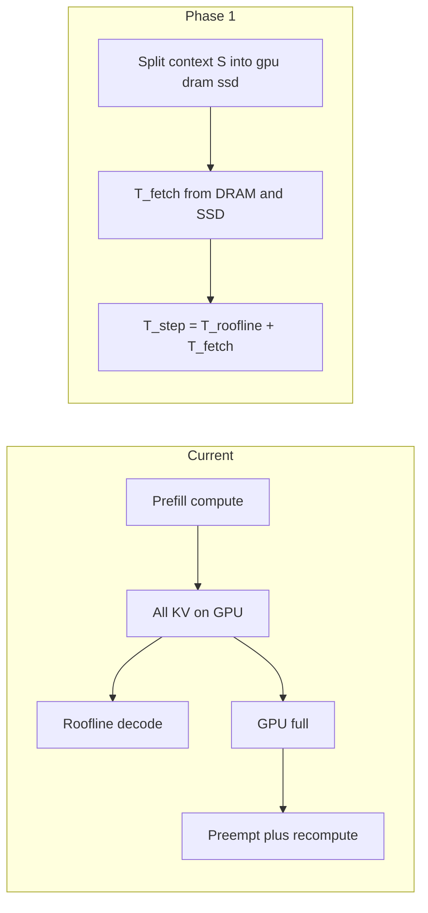

# KV Working-Set Offload Simulator / KV 工作集分层卸载模拟

Development plan and v1 design for decode-time hierarchical KV cache
(GPU HBM / DRAM / SSD).

Decode 阶段分层 KV（GPU HBM / DRAM / SSD）的开发计划与 v1 设计。

---

## 1. Motivation / 动机

**EN.** LLM decode attention needs the full KV context each step. When context no
longer fits in GPU HBM, real systems either:

1. keep everything on GPU and **preempt / recompute** when memory pressure hits, or
2. keep a **working-set hierarchy**: hot tokens on HBM, warm on DRAM, cold on SSD,
   and fetch missing KV on demand before (or overlapped with) compute.

TokenSim today models (1) well for paged attention, and models Mooncake-style
**prefix archival** to DRAM/SSD for later request reuse. It does **not** model
decode-step working-set fetch. This feature adds (2) as a separate path so we can
answer:

> Given `gpu_frac` / `dram_frac` / `ssd_frac` of the live KV context, and given
> HBM / DRAM / SSD read latency and bandwidth, what decode speed do we get
> compared to all-on-GPU and to recompute-on-overflow?

**中文。** Decode 每一步 attention 都需要整段 KV。显存放不下时，实际系统通常：

1. KV 全放 GPU，不够就 **抢占 + 重算**；或
2. 做 **工作集分层**：热 token 在 HBM，温数据在 DRAM，冷数据在 SSD，decode
   按需把缺失 KV 读回来再算。

TokenSim 对 (1) 和 Mooncake 式 **prefix 归档**（给后续请求复用）已经有模型，
但没有 decode 步的工作集按需读取。本功能把 (2) 做成独立路径，用来回答：

> 给定当前 KV 在 GPU / DRAM / SSD 上的比例，以及各级读写延迟与带宽，
> decode 能到多快？和全在 GPU、不够就重算相比如何？

---

## 2. Current Gap / 现状缺口

| Path / 路径 | What TokenSim does today / 现状 | Relation / 关系 |
| --- | --- | --- |
| Roofline / LLMCompass decode | Assumes **all KV on HBM** / 假定 KV 全在 HBM | Need additive `T_fetch` / 需要叠加读取时延 |
| GPU full / 显存满 | `can_append_slot` fails → preempt + recompute | Baseline when `gpu_frac=1` / `gpu_frac=1` 时作对照 |
| GPU occupancy / 占用 | Prefill/recompute charge full context; decode charges `floor(S*gpu_frac)` after trim | More decode concurrency; DRAM/SSD capacity infinite |
| Mooncake store SSD | Prefill **prefix archive** / prefill 归档给后人 | **Orthogonal** / 正交，不要混用 |
| CPU `BlockAllocator` | Allocated but unused on decode append | Not DRAM capacity / 不作 DRAM 容量 |

**EN — critical distinction.**

- **Mooncake prefix offload**: write prompt KV after prefill so a *future*
  request can skip compute. Does not feed the *current* request's decode steps.
- **Working-set offload (this feature)**: each decode step may need to read
  DRAM/SSD KV that is part of *this* request's context window.

Do not wire working-set fetch through Mooncake `start_load_kv` / `wait_for_save`.

**中文 — 关键区别。**

- **Mooncake prefix 下盘**：prefill 后把 prompt KV 存起来，给 *以后的* 请求少算。
  当前这条请求的 decode 不用盘上的数据。
- **工作集卸载（本功能）**：当前请求 decode 每一步，可能要把 *自己* 上下文里
  不在 GPU 的 KV 从 DRAM/SSD 读回来。

不要接到 Mooncake 的 `start_load_kv` / `wait_for_save` 上。



---

## 3. Semantics and Formulas (v1) / 语义与公式

### 3.1 Placement / 放置策略

| Policy / 策略 | Meaning / 含义 |
| --- | --- |
| `sliding_window` (default) | Newest `gpu_frac` on GPU; next `dram_frac` on DRAM; oldest `ssd_frac` on SSD。最新一段在 GPU，中间 DRAM，最老 SSD |
| `static_fraction` | Same counts from fractions of `S`; ordering unused for latency. 只按比例拆 token 数，不计顺序 |

Constraints / 约束:

- `gpu_frac`, `dram_frac`, `ssd_frac` ∈ [0, 1]
- `gpu_frac + dram_frac + ssd_frac ≈ 1` (tolerance `1e-6`)
- Token counts are non-negative integers that sum exactly to `S`

### 3.2 Context and bytes / 上下文与字节

At each decode step / 每个 decode 步:

```text
S = prefill_len + generation_idx
bytes(tier) = S_tier * size_per_token
```

`size_per_token` comes from `CacheConfig` (`TokenSim/config/cache_config.py`).

### 3.3 Media delay / 介质时延

Coalesced (`io_size_bytes = 0`, default) matches `OffloadTier` in
`TokenSim/mooncake/ssd.py`:

```text
T(tier) = read_latency_us / 1e6 + bytes(tier) / 2^30 / max(eps, read_bw_gbps)
```

Queued SSD (`io_size_bytes > 0`) splits the miss into DMA commands and applies a
host-visible `L(QD)` curve. Shipped SSD uses **128KiB** (`io_size_bytes=131072`)
so sequential/large-block reads sit on the bandwidth roof (~14 GB/s), not the
4K IOPS knee. Default synthesis (no `qd_latency_us` table):

```text
n_ios = ceil(bytes / io_size_bytes)
QD    = min(n_ios, qd_cap)
L     = L1                      if QD <= 32
      = L1 * (QD / 32)          if QD > 32
T     = max(n_ios * L / QD, bytes / 2^30 / read_bw_gbps)
```

`qd_cap` is the one-step outstanding-command cap. Raising it drops `t_iops`
until `T` hits bandwidth and drives with different `L1` look the same.

`io_size_bytes = 0` 时仍是一次固定延迟 + 传输。`io_size_bytes > 0` 时按 DMA
粒度排队；正式配方是 **128KiB**，避免 4K 命令把顺序盘打成 IOPS 瓶颈。`qd_cap`
决定延迟能否盖过带宽。

GPU / HBM fraction uses TransformerRoofline H200 (`BW_TBs=4.8`, i.e. **4.8 TB/s**).
There is no separate HBM fetch in v1. Config `hbm.read_bw_gbps` is optional
metadata and is **not** applied to `T_fetch` / `T_spill` (a JSON value of 2000
does not throttle HBM).

GPU 比例走 Roofline H200 的 **4.8 TB/s**，v1 不再单独加 HBM 读取。配置里的
`hbm` 不计时延，不会把 HBM 节流到 2000 GB/s。

### 3.4 Step latency / 单步时延

Shipped configs use **layer-prefetch** overlap and **per-step cold-set fetch** /
正式配方是层间预取 + **每步读冷 KV**:

```text
T_fetch = T(dram) + T(ssd)   # entire [0, S_gpu_start) every decode step
T_step  = T_fetch / N + max(T_roofline, T_fetch * (N-1) / N)
```

`N` is `model.Nlayer` (80 for LLaMa2-70B; PP uses this rank's layer count).
That is one layer of bubble plus overlap of the remaining fetch with compute.
`overlap: "blocking"` still does `T_roofline + T_fetch` for comparisons.

`N` 是模型层数。计算绑定时几乎藏住摆运；I/O 绑定时仍约等于 `T_fetch`。

Full attention needs every historical K/V each decode step. GPU keeps only the
newest ``gpu_frac`` of the context, so ``[0, S_gpu_start)`` is read from
DRAM/SSD **every** decode token. This is not a once-per-request page-in.

全注意力每步都要碰全部历史 K/V。GPU 只留最新 ``gpu_frac``，因此
``[0, S_gpu_start)`` **每个 decode token 都要从 DRAM/SSD 读一遍**。

`T_roofline_decode` is the existing decode-branch result of
`RooflineLatencyBackend.estimate_step_latency` (after `DECODE_SCALE`).
`T_fetch` is added **after** that scale so media time is not distorted.

Notes / 说明:

- Prefill and recompute stay all-GPU **for latency** (no fetch) **and occupancy**
  (full prompt / rebuilt context on HBM). After those steps, GPU blocks are
  trimmed to ``gpu_frac``. Spill **writes** are charged once:
  `T_spill = max(T_dram_wr, T_ssd_wr, (dram_bytes+ssd_bytes)/pcie_bw)` and added
  to that prefill/recompute step so TTFT includes writeback. Prefill / 重算时延
  与占位都按全量 GPU；结束后把块裁到 ``gpu_frac``，按写入带宽和 PCIe 争用计一次写回。
- Preemption is **recompute**, not swap: drop GPU KV and rebuild with compute.
  Recompute pays GPU time, then the same trim+spill. 抢占走重算，不走 KV swap。
- v1 does **not** subtract off-GPU KV from HBM attention in the roofline
  (pessimistic double-count). Phase 2 再从 HBM attention 里扣掉不在 GPU 的流量。
- Decode window-slide writes are not charged. Decode 滑窗挤出的写回本轮不计。

### 3.5 Sliding-window split / 滑窗拆分

```text
S_gpu  = floor(S * gpu_frac)
S_dram = floor(S * dram_frac)
S_ssd  = S - S_gpu - S_dram
```

`sliding_window` ranges / 区间:

- `[S - S_gpu, S)` → GPU (newest / 最新)
- `[S - S_gpu - S_dram, S - S_gpu)` → DRAM
- `[0, S - S_gpu - S_dram)` → SSD (oldest / 最老)

`static_fraction` uses the same counts; ranges are unused for `T_fetch`.

**Batch policy:** coalesced tiers still **sum** per-request `T`. If a tier has
`io_size_bytes > 0`, that decode step shares one media queue:
`T = max(Σn_ios × L(QD) / QD, Σbytes / BW)` with `QD = min(Σn_ios, qd_cap)`.

合批：`io_size=0` 的层仍按请求求和；`io_size>0` 的层在该 decode 步共享一条队列。

---

## 4. Config Schema / 配置

Standalone JSON under `data/kv_working_set/`. Do **not** overload
`kv_connector_extra_config`. 独立 JSON，不要塞进 Mooncake extra config。

### 4.1 Fields / 字段

```json
{
  "enabled": true,
  "placement": "sliding_window",
  "gpu_frac": 0.3,
  "dram_frac": 0.5,
  "ssd_frac": 0.2,
  "overlap": "layer_prefetch",
  "pcie_bw_gbps": 50.0,
  "dram": {
    "read_latency_us": 2.0,
    "read_bw_gbps": 50.0
  },
  "ssd": {
    "read_latency_us": 13.0,
    "read_bw_gbps": 14.0,
    "io_size_bytes": 131072,
    "qd_cap": 32
  },
  "hbm": {
    "read_latency_us": 0.0,
    "read_bw_gbps": 2000.0
  }
}
```

| Field | Required / 必填 | Notes / 说明 |
| --- | --- | --- |
| `enabled` | yes | false = today's behavior / 关闭则与现网一致 |
| `placement` | yes | `sliding_window` \| `static_fraction` |
| `gpu_frac` / `dram_frac` / `ssd_frac` | yes | Sum ≈ 1 |
| `overlap` | yes | `blocking` or `layer_prefetch` (shipped default) |
| `pcie_bw_gbps` | no | Host link for spill contention; default 50 |
| `dram` / `ssd` | yes when frac > 0 | `read_latency_us` ≥ 0, `read_bw_gbps` > 0. Optional write fields default to the read values. Optional: `io_size_bytes` (0 = coalesced; shipped SSD is **128KiB**), `qd_cap` (≥ 1, default 32), `qd_latency_us` as `[qd, latency_us]` pairs. DRAM example is PCIe DMA (~2 µs, ~50 GB/s, coalesced). Shipped SSD is N3X-SLC **13 µs** / **14 GB/s** / 128KiB / `qd_cap=32`. Also `hier_n3x.json` (18 µs) and `hier_n3.json` (50 µs). |
| `hbm` | no | Ignored in v1 latency. GPU HBM bandwidth is Roofline **4.8 TB/s**, not this field. / v1 不计时延；HBM 带宽以 Roofline 4.8 TB/s 为准 |

Shipped examples / 附带示例:

- `data/kv_working_set/hbm_only.json` — `gpu_frac=1`
- `data/kv_working_set/hier_30_50_20.json` — same as `hier_n3x_slc.json` (30/50/20, SLC)
- `data/kv_working_set/hier_n3x.json` — N3X MLC 18 µs
- `data/kv_working_set/hier_n3.json` — N3 50 µs

### 4.2 CLI

```text
--kv_working_set_config PATH
```

Absent path ⇒ feature disabled. 不传则关闭。

### 4.3 Module layout / 模块

```text
TokenSim/kv_working_set/
  __init__.py
  config.py          # parse + validate
  placement.py       # split S
  fetch.py           # T_fetch
  stats.py           # kv_ws_* metrics
```

---

## 5. Implementation Slices / 实现切片

### Slice A — Config and helpers / 配置与纯函数

`TokenSim/kv_working_set/` with validation, split, fetch. Unit-test rounding,
zero-tier short-circuit, hand-calculated `T_fetch`.

### Slice B — Latency / 时延

Pass config + `size_per_token` into `build_latency_backend`. Decode branch of
`RooflineLatencyBackend.estimate_step_latency` adds summed `T_fetch`. Prefill /
recompute unchanged. LLMCompass applies the **same addend** on decode.

### Slice C — Engine / CLI

`benchmark.py` `--kv_working_set_config`; `LLMEngine` / `LLMWorker` inject
`CacheConfig.size_per_token` into the latency backend.

### Slice D — Metrics / 指标

`LLMResult` + `util/results.py`: `kv_ws_enabled`, `kv_ws_placement`,
`kv_ws_gpu_frac` / `dram_frac` / `ssd_frac`, `kv_ws_fetch_latency`,
`kv_ws_dram_read_bytes` / `ssd_read_bytes`, `kv_ws_dram_read_tokens` /
`ssd_read_tokens`, `kv_ws_dram_ios` / `ssd_ios`. Print one line in
`print_all_stats` when enabled.

### Slice E — Examples / 示例

Reuse `data/clusters/1_h200/h1.json` + `data/psla/llama-70b.json` + `paged-attn`.

---

## 6. Three-Way Comparison / 三臂对照

| Arm / 臂 | How to configure / 怎么配 | What to read / 看什么 |
| --- | --- | --- |
| All GPU / 全 GPU | omit config or `hbm_only.json`; KV fits GPU | `decode_time`, throughput |
| Hierarchical / 分层 | `hier_30_50_20.json` | `decode_time`, `kv_ws_fetch_latency`, bytes |
| Recompute / 重算 | working-set **off**; shrink GPU or raise length / QPS until preempt | `preemption_count`, `recompute_service_time` |

```bash
# Arm 1: all GPU
./benchmark.py --batching paged-attn --qps 10 \
  --cluster ./data/clusters/1_h200/h1.json \
  --model ./data/psla/llama-70b.json \
  --verbose none

# Arm 2: hierarchical working set
./benchmark.py --batching paged-attn --qps 10 \
  --cluster ./data/clusters/1_h200/h1.json \
  --model ./data/psla/llama-70b.json \
  --kv_working_set_config ./data/kv_working_set/hier_30_50_20.json \
  --verbose none

# Arm 3: recompute (working-set off; undersized GPU or long decode)
# 关闭工作集；减小 Capacity 或加长 decode / 提高并发，让 can_append_slot 抢占
```

---

## 7. Test Plan / 测试

`tests/test_kv_working_set.py`

| Case / 用例 | Expectation / 期望 |
| --- | --- |
| Fractions sum ≠ 1 | `ConfigurationError` |
| Negative bw / latency | `ConfigurationError` |
| Split `S=100`, `0.3/0.5/0.2` | counts sum to 100; newest → GPU |
| `S_dram=S_ssd=0` | `T_fetch == 0` |
| Hand calc `T_fetch` | `io_size=0` matches `lat + bytes/bw` |
| 70B token / 4K | 2.50 MiB → 640 IOs |
| 70B token / 128KiB | 2.50 MiB → 20 IOs |
| `qd_cap=8` vs `512` | smaller cap → larger `T` on the same miss |
| SLC/MLC/N3 at `qd_cap=32` | `T(13) < T(18) < T(50)` |
| `gpu_frac=1` vs disabled | identical decode step latency |
| Hierarchical vs disabled (blocking) | decode latency += full-cold-set `T_fetch` |
| `layer_prefetch` | `T_step = T_fetch/N + max(T_roofline, T_fetch*(N-1)/N)` |
| Trim spill | `gpu_frac=1` is 0; otherwise `max(writes, PCIe)` |
| Prefill / recompute | no fetch addend; full GPU occupancy then trim+spill |
| Second decode step | rereads the whole ``[0, gpu_start)``, not a watermark miss |

---

## 8. Non-Goals (v1) / v1 明确不做

- Per-block page table and I/O `(offset, length)` traces / 物理地址 trace
- Changing Mooncake decode `start_load_kv` / `wait_for_save`
- Using CPU `BlockAllocator` as placement backend
- Subtracting off-GPU KV from HBM roofline
- Decode window-slide writes (only prompt-end trim is charged)
- DRAM / SSD **capacity** limits (only GPU HBM blocks are finite)

---

## 9. Phase 2 Backlog / 后续

1. **Accuracy / 精度:** drop off-GPU tokens from HBM attention bytes.
2. **Prefill-Decode 分离:** independent P/D workers plus KV transfer. Expected to
   remove the same-card TTFT cliff from P/D fighting over HBM; decode nodes still
   pay per-step cold KV. Reuse `data/clusters/8_a100/p2d5.json` and
   `dispatch_prefill_to_decode`. Not run in the current 1×H200 official recipe.
3. **GQA 对照 (done):** `data/psla/llama-70b-gqa.json` → `LLaMa2-70B-GQA`.
   Report: `gqa_working_set_test_report.md`. Keep `llama-70b.json` as MHA-64.
4. **Placement:** importance / attention-score residency.
5. **Traces:** per-step `(tier, tokens, bytes, latency)`.
6. **Block table:** mark physical blocks with tier.
7. **Capacity:** finite DRAM/SSD.
8. **Docs:** optional `docs/kv-working-set.md` user guide.

---

## 10. Success Criteria / 完成标准

1. Hierarchical config changes decode latency by a verified `T_fetch` delta.
2. `gpu_frac=1` matches disabled baseline on decode step latency.
3. Results JSON exposes `kv_ws_*`.
4. Mooncake prefix store and existing tests unchanged.
5. Three-arm recipe runs with config / Capacity only (no extra code for the
   recompute arm).
